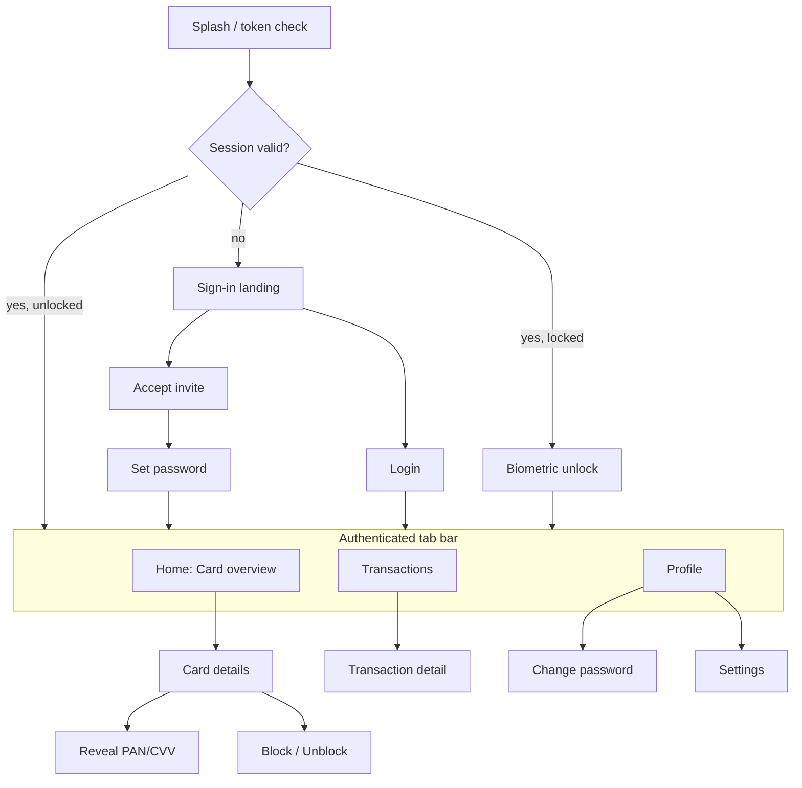

# Card Management Mobile App — Product Requirements (MVP)

**Companion to:** [Backend implementation plan](2026-07-13-card-management-app-mvp.md). Every screen in this PRD maps to a backend endpoint defined there; endpoint references use that plan's `/app/*` routes.

**Date:** 2026-07-13 · **Status:** MVP scope, approved product decisions baked in.

---

## 1. Overview

A mobile app that lets an existing cardholder view and manage the virtual card issued to them through the Pismo hub. The cardholder can see card details (including full PAN/CVV on demand), review their transaction history, and freeze/unfreeze the card. Accounts are provisioned by back-office (invite-based) — the app is **not** a self-service card-application product in the MVP.

**Primary goal:** Give cardholders self-serve visibility and basic control over their card, reducing support load and increasing trust.

**Target user:** An individual who has already been issued a virtual card and receives an invite to activate app access.

### Success metrics (MVP)
- ≥ 70% of invited users complete activation (accept-invite → first login).
- ≥ 50% of active cards viewed in-app within 7 days of issuance.
- Card block/unblock and PAN reveal completed in-app without contacting support.
- Zero PAN/CVV exposure in logs, crash reports, or screenshots (hard requirement, not a metric).

---

## 2. Platform & key decisions

| Decision | Choice |
|---|---|
| Platform | **iOS + Android, single cross-platform codebase** (React Native or Flutter — team's choice) |
| Authentication | Email + password, backed by the service's own JWT (access + refresh) |
| App unlock & reveal step-up | **Device biometrics** (Face ID / Touch ID / Android BiometricPrompt), with device passcode fallback |
| Onboarding | **Invite/link only** — back-office creates the user and issues an invite token; no in-app signup or KYC |
| Card data | **Full PAN/CVV reveal** available on demand (step-up + biometric gated) |
| Card actions | View + **block/unblock (freeze/unfreeze)** |
| Push notifications | **Out of scope for MVP** (fast-follow v1.1) |

---

## 3. Scope

### In scope (MVP)
1. Invite activation & password setup
2. Login / logout, biometric app unlock, token refresh
3. Card overview (single card) with balance and status
4. Card details (masked metadata)
5. Full PAN/CVV reveal with step-up + biometric + auto-hide
6. Block / unblock card
7. Transaction history list with detail view and date filtering
8. Profile view + change password
9. Settings (biometric toggle, logout, support/legal links)

### Out of scope (MVP — deferred)
- Self-service signup, KYC, in-app card issuance
- Multiple cards / multiple accounts per user (MVP assumes **1 user ↔ 1 customer ↔ 1 account ↔ 1 active card**)
- Push notifications / transaction alerts (v1.1)
- Self-service password reset (**gap — see §9**); MVP routes to support / back-office re-invite
- Spend limits editing, card PIN management, statements/PDF export, disputes, card replacement

---

## 4. User roles

| Role | Where | Capability |
|---|---|---|
| **Cardholder** | Mobile app | All in-scope features, scoped to their own card only |
| **Back-office admin** | Existing back-office / API (not this app) | Creates app users, links Pismo customer/account, issues invites (`POST /app/admin/users`) |

The app ships to cardholders only. Admin provisioning is out-of-app.

---

## 5. Feature list & acceptance criteria

### F1 — Invite activation
User activates access using an invite delivered out of band (email/SMS with a deep link or a code to enter).
- **AC1:** Given a valid, unexpired invite token + email, the user can set a password (min 8 chars, strength meter) and is logged in immediately. → `POST /app/auth/accept-invite`
- **AC2:** An expired/invalid/used invite shows a clear error and a "Contact support" action; no account is created or modified.
- **AC3:** Deep link `cardapp://invite?email=…&token=…` pre-fills the activation screen; manual code entry is also supported.

### F2 — Authentication & session
- **AC1:** Valid email+password returns a session; invalid credentials show a generic "Invalid email or password". → `POST /app/auth/login`
- **AC2:** Access token stored in the OS secure store (Keychain / Keystore), never in plain storage; refresh handled silently. → `POST /app/auth/refresh`
- **AC3:** On app foreground after backgrounding beyond the auto-lock window, the user must pass biometrics (or passcode) before any card data renders.
- **AC4:** Logout clears all tokens from secure storage and returns to the sign-in landing.

### F3 — Card overview
- **AC1:** Home shows the user's card as a card-art tile with masked PAN (•••• last-4), cardholder name, expiry, brand, current status (Active / Blocked), and available balance. → `GET /app/cards`, `GET /app/cards/balance`
- **AC2:** Status is visually unmistakable (e.g. greyed/frozen treatment when Blocked).

### F4 — Card details
- **AC1:** Tapping the card opens details: name, type (VIRTUAL), status, transaction limit, validity/expiry, and the block/unblock control. → `GET /app/cards/:cardId`
- **AC2:** No full PAN/CVV is shown here — only masked metadata.

### F5 — Reveal full PAN/CVV
- **AC1:** "Show card number" triggers a biometric step-up; on success the app requests a short-lived reveal token, then the sensitive data. → `POST /app/auth/step-up` then `GET /app/cards/:cardId/sensitive`
- **AC2:** Revealed PAN/CVV/expiry display with a visible countdown and auto-hide (≤ 90 s, matching `APP_REVEAL_TTL`).
- **AC3:** "Copy number" copies to a clipboard entry that auto-clears after 60 s.
- **AC4:** The reveal screen disables screenshots/screen recording (`FLAG_SECURE` on Android; screenshot/record obfuscation on iOS) and is excluded from the app switcher preview.
- **AC5:** PAN/CVV are held in memory only — never written to disk, cache, analytics, or logs.

### F6 — Block / unblock card
- **AC1:** A toggle (with confirm) freezes the card; UI reflects Blocked immediately on success. → `POST /app/cards/:cardId/block`
- **AC2:** Unfreeze restores Active status. → `POST /app/cards/:cardId/unblock`
- **AC3:** Failure rolls the toggle back and shows a retryable error.

### F7 — Transaction history
- **AC1:** A reverse-chronological list shows each transaction's merchant/description, amount (credit/debit styled), and date/time. → `GET /app/transactions`
- **AC2:** Default view loads a recent window (e.g. last 30 days / latest N); a date-range filter is available.
- **AC3:** Infinite scroll / pagination; pull-to-refresh.
- **AC4:** Tapping a row opens a transaction detail view with full fields (amount, type, status, timestamps, authorization info).

### F8 — Profile & password
- **AC1:** Profile shows display name and email (read-only in MVP). → `GET /app/me`
- **AC2:** Change password requires current password and enforces the strength rule. → `POST /app/auth/change-password`

### F9 — Settings
- **AC1:** Toggle biometric unlock on/off (off falls back to password on every launch).
- **AC2:** Logout, app version, and links to Support, Terms, and Privacy.

---

## 6. Information architecture & navigation

Post-auth navigation is a **3-tab bar**: **Home** (card), **Transactions**, **Profile**. Auth screens live in a separate pre-auth stack.

---

## 7. Screen inventory

Each screen lists its purpose, key elements, non-happy states, and the backend endpoint(s) it calls.

| # | Screen | Purpose | Key elements | States (loading / empty / error) | Endpoints |
|---|---|---|---|---|---|
| S1 | **Splash** | Decide route on launch | Logo; silent token check + refresh | Loading spinner; on refresh failure → S3 | `POST /app/auth/refresh` |
| S2 | **Sign-in landing** | Entry point | "Log in" and "Activate invite" CTAs, brand | — | — |
| S3 | **Login** | Password auth | Email, password, show/hide, submit, "Trouble signing in?" | Inline validation; generic auth error | `POST /app/auth/login` |
| S4 | **Accept invite** | Start activation | Email + invite-token fields (or deep-link prefill), continue | Invalid/expired invite error → support CTA | (validates on S5 submit) |
| S5 | **Set password** | Finish activation | New password, confirm, strength meter, submit | Password rule errors; token-expired error | `POST /app/auth/accept-invite` |
| S6 | **Biometric unlock** | Re-entry gate | Face ID/fingerprint prompt, "Use password" fallback | Biometric fail → retry / password fallback | — (local) |
| S7 | **Home / Card overview** | See card at a glance | Card-art tile (masked PAN, name, expiry, brand, status badge), balance, quick actions (Freeze, Show number, View transactions) | Skeleton card; "No card found" empty; retry error banner | `GET /app/cards`, `GET /app/cards/balance` |
| S8 | **Card details** | Full metadata + controls | Status, type, limit, validity; Block/Unblock control; "Show card number" | Skeleton rows; error retry | `GET /app/cards/:cardId` |
| S9 | **Reveal PAN/CVV** | Show sensitive data securely | Biometric gate → full PAN, CVV, expiry; countdown; copy; auto-hide; screenshot-blocked | Step-up fail → dismiss; reveal-token expired → re-step-up | `POST /app/auth/step-up`, `GET /app/cards/:cardId/sensitive` |
| S10 | **Block/Unblock confirm** | Confirm state change | Confirmation sheet; result toast | In-flight disabled state; rollback on error | `POST /app/cards/:cardId/block` \| `/unblock` |
| S11 | **Transactions list** | History | List rows (merchant, amount, date), date-range filter, pull-to-refresh, pagination | Skeleton list; "No transactions yet" empty; error retry | `GET /app/transactions` |
| S12 | **Transaction detail** | One transaction | Amount, type, status, timestamps, authorization details | — (data from list or refetch) | `GET /app/transactions` (item) |
| S13 | **Profile** | Identity | Display name, email (read-only), links to Change password & Settings | Skeleton; error retry | `GET /app/me` |
| S14 | **Change password** | Rotate password | Current, new, confirm, strength meter | Wrong-current error; rule errors | `POST /app/auth/change-password` |
| S15 | **Settings** | Preferences | Biometric toggle, logout, version, Support/Terms/Privacy links | — | — |
| S16 | **Global states** | Consistency | Offline banner, session-expired modal (→ S3), generic error component | Applies app-wide | — |

---

## 8. Key user flows

**Activation (first run)**
1. User taps invite link / opens app → S4 Accept invite (email + token, or prefilled via deep link).
2. S5 Set password → `POST /app/auth/accept-invite` returns tokens → land on S7 Home.
3. Prompt to enable biometric unlock (writes preference; no card data shown until enabled or skipped).

**Daily use (returning)**
1. Launch → S1 Splash refreshes token → S6 biometric unlock → S7 Home.
2. View balance/status; drill into S8 details or S11 transactions.

**Reveal card number**
1. S8 → "Show card number" → biometric step-up.
2. On biometric success → `POST /app/auth/step-up` (password already established; step-up is biometric-authorized on device, password re-entry as fallback) returns reveal token.
3. `GET /app/cards/:cardId/sensitive` with `x-reveal-token` → S9 shows PAN/CVV with countdown; auto-hides at expiry.

**Freeze card**
1. S8 toggle → S10 confirm → `POST /app/cards/:cardId/block` → status flips to Blocked on S7/S8.

> **Note on step-up + biometric:** the backend `step-up` endpoint verifies the account password. In the app, biometrics unlock a securely stored credential/session to satisfy step-up so the user isn't retyping their password each reveal; if biometrics are unavailable or disabled, the app falls back to prompting for the password to complete `POST /app/auth/step-up`.

---

## 9. Security & privacy requirements

1. **Token storage:** access/refresh tokens only in iOS Keychain / Android Keystore-backed secure storage. Never in `AsyncStorage`/`SharedPreferences` plaintext, logs, or analytics.
2. **Auto-lock:** app locks after configurable inactivity (default 2 min background) and requires biometric/passcode to resume.
3. **PAN/CVV handling:** in-memory only; masked everywhere except S9; auto-hide ≤ 90 s; clipboard auto-clear ≤ 60 s; screenshot/screen-record blocked on S9 (`FLAG_SECURE` / iOS secure field); S9 excluded from app-switcher snapshot.
4. **Transport:** TLS only; certificate pinning recommended for the API host.
5. **No sensitive data in telemetry:** crash/analytics SDKs must scrub PAN/CVV, tokens, emails from breadcrumbs and payloads.
6. **Least exposure:** the app never sends or trusts a Pismo `account_id`/`customer_id`; the backend derives them from the session (enforced server-side per the implementation plan).
7. **Session-expired UX:** a 401 anywhere triggers a single silent refresh; if that fails, force logout to S3 with a "Session expired" message.

### Known gap — password reset
The MVP backend has no self-service password-reset flow (only admin re-invite). The app's "Trouble signing in?" routes to a support/help screen for MVP. **Recommended fast-follow:** add `POST /app/auth/forgot-password` + `reset-password` to the backend and a reset flow to the app.

---

## 10. Non-functional requirements

- **Performance:** Home renders card + balance within 1.5 s on a warm session; transactions first page < 2 s.
- **Offline:** read-only cached last-known card summary with a clear "offline / last updated" indicator; actions (block, reveal) require connectivity and disable gracefully offline.
- **Accessibility:** WCAG AA contrast, dynamic type, screen-reader labels (never read full PAN aloud unless explicitly revealed by the user), min 44pt touch targets.
- **Localization-ready:** externalized strings; currency/date formatting per locale (single locale acceptable for MVP).
- **Error copy:** human, non-technical, actionable; no raw server errors surfaced.
- **App store readiness:** privacy nutrition labels/data-safety forms completed; financial-app review requirements met.

---

## 11. Analytics (privacy-safe events, MVP)

Track only non-sensitive funnel events: `invite_opened`, `activation_completed`, `login_success`, `card_viewed`, `pan_revealed` (event only — never the value), `card_blocked`, `card_unblocked`, `transactions_viewed`. No PAN, CVV, email, token, or amount values in any event payload.

---

## 12. Open questions / future (v1.1+)

- Password reset (backend + app) — recommended immediately after MVP.
- Push notifications: transaction alerts, block/unblock confirmations (needs device-token registry + webhook→push pipeline on the backend).
- Multi-card / multi-account support once a user can hold more than one.
- Spend-limit editing, card PIN management, statements export, disputes/chargebacks, card replacement.
- Deep-link hardening and universal/app links for invites.

---

## 13. Traceability — app ↔ backend

| App feature | Backend endpoint(s) | Plan task |
|---|---|---|
| Invite activation (F1) | `POST /app/auth/accept-invite` | Task 6 |
| Login / refresh (F2) | `POST /app/auth/login`, `/refresh` | Task 6 |
| Card overview (F3) | `GET /app/cards`, `GET /app/cards/balance` | Tasks 10–11 |
| Card details (F4) | `GET /app/cards/:cardId` | Tasks 10–11 |
| Reveal PAN/CVV (F5) | `POST /app/auth/step-up`, `GET /app/cards/:cardId/sensitive` | Tasks 6, 8, 11 |
| Block / unblock (F6) | `POST /app/cards/:cardId/block` \| `/unblock` | Tasks 8–11 |
| Transactions (F7) | `GET /app/transactions` | Tasks 10–11 |
| Profile / password (F8) | `GET /app/me`, `POST /app/auth/change-password` | Task 6 |
| Admin provisioning (out-of-app) | `POST /app/admin/users` | Task 7 |
