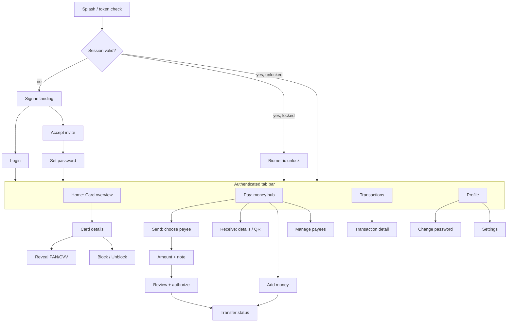

# Card Management Mobile App — Product Requirements (MVP)

**Companion to:** [Backend implementation plan](2026-07-13-card-management-app-mvp.md). Every screen in this PRD maps to a backend endpoint defined there; endpoint references use that plan's `/app/*` routes.

**Date:** 2026-07-13 · **Revised:** 2026-08-11 · **Status:** MVP scope + money movement (added 2026-08-11).

> **Revision note (2026-08-11).** Money movement — add money, send, and receive — was added to scope. Pismo platform support was verified against their developer documentation before committing; see §14. Sections 1, 2, 3, 5, 6, 7, 8, 9, 11 and 13 were updated. The original MVP scope is unchanged and still ships first.

---

## 1. Overview

A mobile app that lets an existing cardholder view and manage the virtual card issued to them through the Pismo hub, **and move money in and out of the account behind it**. The cardholder can see card details (including full PAN/CVV on demand), review their transaction history, freeze/unfreeze the card, add money, send payments, and receive them. Accounts are provisioned by back-office (invite-based) — the app is **not** a self-service card-application product.

**Primary goal:** Give cardholders self-serve visibility and control over their card and their money, reducing support load and increasing trust.

**Target user:** An individual who has already been issued a virtual card and receives an invite to activate app access.

### Success metrics (MVP)
- ≥ 70% of invited users complete activation (accept-invite → first login).
- ≥ 50% of active cards viewed in-app within 7 days of issuance.
- Card block/unblock and PAN reveal completed in-app without contacting support.
- Zero PAN/CVV exposure in logs, crash reports, or screenshots (hard requirement, not a metric).

---

## 2. Platform & key decisions

| Decision | Choice |
|---|---|
| Platform | **iOS + Android, single cross-platform codebase** (React Native or Flutter — team's choice) |
| Authentication | Email + password, backed by the service's own JWT (access + refresh) |
| App unlock & reveal step-up | **Device biometrics** (Face ID / Touch ID / Android BiometricPrompt), with device passcode fallback |
| Onboarding | **Invite/link only** — back-office creates the user and issues an invite token; no in-app signup or KYC |
| Card data | **Full PAN/CVV reveal** available on demand (step-up + biometric gated) |
| Card actions | View + **block/unblock (freeze/unfreeze)** |
| Money movement | **In scope** — add money (cash-in), send (internal transfer + cash-out), receive (payment request). Verified against Pismo platform capability, §14 |
| Transfer authorization | Step-up on **every** outbound movement, same gate as PAN reveal |
| Duplicate protection | Client-generated UUID `trackingId` per transfer, reused across retries; Pismo dedupes natively on it (§14) |
| Push notifications | **Out of scope for MVP** (fast-follow v1.1) |

---

## 3. Scope

### In scope (MVP)
1. Invite activation & password setup
2. Login / logout, biometric app unlock, token refresh
3. Card overview (single card) with balance and status
4. Card details (masked metadata)
5. Full PAN/CVV reveal with step-up + biometric + auto-hide
6. Block / unblock card
7. Transaction history list with detail view and date filtering
8. Profile view + change password
9. Settings (biometric toggle, logout, support/legal links)

### In scope (money movement — added 2026-08-11)
10. **Add money** — cash-in to the account from a configured funding method
11. **Send money** — internal transfer to another platform account, and cash-out to an external destination
12. **Receive money** — share account details, generate a payment request, and a QR code where the rail supports it
13. **Payee management** — add, list, and remove saved payees
14. **Transfer status tracking** — pending → settled / returned / failed, including reconciliation of unknown outcomes
15. **Statements** — generate an account statement for a chosen period, minimum 24 hours and maximum 1 year, downloadable and shareable

Money movement ships **after** items 1–9. It is a second release, not a reason to delay the first.

### Out of scope (deferred)
- Self-service signup, KYC, in-app card issuance
- Multiple cards / multiple accounts per user (assumes **1 user ↔ 1 customer ↔ 1 account ↔ 1 active card**)
- Push notifications / transaction alerts (v1.1) — **note:** this becomes materially more valuable once money movement ships, since inbound payments and settlement changes are exactly what warrants a notification
- Self-service password reset (**gap — see §9**); routes to support / back-office re-invite
- Spend limits editing, card PIN management, disputes, card replacement
- Scheduled and recurring transfers, bulk payments, standing orders
- Cross-currency FX beyond what the configured rail provides natively

---

## 4. User roles

| Role | Where | Capability |
|---|---|---|
| **Cardholder** | Mobile app | All in-scope features, scoped to their own card only |
| **Back-office admin** | Existing back-office / API (not this app) | Creates app users, links Pismo customer/account, issues invites (`POST /app/admin/users`) |

The app ships to cardholders only. Admin provisioning is out-of-app.

---

## 5. Feature list & acceptance criteria

### F1 — Invite activation
User activates access using an invite delivered out of band (email/SMS with a deep link or a code to enter).
- **AC1:** Given a valid, unexpired invite token + email, the user can set a password (min 8 chars, strength meter) and is logged in immediately. → `POST /app/auth/accept-invite`
- **AC2:** An expired/invalid/used invite shows a clear error and a "Contact support" action; no account is created or modified.
- **AC3:** Deep link `cardapp://invite?email=…&token=…` pre-fills the activation screen; manual code entry is also supported.

### F2 — Authentication & session
- **AC1:** Valid email+password returns a session; invalid credentials show a generic "Invalid email or password". → `POST /app/auth/login`
- **AC2:** Access token stored in the OS secure store (Keychain / Keystore), never in plain storage; refresh handled silently. → `POST /app/auth/refresh`
- **AC3:** On app foreground after backgrounding beyond the auto-lock window, the user must pass biometrics (or passcode) before any card data renders.
- **AC4:** Logout clears all tokens from secure storage and returns to the sign-in landing.

### F3 — Card overview
- **AC1:** Home shows the user's card as a card-art tile with masked PAN (•••• last-4), cardholder name, expiry, brand, current status (Active / Blocked), and available balance. → `GET /app/cards`, `GET /app/cards/balance`
- **AC2:** Status is visually unmistakable (e.g. greyed/frozen treatment when Blocked).

### F4 — Card details
- **AC1:** Tapping the card opens details: name, type (VIRTUAL), status, transaction limit, validity/expiry, and the block/unblock control. → `GET /app/cards/:cardId`
- **AC2:** No full PAN/CVV is shown here — only masked metadata.

### F5 — Reveal full PAN/CVV
- **AC1:** "Show card number" triggers a biometric step-up; on success the app requests a short-lived reveal token, then the sensitive data. → `POST /app/auth/step-up` then `GET /app/cards/:cardId/sensitive`
- **AC2:** Revealed PAN/CVV/expiry display with a visible countdown and auto-hide (≤ 90 s, matching `APP_REVEAL_TTL`).
- **AC3:** "Copy number" copies to a clipboard entry that auto-clears after 60 s.
- **AC4:** The reveal screen disables screenshots/screen recording (`FLAG_SECURE` on Android; screenshot/record obfuscation on iOS) and is excluded from the app switcher preview.
- **AC5:** PAN/CVV are held in memory only — never written to disk, cache, analytics, or logs.

### F6 — Block / unblock card
- **AC1:** A toggle (with confirm) freezes the card; UI reflects Blocked immediately on success. → `POST /app/cards/:cardId/block`
- **AC2:** Unfreeze restores Active status. → `POST /app/cards/:cardId/unblock`
- **AC3:** Failure rolls the toggle back and shows a retryable error.

### F7 — Transaction history
- **AC1:** A reverse-chronological list shows each transaction's merchant/description, amount (credit/debit styled), and date/time. → `GET /app/transactions`
- **AC2:** Default view loads a recent window (e.g. last 30 days / latest N); a date-range filter is available.
- **AC3:** Infinite scroll / pagination; pull-to-refresh.
- **AC4:** Tapping a row opens a transaction detail view with full fields (amount, type, status, timestamps, authorization info).

### F8 — Profile & password
- **AC1:** Profile shows display name and email (read-only in MVP). → `GET /app/me`
- **AC2:** Change password requires current password and enforces the strength rule. → `POST /app/auth/change-password`

### F9 — Settings
- **AC1:** Toggle biometric unlock on/off (off falls back to password on every launch).
- **AC2:** Logout, app version, and links to Support, Terms, and Privacy.

---

## 5b. Money movement — features & acceptance criteria

These four features were added 2026-08-11. All endpoint references are **provisional** until the `/app/*` wrappers are defined; the underlying Pismo capability is confirmed in §14.

### F10 — Add money (cash-in)
- **AC1:** The user can see available funding methods and choose one. → `GET /app/topups/methods`
- **AC2:** Amount entry validates against the method's limits before submission, showing the limit and what remains rather than a bare rejection.
- **AC3:** Submission requires step-up and carries a client-generated UUID `trackingId`, with the same semantics as F11/AC7–AC8. → `POST /app/topups`
- **AC6:** Where the funding source can fail after acceptance, use Pismo pre-authorization — for cash-in the financial impact lands only on confirmation, so the money cannot be spent before the source clears (§14).
- **AC4:** Result routes to the transfer status view; the balance reflects the change once settled.
- **AC5:** When no funding method is configured, an empty state explains this and offers support — not a dead end.

### F11 — Send money
- **AC1:** The user can select a saved payee or add a new one. → `GET /app/payees`, `POST /app/payees`
- **AC2:** Adding a payee requires the destination identifier to be confirmed (re-entry or checksum validation) before it can be used. Mistyped account numbers are the primary cause of irrecoverable misdirected payments.
- **AC3:** Amount entry validates against available balance and per-transaction / daily limits, client-side for UX, server-side as the authority.
- **AC4:** Fees and any FX are shown **before** the review screen, and the total debit is stated explicitly. → `POST /app/transfers/quote`
- **AC5:** A quote that expires before authorization forces a re-quote and explicit re-confirmation of the changed figures. Executing against a stale quote is prohibited.
- **AC6:** Authorization requires step-up. → `POST /app/transfers` carrying `trackingId`
- **AC7:** The client generates a UUID `trackingId` **once** when the review screen opens, and reuses it for every retry of that transfer. The `/app/*` layer passes it through to Pismo's `tracking_id` unchanged and never generates one itself — the guarantee depends on the client owning the id across retries (§14).
- **AC8:** On timeout or lost response, the client **re-sends the identical request with the same `trackingId`**. This is inherently safe: Pismo returns the original authorization with **200** rather than creating a second one, and **201** means it is genuinely new. The app surfaces the distinction so a replay never reads as a second payment.
- **AC9:** Outbound money movement is blocked while the card is blocked, with the reason shown.
- **AC10:** Amounts cross the Pismo boundary as floats while our stack uses integer minor units. Conversion happens in one place in the `/app/*` layer, with defined rounding rules and test coverage (§14).

### F12 — Receive money
- **AC1:** The user can view their account details for receiving funds. → `GET /app/account/details`
- **AC2:** The full account number is masked by default and revealed only behind step-up, with screenshot blocking and clipboard auto-clear — the same treatment as PAN (§9.3).
- **AC3:** The user can create a payment request specifying amount and optional expiry, shareable to a payer. → `POST /app/payment-requests`
- **AC4:** Where the configured rail supports it, a QR code encodes the payment details.
- **AC5:** Incoming payments appear in transaction history without requiring an app restart.

### F13 — Payee management
- **AC1:** List saved payees with **masked** identifiers. Full destination identifiers are never rendered in list views.
- **AC2:** Delete a payee, with confirmation.
- **AC3:** Editing an existing payee's destination identifier is **not supported** — it is delete-and-re-add, so the F11/AC2 confirmation always runs against a new destination. Silently changing where money goes is a fraud vector.

### F14 — Statements
The user can produce a statement of account activity for a period they choose.

- **AC1:** Period selection offers presets — **Last 24 hours**, Last 7 days, Last 30 days, Last 90 days — plus a custom range.
- **AC2:** **Minimum period is 24 hours; maximum is 1 year (365 days).** Both bounds are enforced in the UI before submission and re-validated server-side. A range outside them states the limit and what would be valid, rather than failing generically.
- **AC3:** The end date cannot be in the future, and the start date cannot precede account opening. Where the start precedes account opening, the range is clamped and the user is told.
- **AC4:** A statement contains: account and holder identification, masked card identifier, the period covered, **opening balance, closing balance**, every transaction in the period in reverse-chronological order with date, description, direction and amount, and totals for money in and money out. → `POST /app/statements`
- **AC5:** Generation is **asynchronous**. The request returns immediately with a job; the screen shows progress and the user may leave and come back. → `GET /app/statements/:statementId`
- **AC6:** When ready, the statement can be viewed, saved, and shared through the OS share sheet. Formats: **PDF** (primary) and **CSV** (secondary, for reconciliation).
- **AC7:** Previously generated statements are listed and re-downloadable while their links remain valid. → `GET /app/statements`
- **AC8:** Download links are short-lived and authenticated. A statement URL must not be a bearer of long-lived access to account history.
- **AC9:** Empty periods still produce a valid statement, showing opening and closing balances and stating that there was no activity. An empty statement is a legitimate document — it is evidence of no activity, not an error.
- **AC10:** Statements are **rendered server-side**. The app never assembles the document itself.

---

## 6. Information architecture & navigation

Post-auth navigation is a **4-tab bar**: **Home** (card), **Pay** (money movement), **Transactions**, **Profile**. Auth screens live in a separate pre-auth stack. Home also carries Send and Add money as shortcuts into the Pay hub.

---

## 7. Screen inventory

Each screen lists its purpose, key elements, non-happy states, and the backend endpoint(s) it calls.

| # | Screen | Purpose | Key elements | States (loading / empty / error) | Endpoints |
|---|---|---|---|---|---|
| S1 | **Splash** | Decide route on launch | Logo; silent token check + refresh | Loading spinner; on refresh failure → S3 | `POST /app/auth/refresh` |
| S2 | **Sign-in landing** | Entry point | "Log in" and "Activate invite" CTAs, brand | — | — |
| S3 | **Login** | Password auth | Email, password, show/hide, submit, "Trouble signing in?" | Inline validation; generic auth error | `POST /app/auth/login` |
| S4 | **Accept invite** | Start activation | Email + invite-token fields (or deep-link prefill), continue | Invalid/expired invite error → support CTA | (validates on S5 submit) |
| S5 | **Set password** | Finish activation | New password, confirm, strength meter, submit | Password rule errors; token-expired error | `POST /app/auth/accept-invite` |
| S6 | **Biometric unlock** | Re-entry gate | Face ID/fingerprint prompt, "Use password" fallback | Biometric fail → retry / password fallback | — (local) |
| S7 | **Home / Card overview** | See card at a glance | Card-art tile (masked PAN, name, expiry, brand, status badge), balance, quick actions (Freeze, Show number, View transactions) | Skeleton card; "No card found" empty; retry error banner | `GET /app/cards`, `GET /app/cards/balance` |
| S8 | **Card details** | Full metadata + controls | Status, type, limit, validity; Block/Unblock control; "Show card number" | Skeleton rows; error retry | `GET /app/cards/:cardId` |
| S9 | **Reveal PAN/CVV** | Show sensitive data securely | Biometric gate → full PAN, CVV, expiry; countdown; copy; auto-hide; screenshot-blocked | Step-up fail → dismiss; reveal-token expired → re-step-up | `POST /app/auth/step-up`, `GET /app/cards/:cardId/sensitive` |
| S10 | **Block/Unblock confirm** | Confirm state change | Confirmation sheet; result toast | In-flight disabled state; rollback on error | `POST /app/cards/:cardId/block` \| `/unblock` |
| S11 | **Transactions list** | History | List rows (merchant, amount, date), date-range filter, pull-to-refresh, pagination | Skeleton list; "No transactions yet" empty; error retry | `GET /app/transactions` |
| S12 | **Transaction detail** | One transaction | Amount, type, status, timestamps, authorization details | — (data from list or refetch) | `GET /app/transactions` (item) |
| S13 | **Profile** | Identity | Display name, email (read-only), links to Change password & Settings | Skeleton; error retry | `GET /app/me` |
| S14 | **Change password** | Rotate password | Current, new, confirm, strength meter | Wrong-current error; rule errors | `POST /app/auth/change-password` |
| S15 | **Settings** | Preferences | Biometric toggle, logout, version, Support/Terms/Privacy links | — | — |
| S16 | **Global states** | Consistency | Offline banner, session-expired modal (→ S3), generic error component | Applies app-wide | — |
| S17 | **Pay hub** | Money entry point | Balance, Send / Receive / Add money, recent payees, pending transfers, manage payees | Skeleton; outbound actions disabled when card blocked | `GET /app/cards/balance`, `GET /app/payees`, `GET /app/transfers` |
| S18 | **Send — choose payee** | Pick recipient | Payee list (masked), add new payee with identifier confirmation | "No payees yet" empty; validation errors | `GET /app/payees`, `POST /app/payees` |
| S19 | **Send — amount** | Compose transfer | Amount, optional note, live balance/limit validation, fee + FX + total debit | Over-balance and over-limit blocked with the limit shown; quote error retry | `POST /app/transfers/quote` |
| S20 | **Send — review & authorize** | Commit point | Payee, amount, fee, total, quote expiry countdown; step-up gate | Expired quote → re-quote + re-confirm; timeout → reconcile, never blind-retry | `POST /app/auth/step-up`, `POST /app/transfers` |
| S21 | **Transfer status** | Outcome | Status, amount, payee, timestamps, check-again action | PENDING ≠ "Sent"; UNKNOWN shown as neither success nor failure | `GET /app/transfers/:transferId` |
| S22 | **Receive** | Get paid | Account details (masked, reveal behind step-up), payment request, QR where supported, copy/share | Reveal failure → dismiss; rail without QR hides that action | `GET /app/account/details`, `POST /app/payment-requests` |
| S23 | **Add money** | Fund account | Funding method picker, amount, review, step-up | "No funding methods" empty → support | `GET /app/topups/methods`, `POST /app/topups` |
| S24 | **Manage payees** | Keep list clean | Masked list, add, delete with confirm. No identifier editing | Empty state; delete error retry | `GET /app/payees`, `DELETE /app/payees/:payeeId` |
| S25 | **Statements** | Choose a period | Presets (24 h / 7 d / 30 d / 90 d) + custom range, format (PDF / CSV), generate; list of previous statements | Range outside 24 h–1 year blocked with the limit stated; "No statements yet" empty | `POST /app/statements`, `GET /app/statements` |
| S26 | **Statement ready** | Get the document | Generation progress, then period, transaction count, view / save / share | Generating (leaveable); failed → retry; link expired → regenerate | `GET /app/statements/:statementId` |

---

## 8. Key user flows

**Activation (first run)**
1. User taps invite link / opens app → S4 Accept invite (email + token, or prefilled via deep link).
2. S5 Set password → `POST /app/auth/accept-invite` returns tokens → land on S7 Home.
3. Prompt to enable biometric unlock (writes preference; no card data shown until enabled or skipped).

**Daily use (returning)**
1. Launch → S1 Splash refreshes token → S6 biometric unlock → S7 Home.
2. View balance/status; drill into S8 details or S11 transactions.

**Reveal card number**
1. S8 → "Show card number" → biometric step-up.
2. On biometric success → `POST /app/auth/step-up` (password already established; step-up is biometric-authorized on device, password re-entry as fallback) returns reveal token.
3. `GET /app/cards/:cardId/sensitive` with `x-reveal-token` → S9 shows PAN/CVV with countdown; auto-hides at expiry.

**Freeze card**
1. S8 toggle → S10 confirm → `POST /app/cards/:cardId/block` → status flips to Blocked on S7/S8.

> **Note on step-up + biometric:** the backend `step-up` endpoint verifies the account password. In the app, biometrics unlock a securely stored credential/session to satisfy step-up so the user isn't retyping their password each reveal; if biometrics are unavailable or disabled, the app falls back to prompting for the password to complete `POST /app/auth/step-up`.
>
> **This mechanism must be hardened before money movement ships.** Storing the account password on-device — even Keychain-held and biometric-gated — is an acceptable trade to authorize *viewing* a card number. It is a materially worse trade to authorize *moving money*, because the stored secret is the password itself rather than a scoped, revocable artifact, and it cannot be invalidated server-side. Recommended: `step-up` accepts a dedicated, server-issued, device-bound, revocable step-up token. See §9 and §14.

**Send money**
1. S17 Pay → Send → S18 choose or add payee (new payee requires identifier confirmation).
2. S19 amount + note; balance and limits validated live; `POST /app/transfers/quote` returns fee, FX and total debit.
3. S20 review — UUID `trackingId` generated **once on mount**. If the quote has expired, re-quote and require re-confirmation of the changed figures.
4. Step-up → `POST /app/transfers` carrying that `trackingId`.
5. S21 status: PENDING → SETTLED / RETURNED / FAILED. On timeout, re-send the identical request with the same `trackingId`; a **200** means it already went through and returns the original authorization, a **201** means it is new.

**Add money**
1. S17 → Add money → S23 pick funding method → amount (validated against method limits) → review.
2. Step-up → `POST /app/topups` with the UUID `trackingId` → S21 status.

**Receive money**
1. S17 → Receive → S22 shows masked account details; full number revealed only behind step-up with screenshot blocking.
2. Optionally create a payment request (amount, expiry) or present a QR code where the rail supports one.
3. Inbound settlement appears in S11 history.

**Generate a statement**
1. S11 Transactions (or S13 Profile) → Statements → S25.
2. Pick a preset or a custom range. The UI enforces **≥ 24 hours and ≤ 1 year** before the request is allowed, and clamps a start date that precedes account opening.
3. Choose PDF or CSV → `POST /app/statements` returns a job immediately.
4. S26 shows progress. The user may leave; the job continues. → `GET /app/statements/:statementId`
5. When ready: view, save, or share via the OS share sheet. Previously generated statements remain listed while their links are valid.

---

## 9. Security & privacy requirements

1. **Token storage:** access/refresh tokens only in iOS Keychain / Android Keystore-backed secure storage. Never in `AsyncStorage`/`SharedPreferences` plaintext, logs, or analytics.
2. **Auto-lock:** app locks after configurable inactivity (default 2 min background) and requires biometric/passcode to resume.
3. **PAN/CVV handling:** in-memory only; masked everywhere except S9; auto-hide ≤ 90 s; clipboard auto-clear ≤ 60 s; screenshot/screen-record blocked on S9 (`FLAG_SECURE` / iOS secure field); S9 excluded from app-switcher snapshot.
4. **Transport:** TLS only; certificate pinning recommended for the API host.
5. **No sensitive data in telemetry:** crash/analytics SDKs must scrub PAN/CVV, tokens, emails from breadcrumbs and payloads.
6. **Least exposure:** the app never sends or trusts a Pismo `account_id`/`customer_id`; the backend derives them from the session (enforced server-side per the implementation plan).
7. **Session-expired UX:** a 401 anywhere triggers a single silent refresh; if that fails, force logout to S3 with a "Session expired" message.

### Money-movement security requirements

8. **Step-up on every outbound movement.** Send and add-money both require step-up. Possession of an unlocked phone is not authorization to move money.
9. **Idempotency is mandatory and client-owned.** Every execute call carries a client-generated UUID `trackingId`, created once per transfer and reused across retries. The app must never issue a transfer without one, and no server layer may substitute its own — Pismo requires `tracking_id` (36–50 chars) and keys deduplication on it (§14).
10. **Retry is safe, but the outcome must not be guessed.** Re-sending an identical request with the same `trackingId` cannot double-send: Pismo returns **200** with the original authorization, or **201** for a genuinely new one. Until the app has one of those responses, the transfer is displayed as *unknown* — never as success or failure.
11. **Destination integrity.** New payee identifiers require confirmation (re-entry or checksum). Existing payee identifiers cannot be edited; changing a destination means delete-and-re-add so the confirmation always runs.
12. **Account identifiers are sensitive.** The full receiving account number gets PAN-equivalent treatment: masked by default, revealed behind step-up, screenshot-blocked while revealed, clipboard auto-cleared. Masked everywhere else, including payee lists.
13. **Blocked card blocks outbound money.** A frozen card that still permits transfers makes the freeze meaningless.
14. **Step-up hardening precedes launch.** Money movement must not ship on the password-replay step-up described in §8. See §14.
15. **Statement links are short-lived and authenticated.** A statement URL contains a full period of account activity. It must not function as a long-lived bearer of that history, must not be guessable, and must expire. Statement files written to device storage are user-initiated saves, not app caches.

### Known gap — password reset
The MVP backend has no self-service password-reset flow (only admin re-invite). The app's "Trouble signing in?" routes to a support/help screen for MVP. **Recommended fast-follow:** add `POST /app/auth/forgot-password` + `reset-password` to the backend and a reset flow to the app.

---

## 10. Non-functional requirements

- **Performance:** Home renders card + balance within 1.5 s on a warm session; transactions first page < 2 s.
- **Offline:** read-only cached last-known card summary with a clear "offline / last updated" indicator; actions (block, reveal) require connectivity and disable gracefully offline.
- **Accessibility:** WCAG AA contrast, dynamic type, screen-reader labels (never read full PAN aloud unless explicitly revealed by the user), min 44pt touch targets.
- **Localization-ready:** externalized strings; currency/date formatting per locale (single locale acceptable for MVP).
- **Error copy:** human, non-technical, actionable; no raw server errors surfaced.
- **App store readiness:** privacy nutrition labels/data-safety forms completed; financial-app review requirements met.

---

## 11. Analytics (privacy-safe events, MVP)

Track only non-sensitive funnel events: `invite_opened`, `activation_completed`, `login_success`, `card_viewed`, `pan_revealed` (event only — never the value), `card_blocked`, `card_unblocked`, `transactions_viewed`. No PAN, CVV, email, token, or amount values in any event payload.

Money movement adds: `pay_hub_viewed`, `payee_added`, `transfer_started`, `transfer_quoted`, `transfer_authorized`, `transfer_result` (with status only), `transfer_reconciled`, `topup_started`, `topup_result`, `receive_viewed`, `payment_request_created`.

**Never in any payload:** amounts, account numbers, payee identifiers, payee names, transfer references, or idempotency keys. `transfer_result` carries the status enum and nothing else. The reconciliation event is worth tracking specifically — a rising `transfer_reconciled` rate is the earliest signal of a settlement or connectivity problem.

---

## 12. Open questions / future (v1.1+)

- Password reset (backend + app) — recommended immediately after MVP.
- **Step-up hardening** — server-issued, scoped, revocable, device-bound step-up token replacing on-device password storage. **Blocks money-movement launch**, not just recommended.
- **External rail selection** for the deployment region — see §14 open question 1.
- Push notifications: transaction alerts, block/unblock confirmations, **and inbound-payment / settlement alerts** (needs device-token registry + webhook→push pipeline on the backend). Pismo already emits the webhooks; the pipeline is ours to build.
- Multi-card / multi-account support once a user can hold more than one.
- Spend-limit editing, card PIN management, statements export, disputes/chargebacks, card replacement.
- Deep-link hardening and universal/app links for invites.

---

## 13. Traceability — app ↔ backend

| App feature | Backend endpoint(s) | Plan task |
|---|---|---|
| Invite activation (F1) | `POST /app/auth/accept-invite` | Task 6 |
| Login / refresh (F2) | `POST /app/auth/login`, `/refresh` | Task 6 |
| Card overview (F3) | `GET /app/cards`, `GET /app/cards/balance` | Tasks 10–11 |
| Card details (F4) | `GET /app/cards/:cardId` | Tasks 10–11 |
| Reveal PAN/CVV (F5) | `POST /app/auth/step-up`, `GET /app/cards/:cardId/sensitive` | Tasks 6, 8, 11 |
| Block / unblock (F6) | `POST /app/cards/:cardId/block` \| `/unblock` | Tasks 8–11 |
| Transactions (F7) | `GET /app/transactions` | Tasks 10–11 |
| Profile / password (F8) | `GET /app/me`, `POST /app/auth/change-password` | Task 6 |
| Admin provisioning (out-of-app) | `POST /app/admin/users` | Task 7 |

### Money movement — provisional endpoints

These `/app/*` wrappers do not exist yet. The Pismo capability behind each is confirmed (§14); the wrapper contract is not.

| App feature | Proposed `/app/*` endpoint | Pismo capability behind it |
|---|---|---|
| Add money (F10) | `GET /app/topups/methods`, `POST /app/topups` | Payment methods API — create cash-in |
| Send, internal (F11) | `POST /app/transfers/quote`, `POST /app/transfers` | Payment methods API — create transfer (account→account) |
| Send, external (F11) | same, routed by payee kind | Payment methods API — create cash-out; regional rail |
| Transfer status (F11) | `GET /app/transfers/:transferId` | Payment status + client webhooks. No reconciliation endpoint needed — re-sending the same `tracking_id` is the reconciliation (§14) |
| Receive (F12) | `GET /app/account/details`, `POST /app/payment-requests` | Payment requests API; QR Code API where the rail supports it |
| Payees (F13) | `GET/POST /app/payees`, `DELETE /app/payees/:payeeId` | No direct Pismo equivalent — **service-side concern** |
| Statements (F14) | `POST /app/statements`, `GET /app/statements`, `GET /app/statements/:statementId` | `bank-statements/v1` account balance history for opening/closing balances + transaction listing; **rendering is ours** |

**Note on payees:** Pismo transfers address a destination directly (`from` / `to` arrays containing account, card, merchant or custom info). There is no Pismo-side saved-payee concept. The payee book is therefore **our** service's responsibility — storage, validation and masking all sit in the `/app/*` layer, not in Pismo.

---

## 14. Pismo platform verification (2026-08-11)

Money movement was added to scope only after confirming the platform supports it. Findings below were read directly from Pismo's developer documentation on 2026-08-11, including the API reference pages for the specific endpoints.

### Confirmed capabilities

| Need | Pismo support | Notes |
|---|---|---|
| Money in | **Yes** — cash-in | *Create cash-in or cash-out*; direction set by processing code (credit = cash-in) |
| Account-to-account | **Yes** — internal transfer / P2P | *Create transfer*, between two platform accounts |
| Money out | **Yes** — cash-out | Same endpoint as cash-in, debit processing code |
| Request money | **Yes** — Payment requests | `POST payments/v1/payment-requests`. Statuses PENDING / PAID / EXPIRED; declinable by receiver, cancellable by sender |
| QR codes | **Yes, rail-dependent** | Dynamic QR Code API; BR Code / EMV format, documented in a Pix context |
| Settlement notification | **Yes** — client webhooks | Payment-received and reversal events, both directions |
| **Idempotency** | **Yes — native and mandatory** | See below. Better than assumed |
| **Cancellation** | **Yes** | *Cancel transfer*, *Cancel cash-in or cash-out*; full and `PARTIAL_CANCELLATION` |
| **Pre-authorization** | **Yes** | `pre_authorization: true`, then a confirm call |
| **Hold funds** | **Yes** | Block, unblock, transfer, and cancel-transfer of held amounts |
| **Statement source data** | **Yes** | `bank-statements/v1` account balance history — see below |

### Idempotency — resolved, and it changes our design

Both *Create transfer* and *Create cash-in or cash-out* require a **`tracking_id`** body field — a string of length 36–50, i.e. a UUID, described as the unique tracking ID for the operation. The response codes make it an idempotency key outright:

| Code | Meaning |
|---|---|
| **201** | New authorization created |
| **200** | Request processed successfully; **existing authorization with the corresponding `tracking_id` returned** |
| 409 | Conflict |

**This is stronger than the design we had drafted.** We had planned a client-generated `Idempotency-Key` header plus a bespoke `/app/transfers?idempotencyKey=` reconciliation endpoint. Neither is needed:

- The app generates a UUID `tracking_id` once per transfer and reuses it on every retry.
- Re-sending the same `tracking_id` is **inherently safe** — the platform returns the original authorization with a 200 instead of creating a second one.
- Reconciliation after a timeout is simply *re-sending the same request*. The 200/201 distinction tells us whether it had already gone through.

The `/app/*` layer must pass `tracking_id` through unchanged and surface the 200-vs-201 distinction to the client. It must **not** generate the id itself — the whole guarantee depends on the client owning it across retries.

### Cancellation — correction to an earlier assumption

An earlier draft of the front-end spec asserted that an authorized transfer is irreversible. **That is too absolute.** Pismo supports cancelling approved authorizations, in full or in part, via *Cancel transfer* and *Cancel cash-in or cash-out*, and reports `CANCELLATION` / `PARTIAL_CANCELLATION` authorization categories.

The user-facing design still treats **send as a considered action with a review step** — once money reaches an external rail, cancellation depends on that rail, not on Pismo. But an in-platform transfer that has just been authorized is recoverable, and the app should expose that rather than pretending otherwise. **Product decision needed:** whether to offer a cancel window on recent internal transfers.

### Pre-authorization — worth using for cash-in

`pre_authorization: true` defers the financial impact. For **credit pre-authorization (cash-in) the impact occurs only on confirmation**, which prevents the receiving party moving money before the funding source has cleared. This is the right pattern for F10 if the funding method can fail after acceptance.

### Statements — source data confirmed, rendering is ours

`GET bank-statements/v1/account-balances/{externalAccountId}/history` returns balance history for a transaction-banking account:

- `startDate` / `endDate` query parameters
- **Total range must not exceed three years** — our 1-year maximum sits comfortably inside it, so the cap is a product decision, not a platform limit
- Cursor-paginated, `limit` default 100, maximum 500

This supplies the **opening and closing balances** that make a statement a statement rather than a filtered transaction list. Transaction lines come from the existing history endpoint.

**Two things Pismo does not give us.** First, **document rendering** — there is no "produce a PDF" endpoint, so composing and rendering the statement is our service's job. Second, be careful not to confuse this with Pismo's **Statement** APIs (`Get current statement`, `List statements`, `Statement minimum amount due`): those are **credit-card billing-cycle statements** with due dates and minimum payments, which is a different product concept. What F14 needs is an **activity statement over an arbitrary range**, built from balance history plus transactions.

**Granularity caveat:** balance history is generated per configured **daily cycle**. A 24-hour statement therefore resolves to one full cycle-day, not an arbitrary intraday window. If a true intraday statement is ever required, opening and closing balances would have to be derived from transaction running totals instead.

### Which API to build against

**Use the Payment methods API**, not the older *Transfer funds* endpoint. Pismo's guidance is explicit: it is recommended for all new deployments and all new feature development lands only there.

⚠️ **Documented inconsistency:** the Payment requests guide still shows confirmation via the legacy `POST payments/v1/payments` (*Transfer funds*) endpoint. Confirm with Pismo whether payment-request acceptance has a Payment methods API equivalent, or whether this one flow legitimately stays on the older endpoint.

### Amounts are floats at the Pismo boundary

Pismo takes `amount` as a **float** (`amount float required`; payment-request samples show `25.50`). Our stack uses **integer minor units** end to end, which stays correct — but the `/app/*` layer converts at the Pismo boundary, and that conversion is a rounding-risk seam. It needs explicit rounding rules and test coverage, not an inline `/100`.

### Open questions still unresolved

1. **Which external rail applies to a Hong Kong deployment.** The documented instant-payment rails are **Pix (Brazil)** and **Faster Payments (UK, beta)**. Neither is Hong Kong. Hong Kong's own FPS shares a name with the UK scheme while being a different system — the UK integration must not be assumed to cover it. Internal account-to-account transfers are rail-independent and unaffected, so F11's internal path is safe and its cash-out path is not yet. **Highest priority.**
2. **Whether QR is available off-Pix.** If the deployed rail is not Pix, F12/AC4 degrades to account details and payment requests only.
3. **Payment-request reach.** Payment requests address a **destination account id on the platform** — they are peer-to-peer between platform users, not a way to invoice an arbitrary external payer. F12 must not imply otherwise.
4. **Limits and fees.** Pismo validates balances, limits and flexible transaction controls during authorization, and exposes account/program limit configuration — so limits are platform configuration rather than something we invent. The **values** are still a product decision.
5. **Account-specific tokens.** Pismo documents endpoints requiring an account-specific token. How that maps onto our session-derived model (§9.6, where the app never sends an account id) needs design in the `/app/*` layer.
6. **Cancel window.** See above — product decision on whether to expose it.

### What this changes

Item 1 in the previous open-questions list — *does the platform support transfers at all* — is **answered: yes**. Money movement is no longer speculative. What remains is rail selection, the `/app/*` contract, and the regulatory posture, which is unchanged as a gate: funds transfer is a money-transmission activity and sits in a different compliance category from card viewing.

**Sources:** [Payments and transfers](https://developers.pismo.io/pismo-docs/docs/payments) · [Payment methods](https://developers.pismo.io/pismo-docs/docs/payment-methods) · [Payment requests](https://developers.pismo.io/pismo-docs/docs/payment-requests) · [Pix and QR Codes](https://developers.pismo.io/pismo-docs/docs/pix-and-qr-codes) · [Faster Payments (UK)](https://developers.pismo.io/pismo-docs/docs/faster-payment-system) · [Client webhooks](https://developers.pismo.io/pismo-docs/docs/client-webhooks) · [Create cash-in or cash-out](https://developers.pismo.io/pismo-docs/reference/post-payments)
