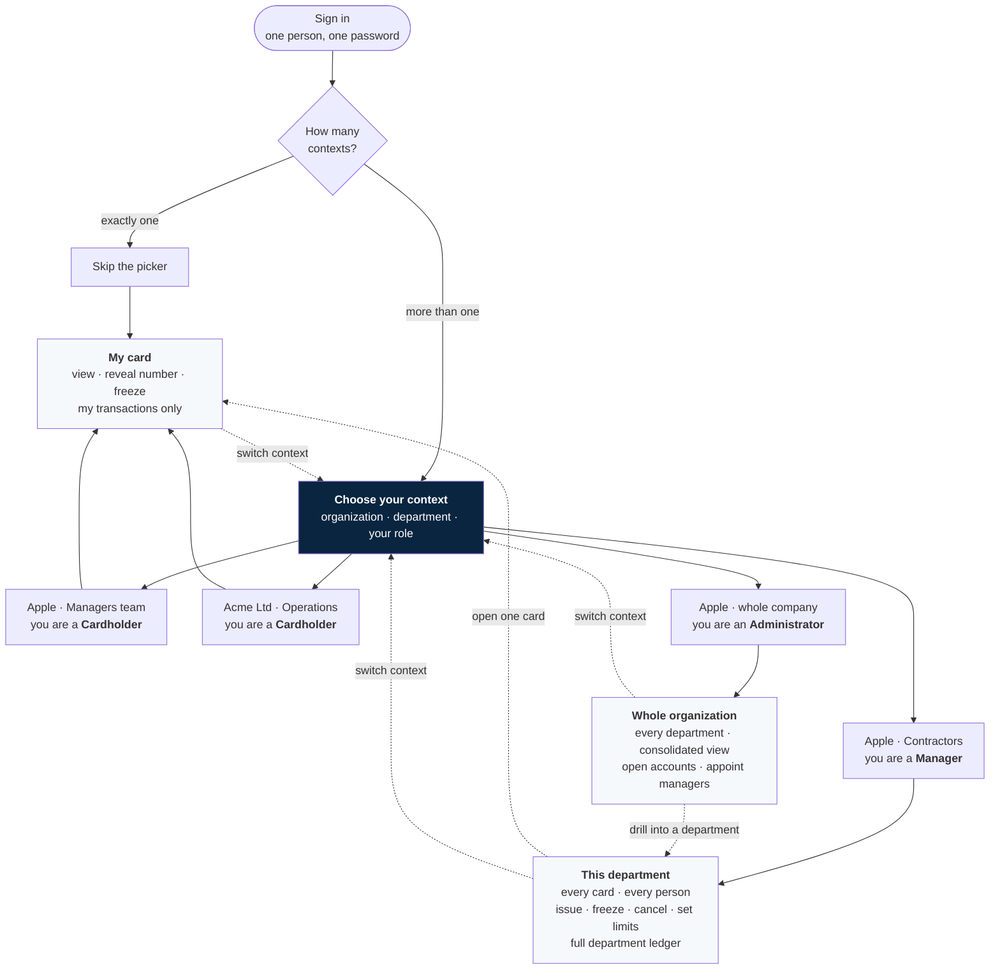
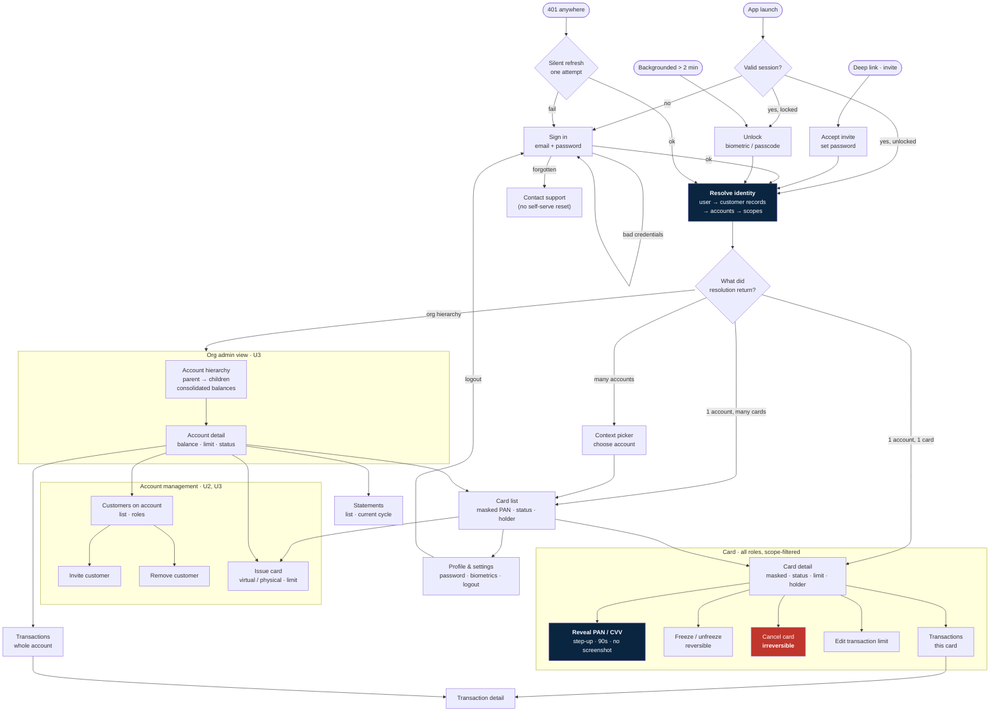
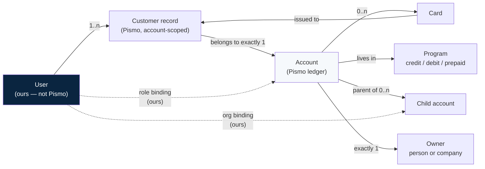

# Card Management App — Feature List & Primitive Layout

**Status:** working draft · **Date:** 2026-08-13
**Scope statement:** this app **manages cards and reads money**. It does not move money. Payment initiation (send / receive / add money — Part III of `card-app-complete-spec.md`, S17–S24) is **out of scope at this stage** and is not listed below.

---

## Part 0 — The application, in one page

### The one-paragraph version

One app, one login. Who you are decides what you see. A driver sees the one card he was given and can freeze it. His team's manager sees every card on that team's account and can issue, freeze and cancel them. The company's administrator sees every account and every card under the company. Same screens, different scope — the scope comes from the token, never from a parameter the app sends.

### The flow, in four steps

1. **Sign in.** One set of credentials. Not a card login, not an account login — a *person* login.
2. **Choose your context.** The app shows every place you have access, as one row each: *which organization · which department · what you are there*. Pick one.
3. **Manage.** The screens are the same for everyone. What is on them, and which buttons are live, comes entirely from the context you picked.
4. **Switch.** Change context at any time without signing out.

### The idea that makes this work: one login, many hats

**Access belongs to the context, not to the person.**

The same human can appear twice in the same company, at two completely different access levels, and both are correct:

> **Lee Wing** works at Apple. They hold a card on the **Managers team** account — that is their own spending card. They also run the **Contractors** sub-account, where a dozen contractor cards are issued.
>
> - Picking **Apple · Managers team** → they are a **cardholder**. One card, theirs. They can look at it, reveal it, freeze it, and read its transactions. They cannot see the other managers' cards or the team's total spend.
> - Picking **Apple · Contractors** → they are a **manager**. Every card on that sub-account, every contractor on it, the whole ledger. They can issue, freeze, cancel, and set limits.
>
> Same person, same password, same app. The second context is far more powerful than the first — and switching to it does not leak anything backwards into the first.

Two rules keep this honest:

- **You never hold two hats at once.** One context is active at a time. There is no merged super-view where the manager's power quietly applies to their personal card.
- **Reveal never travels with rank.** Lee Wing can freeze any contractor's card as a manager, but they can only reveal the full number of a card issued to *them*. Managing a card and reading its secrets are different rights.

Contexts can also span organizations entirely — a contractor working for two companies sees both, side by side, in one list.

### Overview diagram

The picker is the whole design. Everything after it is the same three screens, rendered at whatever scope the chosen context allows.

> **Where this sits technically:** the context list is the output of the *Resolve identity* step in [Part 3](#part-3--refined-flow). Each row is one `(organization, account, role)` triple. Picking a row is what produces the scoped token every later screen reads from.

---

## Part 1 — Definitions (Pismo model)

> Sourced from the Pismo developer documentation. The docs site is behind a bot-verification gate, so these were read from indexed documentation content rather than fetched live — the ones marked ⚠ should be re-confirmed against the live page before they are built against.

### Account
The foundational object for all financial operations. Transactions, fees, payments and statements attach to it; the ledger is based on it. An account has **balances and credit limits** as attributes, and contains the cards issued for it.

Each account lives inside a **Program**, and the program's type determines the account's type — credit, debit, or prepaid. This matters: the app's UI for a prepaid account and a credit account are not the same screen (a credit account has a due date, a statement cycle, and delinquency buckets; a prepaid one has a balance).

**Account statuses:** `NORMAL` (default at creation), `BLOCKED`, `CANCELLED`, `CLOSED`. Transaction-banking accounts add dormancy statuses. Custom statuses can be defined per org. ⚠

### Customer
Every account is required to have **at least one customer**. A customer is either a **person** or a **company**.

When an account is created it is established with a `person` or `company` object — that first customer is the **account owner**. Additional customers are added with the lighter-weight `customer` object (the `person` / `company` objects carry many fields the `customer` object does not).

**An account has many customers, but exactly one owner.** Multiple customers on one account is how joint accounts and shared-balance cards work.

### ⚠ Unresolved contradiction in the Pismo docs

Two statements appear in Pismo's own account documentation:

| Statement | Implication |
|---|---|
| "A customer can have multiple accounts also. For example, a person may have an account associated with a corporate credit card and another associated with a debit card." | A single identity spans accounts. |
| "A customer can only belong to one account." | A `customer` record is account-scoped. |

**How we resolve it, and how we should build regardless:** treat `person` (or `company`) as the org-wide identity, and `customer` as the *link record* between that identity and one account. One person → many customer records → many accounts. This satisfies both statements and is the only model that supports the Mr. Zhang case below.

**Consequence for us:** the app's login identity is **not** a Pismo customer id. It is our own `User`, which resolves to a *set* of `(customer_id, account_id)` pairs. This is the single most important design fact in this document.

### Account hierarchies
A parent/child relationship can be defined between accounts. Pismo's **Get related accounts** endpoint returns balances and limits for all related accounts under a parent, up to two levels of children, within the same Org.

**This is how "Apple, the company" is represented.** Apple is the parent account; "Drivers team", "Sales team", "Contractors" are child accounts. The org administrator's view is a walk of that hierarchy — not a bespoke query we invent.

### Card
Belongs to an account, issued to a customer on that account. `VIRTUAL` or `PHYSICAL`. Mode `SINGLE` or `MULTIPLE`. Carries a transaction limit, a printed name, an expiry, and (for virtual) a rotating CVV.

**Card statuses** include `ACTIVE`, `BLOCKED`, and a set of **termination** statuses. Transition rules: a termination status cannot go back to active or temporarily-blocked; a termination status can move to another termination status; a temporary status can move to another temporary status. ⚠ — the full enum table must be read off the live page before the freeze/unfreeze UI is finalised.

**This is why "freeze" and "cancel" are different buttons with different consequences.** Freeze is reversible. Cancel is not. The UI must never present them as siblings.

---

## Part 2 — User types

Five types. The first three are app users; the fourth is a console user; the fifth is optional but cheap.

### U1 · Cardholder
**Who:** Chan Taiman, the driver.
**Identity:** one `person`, one or a few `customer` records, each on one account.
**Sees:** only the cards issued **to him**, on the accounts he is a customer of. Balance of those cards. Transactions on those cards.
**Can:** view masked card, reveal PAN/CVV under step-up, freeze/unfreeze **his own** card, view his transactions and statements, change his own password.
**Cannot:** see other people's cards on the same account, issue cards, add or remove customers, see account-level totals.

> The nuance that makes this hard: Chan Taiman is a customer on a **shared-balance** account. He can see *his card's* activity, but he should not necessarily see the account's whole ledger — because that includes other drivers' spending. **This is a policy decision we have not made.** See Open Question 3.

### U2 · Account manager
**Who:** the drivers-team supervisor.
**Identity:** a customer on one account, flagged in **our** system as manager of it. Pismo has no "manager" concept — it has an owner, and that is not the same thing.
**Sees:** every card on that one account, every customer on it, the account balance and limit, the full transaction ledger and statements for the account.
**Can:** everything U1 can, plus — issue a new card on the account, freeze/unfreeze/cancel **any** card on it, set per-card transaction limits, invite a person as a customer of the account, remove a customer.
**Cannot:** touch sibling accounts, create accounts, change program configuration.

### U3 · Organization administrator
**Who:** Mr. Zhang.
**Identity:** bound to the **parent account** / org, not to a single child account.
**Sees:** the whole account hierarchy under the company — every child account, every card, every customer, consolidated balances and limits.
**Can:** everything U2 can, on **every** account in the hierarchy, plus — open a new child account (submit an account application), promote/demote account managers, view consolidated reporting.
**Cannot:** change program definitions, exchange rates, or anything at issuer level.

### U4 · Issuer / back-office operator
**Who:** YedPay operations.
**Surface:** not this app. A separate console, or direct API access.
**Can:** create programs, set exchange rates, run account applications end-to-end, override statuses, handle disputes and delinquency, reset user credentials.
**Why it is listed here anyway:** every "the app cannot do X" in this document has to land somewhere, and it lands here. Password reset is the live example — the app has no reset flow, so it is a U4 action today.

### U5 · Auditor (read-only) — optional
**Who:** finance, compliance, external audit.
**Can:** read accounts, cards (masked only — **never** reveal), transactions and statements across a defined scope.
**Cannot:** mutate anything, ever. No reveal, no freeze, no issue.
**Why include it:** it is the same screens as U3 with every write scope removed, so it costs almost nothing and it is the role most often asked for after launch.

### Permission model

Roles are a *label*. The token carries **scopes**, and the UI renders off scopes — never off a role string. This keeps U5 free and keeps role changes from becoming UI changes.

| Scope | U1 Cardholder | U2 Acct manager | U3 Org admin | U5 Auditor |
|---|:--:|:--:|:--:|:--:|
| `account:read` | own, limited | ✅ one | ✅ hierarchy | ✅ scope |
| `account:create` | — | — | ✅ | — |
| `account:status` | — | — | ✅ | — |
| `customer:read` | self | ✅ one account | ✅ hierarchy | ✅ |
| `customer:invite` | — | ✅ | ✅ | — |
| `customer:remove` | — | ✅ | ✅ | — |
| `card:read` | own cards | ✅ one account | ✅ hierarchy | ✅ masked |
| `card:reveal` | ✅ own only | ✅ own only¹ | ✅ own only¹ | ❌ **never** |
| `card:block` | ✅ own only | ✅ any on account | ✅ any | — |
| `card:cancel` | — | ✅ | ✅ | — |
| `card:issue` | — | ✅ | ✅ | — |
| `card:limits` | — | ✅ | ✅ | — |
| `txn:read` | own card | ✅ account | ✅ hierarchy | ✅ |
| `statement:read` | own | ✅ account | ✅ hierarchy | ✅ |

¹ **Reveal is never delegable.** A manager may freeze someone else's card; a manager may not read someone else's PAN. This is not a UX preference — it is the line between card management and card fraud, and the backend must enforce it, not the app.

---

## Part 3 — Refined flow

### What changed from the earlier draft

The old spec assumed **one user ↔ one customer ↔ one account ↔ one card**, and that the backend derives everything from the session so the app never sends an id. That assumption is now wrong in two places:

1. A user can hold **several** `(customer, account)` pairs, so there is a **scope-resolution step** after login and possibly a **context picker**.
2. Managers and admins address cards that are **not theirs**, so the app *does* send an `account_id` and `card_id`. The session no longer implies the target — it only bounds it. **Authorization moves from "the backend can't address anything else" to "the backend must check every id against the token's scope."** That is a real, deliberate downgrade in safety posture and needs server-side enforcement to compensate.

The single-card fast path is preserved: if resolution yields exactly one account with one card, skip every picker and land on the card.

### Main flow

Three nodes are load-bearing:

- **Resolve** (navy) — the step that did not exist before. Everything downstream is a projection of what it returns.
- **Reveal** (navy) — step-up gate. Own card only, for every role.
- **Cancel** (red) — the only irreversible action in the app now that money movement is out of scope.

### Identity resolution, in detail

The dotted lines are **ours to build**. Pismo gives us the solid ones. There is no Pismo object that says "this login can manage that account" — that table is entirely on our side, and it is the authorization system.

---

## Part 4 — Feature list

Legend for **Backend**: 🟢 endpoint exists on the gateway today · 🟡 exists in Pismo, not exposed on our gateway · 🔴 does not exist anywhere, must be built.

### A · Identity & session

| # | Feature | Roles | Backend |
|---|---|---|---|
| F1 | Accept invite via deep link, set password | all | 🔴 |
| F2 | Sign in with email + password | all | 🔴 |
| F3 | Session token with **scopes**, silent refresh, expiry | all | 🔴 |
| F4 | Identity resolution → customers, accounts, scopes | all | 🔴 |
| F5 | Biometric unlock + auto-lock after 2 min background | all | — (client) |
| F6 | Change own password | all | 🔴 |
| F7 | Password reset | all | 🔴 — **gap, U4 handles manually today** |
| F8 | Logout, wipe tokens from Keychain/Keystore | all | — (client) |
| F9 | Step-up authentication for reveal | all | 🔴 |

**F1–F9 do not exist in any form.** The gateway authenticates with `x-api-key` only, described in its own spec as: *"Clients authenticate only with x-api-key; Pismo credentials, access tokens, and refresh logic are managed internally by the microservice."* That is a machine-to-machine contract. A mobile app cannot hold an `x-api-key` — shipping one in a binary hands every account to anyone who unzips the IPA. **This is the blocking prerequisite for the entire app**, ahead of block-card and everything else.

### B · Accounts

| # | Feature | Roles | Backend |
|---|---|---|---|
| F10 | View account: balance, limit, status, program type | U1(own) U2 U3 U5 | 🟢 `GET /accounts/{accountId}` |
| F11 | List accounts I have access to | all | 🔴 (derived from F4) |
| F12 | Account hierarchy tree, consolidated balances | U3 U5 | 🟡 Pismo *Get related accounts* |
| F13 | Switch account context | U2 U3 U5 | — (client) |
| F14 | Open new child account (application) | U3 | 🟢 `POST /accounts/applications` + `GET`/`PATCH /{applicationId}` |
| F15 | Track application status | U3 | 🟢 `GET /accounts/applications/{applicationId}` |
| F16 | Change account status (block / cancel / close) | U3 | 🟢 `PATCH /accounts/{accountId}` (`status`) |
| F17 | Change credit limit / billing cycle day | U3 | 🟢 `PATCH /accounts/{accountId}` |

### C · Customers

| # | Feature | Roles | Backend |
|---|---|---|---|
| F18 | List customers on an account | U2 U3 U5 | 🔴 — **`Customers` tag exists on the gateway with zero endpoints** |
| F19 | View customer detail | U2 U3 U5 | 🔴 |
| F20 | Invite a person as customer of an account | U2 U3 | 🔴 |
| F21 | Remove a customer from an account | U2 U3 | 🔴 |
| F22 | Assign / revoke account-manager role | U3 | 🔴 (our own role table) |

### D · Cards

| # | Feature | Roles | Backend |
|---|---|---|---|
| F23 | List cards on an account | U2 U3 U5 | 🟢 `GET /cards?account_id=` |
| F24 | List cards for a customer on an account | U1 U2 U3 | 🟢 `GET /cards/customers/{cid}/accounts/{aid}/cards` |
| F25 | Card detail — masked PAN, expiry, status, limit, holder | all | 🟢 `GET /cards/{cardId}` |
| F26 | Card balance | U1(own) U2 U3 U5 | 🟢 `GET /cards/balance/{aid}/{cid}` |
| F27 | **Reveal full PAN + CVV** under step-up, 90s, screenshot-blocked | own card only | 🔴 — **not exposed** |
| F28 | **Freeze / unfreeze card** | U1(own) U2 U3 | 🟡 Pismo `PUT /wallet/v1/customers/{cid}/accounts/{aid}/cards/{cardId}/status` |
| F29 | **Cancel card** (irreversible, termination status) | U2 U3 | 🟡 same endpoint, termination status |
| F30 | Issue new card (virtual / physical) | U2 U3 | 🟢 `POST /cards/issue` |
| F31 | Set / edit transaction limit on a card | U2 U3 | 🔴 — issue-time only today |
| F32 | Activate a physical card | U1 U2 | 🟡 |
| F33 | Reissue / replace a lost card | U2 U3 | 🟡 Pismo card reissuing |
| F34 | Set / change PIN | U1 | 🟡 — `pin_length` accepted at issue, no PIN management |
| F35 | Add to Apple Pay / Google Pay | U1 | 🟡 Pismo tokenization |

**F27, F28, F29 are the named gaps.** F28/F29 are the "block card and so on" the brief calls out — Pismo has the endpoint, our gateway does not proxy it. F27 is worse: it is the app's headline feature and there is no path to it at all today.

### E · Transactions & statements

| # | Feature | Roles | Backend |
|---|---|---|---|
| F36 | Transaction list, filtered and paginated | all, scoped | 🟢 `GET /transactions` (rich filters incl. `customerId`, date range, paging) |
| F37 | Transaction detail | all, scoped | 🟢 `GET /transactions/{transactionId}` |
| F38 | Transactions scoped to one card | U1 | 🟡 — filters by account/customer, **not by card** |
| F39 | List statements for an account | U1(own) U2 U3 U5 | 🟢 `GET /statements/accounts/{accountId}` |
| F40 | Current open statement | same | 🟢 `.../current` |
| F41 | Interest accruals (credit programs) | U2 U3 U5 | 🟢 `.../interest-accruals` |
| F42 | Delinquency buckets / arrears | U2 U3 U5 | 🟢 `GET /delinquency/accounts/{accountId}/buckets` |
| F43 | Statement as a shareable PDF | U1 U2 U3 | 🔴 — Pismo supplies data, **rendering is ours** |
| F44 | Programs: due dates, calendars | U2 U3 | 🟢 `GET /programs/{programId}/due-dates`, `GET /programs/calendars` |

F38 is a small but real gap: a cardholder on a shared-balance account filtered only by `customerId` may see transactions from cards that are not his. Either the filter gains a card dimension or the app filters client-side — and client-side filtering of data the server already sent is not access control.

### F · Cross-cutting

| # | Feature | Roles | Backend |
|---|---|---|---|
| F45 | Loading / empty / error / offline states everywhere | all | — |
| F46 | Push notification on card status change or transaction | all | 🔴 — webhooks exist for VCAS 3DS only |
| F47 | Audit log of who froze / cancelled / issued what | U3 U5 | 🔴 |
| F48 | 3DS step-up during a purchase (VCAS) | U1 | 🟢 `POST /webhooks/vcas` — **inbound to us**; the in-app half is 🔴 |

F48 is worth flagging: the gateway already receives Visa 3DS step-up webhooks. Something has to present that challenge to the cardholder, and this app is the natural place. It is not payment *processing* — it is authenticating a payment someone else is processing — so it stays in scope, but it is unbuilt on the app side.

### Explicitly out of scope now

Send money, receive money, add money, payee book, transfers, cash-in/cash-out. Specified in `card-app-complete-spec.md` Part III (S17–S24) and PRD F10–F13. **Those sections are deferred, not cancelled** — the `Api` seam keeps them cheap to add later. Do not build them now.

---

## Part 5 — What actually blocks us

In dependency order. Nothing below the first item matters until the first item is solved.

| # | Blocker | Blocks |
|---|---|---|
| 1 | **No end-user authentication anywhere.** `x-api-key` is machine-to-machine and cannot ship in a mobile binary. We need a BFF that holds the API key server-side and issues scoped user tokens. | Literally everything |
| 2 | **No authorization model.** Pismo has no concept of "this login manages that account". The user↔account↔role table, and the check on every request, are ours. | U2, U3, U5 entirely |
| 3 | **No customer endpoints.** The `Customers` tag on the gateway is empty. | F18–F22 |
| 4 | **No card status endpoint.** Freeze, unfreeze, cancel. Exists in Pismo, unproxied. | F28, F29 |
| 5 | **No PAN/CVV reveal endpoint.** | F27 — the headline feature |
| 6 | **No account hierarchy endpoint.** Pismo's *Get related accounts*, unproxied. | F12, the whole U3 experience |
| 7 | Statement PDF rendering — composition, storage, link expiry, retention. | F43 |
| 8 | Card-event webhooks → push. | F46, F47 |

### Product decisions still open

1. **Does an account manager exist as a distinct role, or is U2 just U3 scoped to one account?** Collapsing them is simpler and probably right; splitting them is more accurate to how a company delegates. Affects the role table, not the screens.
2. **Is the org administrator bound to the parent *account*, or to a company entity above accounts?** Pismo's hierarchy suggests the former. If Apple has account trees that are not connected to each other, the former breaks.
3. **On a shared-balance account, does a cardholder see the whole account ledger or only their own card's activity?** Only-own is the safe default and the one to ship. Whole-ledger is what a "shared account" arguably means. Blocks F36/F38.
4. **Which program types are we launching on?** Credit implies statements, due dates, delinquency and interest — a materially larger app than prepaid. The gateway exposes all four surfaces, which suggests credit, but that has not been stated.
5. **Physical cards, yes or no?** F32/F33/F34 exist only if yes. `CreateCardDto` accepts `PHYSICAL`, so the backend assumes yes.

---

*Supersedes the account/customer assumptions in `card-app-complete-spec.md` §1 ("one user ↔ one customer ↔ one account ↔ one active card") and its §3 master flow. The screen specs in Parts I–II and IV–VII of that document remain valid for the single-cardholder path.*
