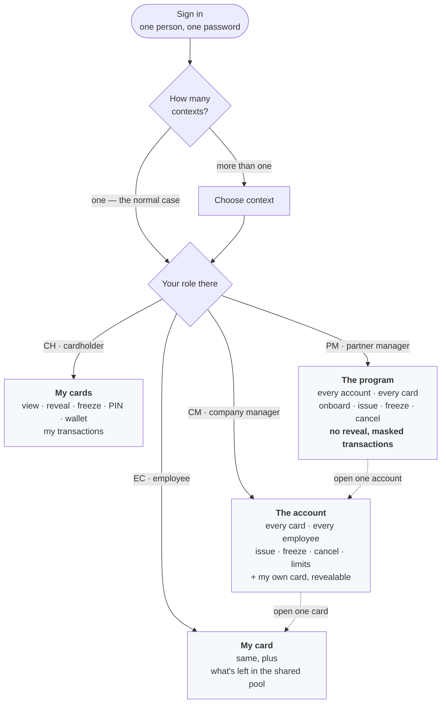
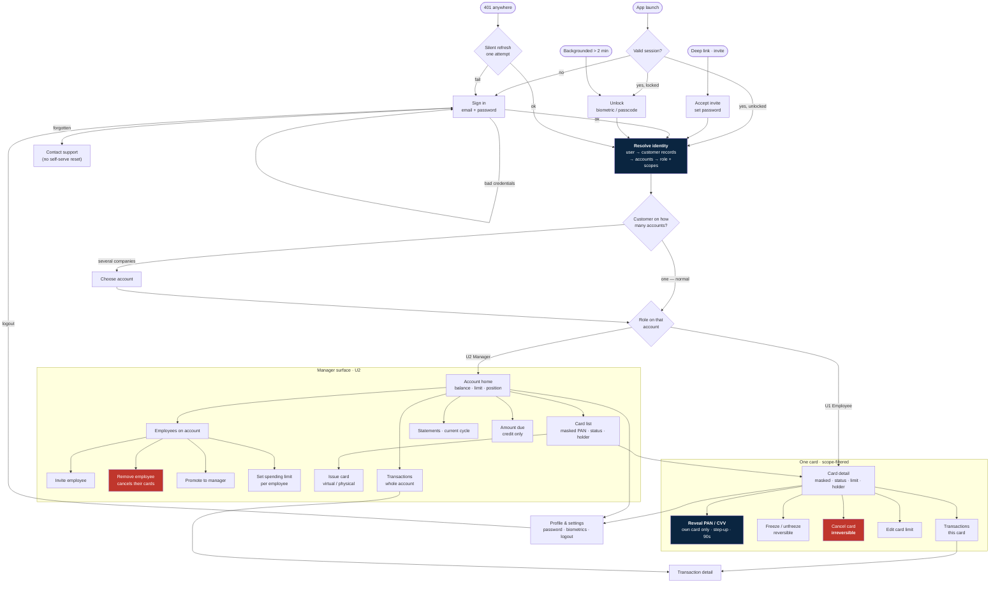
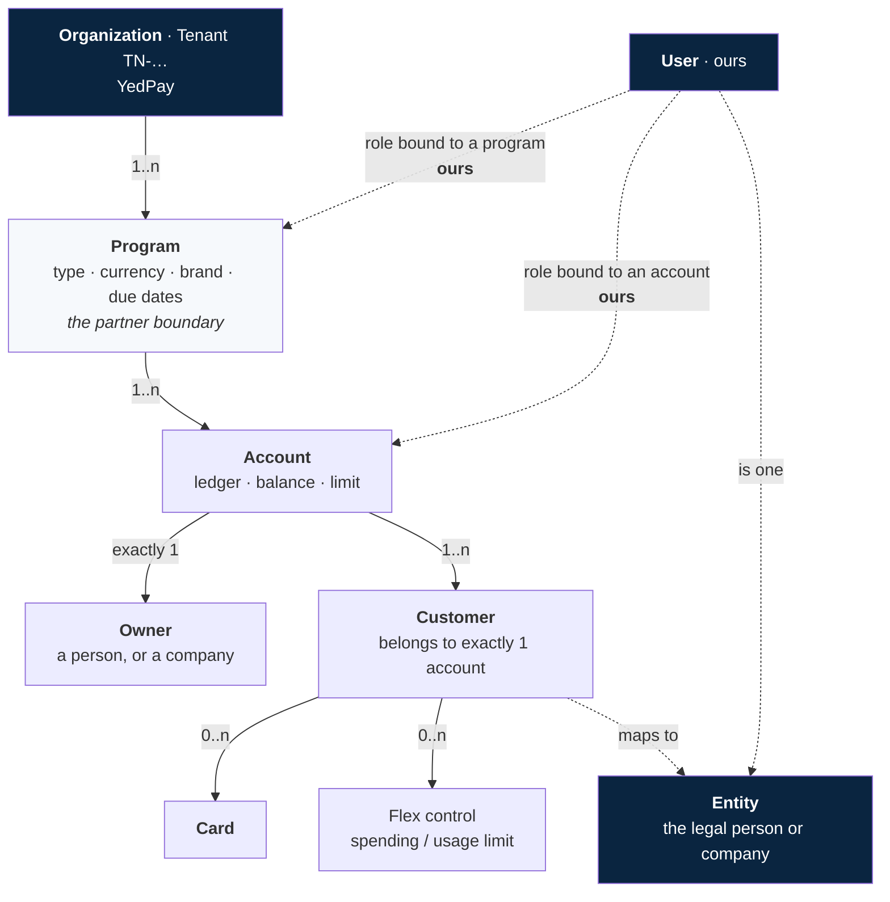

# Card Management App — Feature List & Primitive Layout

**Status:** working draft · **Date:** 2026-08-13
**Revised:** 2026-08-19 — reshaped around the verified Pismo object model (Org → Program → Account → Customer → Card, with Entity as identity). One company, one account; partners are programs; personal, company and partner-issued shapes all supported.
**Scope statement:** this app **manages cards and reads money**. It does not move money. Payment initiation (send / receive / add money — Part III of `card-app-complete-spec.md`, S17–S24) is **out of scope at this stage** and is not listed below.

---

## Part 0 — The application, in one page

### The one-paragraph version

One app, four kinds of user, one build. A person we issue a card to directly signs in and sees their card, their spending, and everything they need to look after it. A company holds **one account**; its employees are **customers** on that account, each with a card drawing on a shared pool, and a manager of that account sees every card and every employee. A **partner** — a company issuing cards under its own brand in collaboration with us — gets a program of its own and oversees the accounts inside it. Same screens throughout; what appears comes from your role, never from a parameter the app sends.

### The three shapes

```
Organization: YedPay (the Tenant)
  │
  ├── Program: YedPay Direct
  │     ├── ① Personal account      owner = a person
  │     │      └── their cards
  │     └── ② Company account       owner = Apple Inc.
  │            ├── Lee Wing    · manager  → card 4417 + spending limit
  │            └── Chan Taiman · employee → card 8802 + spending limit
  │
  └── Program: Acme Co-brand        ← ③ a partner
        ├── Account (Acme's end-customer)
        ├── Account (Acme's end-customer)
        └── …                        Acme oversees these, never reads their PANs
```

Two things follow, and they shape every screen:

- **A company has one account.** Departments — "Drivers", "Contractors", "Sales" — are **a label in our system plus a per-employee spending limit**, not separate accounts. See Part 1.
- **A partner is a Program, not an account.** So a company manager's unit of management is the **customer**, and a partner manager's is the **account**. Different noun, different tab.

### The flow, in four steps

1. **Sign in.** One set of credentials. Not a card login, not an account login — a *person* login.
2. **Land on your account.** Almost everyone has exactly one, and goes straight to it.
3. **Manage.** The screens are the same for everyone. What is on them, and which buttons are live, comes entirely from your role on that account.
4. **Switch**, only if you have more than one account — see below.

### Four kinds of user

| | **CH** Cardholder | **EC** Employee | **CM** Company manager | **PM** Partner manager |
|---|---|---|---|---|
| Where they live | their own personal account | a company account | a company account | a program |
| Sees | their cards | the card issued to them | every card on the account | every account in the program |
| Balance | theirs | what they spent + what's left in the pool | the account's full position | totals across the program |
| Transactions | own | own card only | everyone on the account | program-wide, **masked by default** |
| Manages | nothing | nothing | **customers** | **accounts** |
| Reveal someone else's number | n/a | no | no | **never** |
| Tabs | 3 | 3 | 5 | 5 |

**An account can have several managers.** Pismo allows exactly one *owner*, and that owner is the company itself; "manager" is our own role, so it is not constrained to one person. Part 1 explains why the distinction matters.

**A manager usually also holds a card.** That is the normal case, not an edge case, and it puts two zones on one screen: *my card*, whose number they may reveal, and *the account's cards*, which they may manage but never reveal. Managing a card and reading its secrets are different rights.

### When does someone have more than one account?

Only when they work for **more than one company**. A contractor with cards from two firms is a customer on two accounts, so they pick which one they are working in and can switch without signing out.

Within a single company there is nothing to switch between — one account, one role on it.



---

## Part 1 — Definitions (Pismo model)

> Read directly from the Pismo developer documentation on 2026-08-17 (`developers.pismo.io/pismo-docs/llms.txt` serves every page as markdown). Quoted text is verbatim. Nothing here is second-hand any more.

### Organization, Program, Entity

Verified against Pismo's *Core objects* reference, 2026-08-19.

| Object | Pismo's words | Ours |
|---|---|---|
| **Organization** | *"Defines your company or enterprise. Contains one or more programs."* ID is the Tenant ID, `TN-…` | **YedPay.** The root. One org. |
| **Program** | *"Defines a set of parameters for a group of accounts."* Carries type, currency, brand, due dates; accounts inherit what they do not define | **The partner boundary**, and the product definition |
| **Entity** | *"A legal entity (person, company, or organization)"* — and *"multiple customers with different customer IDs could all map to the same entity object, meaning they are all the same person or company"* | **Identity.** What a login represents |

**Program types:** `CREDITO`, `CREDITO ZERO-BALANCE`, `DEBITO`, `DEBITO ZERO-BALANCE`, `PRE-PAGO`, `PRE-PAGO ZERO-BALANCE`, `VOUCHER`. Full- vs zero-balance is a card-network integration model, invisible to the cardholder. The app cares about credit, debit and prepaid; voucher is a prepaid variant a partner may want.

### Partners are programs, not sub-organizations

A company that issues cards **in collaboration with us** — its brand on the card, its own end-customers — is **one or more Programs inside our Org**. Not a sub-org, not a parent account.

```
Organization: YedPay  (TN-…)
  ├── Program: YedPay Direct        → personal + company accounts
  ├── Program: Acme Co-brand        → Acme's end-customers, one account each
  └── Program: Beta Retail Prepaid  → …
```

Consequences:

- A partner's oversight scope is a **`program_id`**, not an `account_id`. Their unit of management is the **account**; a company manager's is the **customer**.
- Program carries the brand, currency, type and due dates, so a partner's product is configured once at onboarding rather than per account.
- `Transfer account to different program` is permitted only when program type, currency, brand and due date all match — so an account cannot be moved between partners casually.
- Our gateway already thinks in programs: `GET /programs/calendars` **requires** an `x-program-id` header.

### Identity is the Entity

Our `User` maps to one Pismo **entity**. That entity holds one `customer` record per account. This resolves the contradiction an earlier draft flagged: *Core objects* states flatly that *"a customer can only belong to one account"*, while the accounts guide says a customer may have several — the customer is the **link**, the entity is the **person**.

> ⚠ **Do not build on entity lookup.** Pismo: *"To search an organization's data using an entity ID, contact our Service Desk and request this."* Entity search is disabled by default. The BFF keeps its own `user → [(customer_id, account_id)]` table. Entity is the concept we mirror, not an API we call.

### Account
The foundational object for all financial operations. Transactions, fees, payments and statements attach to it; the ledger is based on it. An account has **balances and credit limits** as attributes, and contains the cards issued for it.

Each account lives inside a **Program**, and the program's type determines the account's type — credit, debit, or prepaid.

**Credit is in scope** (decided 2026-08-17), alongside prepaid and debit. That makes program type a **second axis, independent of role**:

> **Role decides what you can see and do. Program type decides what the numbers mean.**

They compose. A cardholder on a prepaid account and a cardholder on a credit account get the same *permissions* and different *screens*. Every balance-bearing screen has to read the program type and render accordingly — this is not one conditional in one place.

| | Prepaid / debit | Credit |
|---|---|---|
| Headline number | Balance available | **Available credit** + **balance owed** |
| Cycle | None | Statement cycle with a closing date |
| Obligation | None | **Amount due** by a **due date**, and a minimum payment |
| Cost of carrying | None | **Interest accruals** |
| Falling behind | Not possible | **Delinquency buckets**, and cards blocked as a consequence |
| Statements | A period of activity | A closed cycle with a due date and a balance |

### ⚠ Credit creates an obligation this app cannot discharge

A credit account has a bill. The gateway exposes the bill — current statement, amount due, due date, interest accruals, delinquency buckets — and the app will show it.

**But payment initiation is out of scope.** So the app can display *"HK$12,400 due in 5 days"* and offer no way to pay it. That is a support-call generator and, if the due date passes, a delinquency the user watched approach and could not act on.

Three ways out, in order of preference:

1. **Tell them where to pay.** The due panel carries an explicit "settled by bank transfer / direct debit / your finance team" line, per deployment. Cheap, honest, ships now.
2. **Bring statement payment into scope** as the *one* money-movement feature. Pismo supports it; it is a narrow, single-payee, single-purpose flow — much smaller than the deferred Part III.
3. **Ship credit without the due panel.** Worst option: the information exists and hiding it does not make the obligation go away.

**This needs a decision before credit ships.** Option 1 is the default assumed throughout these documents.

**Account statuses** — corrected 2026-08-17. The pre-defined enum is:

| Status | Meaning |
|---|---|
| `NORMAL` | Active, cash-in and cash-out both allowed. The default at creation. |
| `DEBIT_ONLY` | Active; cash-out allowed, cash-in not. |
| `BLOCKED` | **Temporary.** Cash-in only. Can move to `DEBIT_ONLY`, `NORMAL` or `CANCELLED`. |
| `CANCELLED` | Final. No movement in or out — **but recoverable** via *Roll back account status*. |

There is no `CLOSED` status; an earlier draft listed one in error. Custom statuses can be defined per org, with optional status *reasons* (court order, fraud attempt). Transaction-banking accounts add dormancy statuses. Credit accounts also carry a separate *collection status* such as `OVERDUE`.

### Customer
Every account is required to have **at least one customer**. A customer is either a **person** or a **company**.

When an account is created it is established with a `person` or `company` object — that first customer is the **account owner**. Additional customers are added with the lighter-weight `customer` object (the `person` / `company` objects carry many fields the `customer` object does not).

**An account has many customers, but exactly one owner.** Multiple customers on one account is how joint accounts and shared-balance cards work.

### Ownership is single and transferable — verified

From *Create customer*, verbatim:

> "You can add multiple customers to an account but **only one can be the account owner**. Other customers can have their own individual cards, but **the balances on those cards must be shared with the account owner**."

And on setting `customer.is_owner = true`:

> "The account owner is **changed** to this new customer, and all existing customers remain active in the account."

— which fires an **Account owner changed** event. So `is_owner` **transfers** ownership; it never creates a second owner. Two owners is not merely discouraged, it is unrepresentable.

**This is why our manager role cannot be Pismo's owner**, and the separation recorded in Part 2 is now proven rather than assumed. The company is the owner; managers are ours.

The second quote also settles the shared-balance question: every additional customer's card **draws on the owner's balance**. One account is one pool, by construction.

### `is_active` does not restrict anything — a trap

From *Overwrite customer*, verbatim:

> "This endpoint allows you to mark the customer on the account as active or inactive using the `is_active` field. **This field is informative only. There are no restrictions that prevent inactive customers from performing any actions.**"

So marking a departed employee inactive does **nothing** to stop them spending. Removing someone's access means **cancelling their cards** and revoking their session on our side. Anyone who assumes `is_active = false` is an off-switch has built a security hole. See F52.

`is_active = true` does have one effect: the customer counts against the `Maximum number of card holders` program parameter.

### One company, one account

**Corrected 2026-08-17.** An earlier draft of this document modelled departments as **child accounts** under a company parent. That was wrong for this product, on four counts:

1. **Our gateway cannot create the tree.** `CreateApplicationDto` carries `{submit, applicant, due_date, program_id}` and `UpdateAccountDto` carries `{status, credit_limit, billing_cycle_day, metadata}`. **Neither has `parent_account_id`.** The child-account model is unreachable through the backend we actually have.
2. **Pismo's own primitive for this is one account with many customers.** From *Create customer*: *"You can add multiple customers to an account but only one can be the account owner. Other customers can have their own individual cards, but the balances on those cards must be shared with the account owner."* That is the shared-pool scenario, natively, with no hierarchy involved.
3. **Pismo expects many cardholders per account.** `Maximum number of card holders` is a **program parameter** — a configurable cap on how many customers can hold cards on one account. You do not get given a cap for something you are not expected to do.
4. **Per-employee budgets do not need sub-accounts.** *Customer flex controls* set `spending_limit` and `usage_limit` per customer, with `limit_duration` and `reset_period`. "Each contractor gets HK$5,000 a month" is one flex control on one customer, not a child account.

**The model:**

```
Company (Apple)
  └── ONE account          ← the ledger, the shared balance, the credit limit
        ├── owner: Apple Inc.        (company object, exactly one)
        ├── customer: Lee Wing       → card 4417   + flex control
        ├── customer: Chan Taiman    → card 8802   + flex control
        └── customer: …              → …
```

Departments — "Drivers", "Contractors", "Sales" — are **a label in our system plus a flex control per customer**. They are not Pismo objects.

### Account hierarchy — deferred, not deleted

Pismo does support account trees, and if YedPay later needs genuine budget separation between divisions, this is the escape hatch:

- `parent_account_id` on the account object links parent to child; depth is unlimited.
- **Get related accounts** returns parent + children + grandchildren — three levels — as a **flat array with the parent/child links stripped**, so a tree has to be rebuilt from each account's `parent_account_id`.
- **Get account hierarchy ascendants** (v4) walks *upward*, returning each ancestor with its level and *centralizer* status.

None of it is exposed on our gateway. **Do not build against it.** Reach for it only when per-customer flex controls prove insufficient, and expect gateway work first.


### Card
Belongs to an account, issued to a customer on that account. `VIRTUAL` or `PHYSICAL`. Mode `SINGLE` or `MULTIPLE`. Carries a transaction limit, a printed name, an expiry, and (for virtual) a rotating CVV.

**Card statuses** include `ACTIVE`, `BLOCKED`, and a set of **termination** statuses. Transition rules: a termination status cannot go back to active or temporarily-blocked; a termination status can move to another termination status; a temporary status can move to another temporary status. ⚠ — the full enum table must be read off the live page before the freeze/unfreeze UI is finalised.

**This is why "freeze" and "cancel" are different buttons with different consequences.** Freeze is reversible. Cancel is not. The UI must never present them as siblings.

---

## Part 2 — User types

**Four app personas** (revised 2026-08-19). With one account per company there is no tree to administer, so the old "organization administrator" tier is gone — but the partner use case adds a genuinely new scope, above many accounts in one program.

[Screens-and-flows.md](Screens-and-flows.md) uses these codes: **CH** cardholder · **EC** employee cardholder · **CM** company manager · **PM** partner manager · **AU** auditor · **BO** back-office. Mapping to the U-codes below: U1 = CH and EC, U2 = CM, **U6 = PM** (new), U5 = AU, U4 = BO.

What is left:

| Code | Role | Surface |
|---|---|---|
| **U1** | Employee cardholder — *additional customer (AC)* | the app |
| **U2** | Manager — *primary customer (PC)*, several per account | the app |
| ~~U3~~ | ~~Organization administrator~~ | **folded into U2** — see below |
| **U6** | Partner program manager — *PM* | the app |
| **U4** | Issuer / back-office operator | a separate console |
| **U5** | Auditor — read-only, optional | the app |

The U-codes are kept because the feature tables reference them; U3 simply no longer appears.

### U1 · Cardholder — *additional customer (AC)*
**Who:** Chan Taiman, the driver.
**Identity:** one `person`, one or a few `customer` records, each on one account.
**Sees:** only the cards issued **to him**, on the accounts he is a customer of. Balance of those cards. Transactions on those cards.
**Can:** view masked card, reveal PAN/CVV under step-up, freeze/unfreeze **his own** card, view his transactions and statements, change his own password.
**Cannot:** see other people's cards on the same account, issue cards, add or remove customers, see account-level totals.

> **Settled:** Chan Taiman is a customer on a **shared-balance** account. He sees three things — his own transactions, what he has spent, and the balance still available on the shared pool. He never sees another driver's activity or who consumed the rest of the pool. Detail in Screens-and-flows §2.

### U2 · Account manager — *primary customer (PC)*
**Who:** the drivers-team supervisor.
**Identity:** a customer on the company's single account who **also holds our manager role** for it. Several people can be PC of the same account — Pismo's one-owner rule constrains the owner, not our role.

> **PC is not Pismo's account owner.** Pismo permits exactly one owner per account, and for a corporate account that owner should be **the company** — `Apple Inc.`, a `company` object, not a human. Our PC role is a row in our own authorization table, `(user, account, role)`, and any number of people can hold it. Keeping these separate is what lets a manager appoint a deputy without surrendering their own rights, and it means no Pismo object changes when a manager is appointed.
**Sees:** every card on that one account, every customer on it, the account balance and limit, the full transaction ledger and statements for the account.
**Can:** everything U1 can, plus — issue a new card on the account, freeze/unfreeze/cancel **any** card on it, set per-card transaction limits, invite a person as a customer, remove a customer, and **promote another customer to PC** directly — there is no higher in-app tier to escalate to.
**Cannot:** create accounts, change the account's credit limit or status, change program configuration, or override the per-org transaction-visibility policy. All of those are back-office (U4).

### ~~U3 · Organization administrator~~ — folded into U2

**Removed 2026-08-17.** This role existed to walk a tree of departmental child accounts. There is no tree: one company, one account. Everything U3 could do, a U2 manager now does on the single account — issue, freeze, cancel, re-limit, add and remove employees, promote another manager.

Two U3-only powers needed rehoming:

| U3 power | Where it went |
|---|---|
| Open a new child account | **U4.** Account creation is a back-office act, and our gateway has no `parent_account_id` anyway. |
| Set org-wide policy no manager can override | **U4**, as per-org configuration. A manager switching off their own visibility of employee spending is self-limiting, and nobody does that voluntarily — so it was never really a manager's control. See F53. |

If YedPay later needs genuine multi-account divisions, U3 comes back **with** the account-hierarchy work in Part 1. Not before.

### U4 · Issuer / back-office operator
**Who:** YedPay operations.
**Surface:** not this app. A separate console, or direct API access.
**Can:** create programs, set exchange rates, run account applications end-to-end, override statuses, handle disputes and delinquency, reset user credentials.
**Why it is listed here anyway:** every "the app cannot do X" in this document has to land somewhere, and it lands here. Password reset is the live example — the app has no reset flow, so it is a U4 action today.

### U5 · Auditor (read-only) — optional
**Who:** finance, compliance, external audit.
**Can:** read accounts, cards (masked only — **never** reveal), transactions and statements across a defined scope.
**Cannot:** mutate anything, ever. No reveal, no freeze, no issue.
**Why include it:** it is the same screens as U2 with every write scope removed, so it costs almost nothing and it is the role most often asked for after launch.

### U6 · Partner program manager — *PM* (new 2026-08-19)
**Who:** someone at a company that issues cards **in collaboration with us**, under their own brand.
**Identity:** bound to a **`program_id`**, not an `account_id`. Their end-customers each have their own account and their own balance.
**Sees:** every account in their program — holder, status, balance, cards — plus program totals, delinquency and expiring cards. All masked.
**Can:** onboard new end-customer accounts, issue cards on them, freeze / cancel / replace cards, read program-wide reporting, read program settings.
**Cannot:** **reveal any end-customer's card number, ever.** Read merchant-level consumer transaction detail unless enabled per program. Change program type, currency, brand, limits or due dates. Create a program.

> **Why the defaults are stricter than U2's.** An employer funds employee spending and has a legitimate reason to see it. A partner whose brand is on the card does not thereby acquire the right to read a consumer's purchase history. U2 defaults to full detail; U6 defaults to masked. Both are deliberate, and neither is a toggle we ship in the permissive position.

### Permission model

Roles are a *label*. The token carries **scopes**, and the UI renders off scopes — never off a role string. This keeps U5 free and keeps role changes from becoming UI changes.

Note the two different scope *shapes*: U2's scopes are bounded by an `account_id`, U6's by a `program_id`. The check is the same code path; the bound is not.

| Scope | U1 Cardholder / Employee | U2 Company manager | **U6 Partner manager** | U5 Auditor | U4 Back-office |
|---|:--:|:--:|:--:|:--:|:--:|
| `account:read` | own spend + pool available | ✅ full position | ✅ every account in program | ✅ | ✅ |
| `account:create` | — | — | ✅ into own program | — | ✅ |
| `account:status` | — | — | — | — | ✅ |
| `account:limits` | — | — | — | — | ✅ |
| `customer:read` | self | ✅ | ✅ account holder only | ✅ | ✅ |
| `customer:invite` | — | ✅ | — | — | ✅ |
| `customer:remove` | — | ✅ | — | — | ✅ |
| `customer:promote` | — | ✅ | — | — | ✅ |
| `customer:limits` (flex controls) | — | ✅ | — | — | ✅ |
| `card:read` | own cards | ✅ all on account | ✅ all in program, masked | ✅ masked | ✅ |
| `card:reveal` | ✅ own only | ✅ own only¹ | ❌ **never**³ | ❌ **never** | ❌ |
| `card:block` | ✅ own only | ✅ any on account | ✅ any in program⁴ | — | ✅ |
| `card:cancel` | — | ✅ | ✅ in program⁴ | — | ✅ |
| `card:issue` | — | ✅ | ✅ in program | — | ✅ |
| `card:limits` | — | ✅ | ✅ in program | — | ✅ |
| `txn:read` | own card | ✅ account² | ⚠ program, **masked by default** | ✅ | ✅ |
| `statement:read` | own | ✅ account | ✅ in program | ✅ | ✅ |
| `org:policy` | — | — | — | — | ✅ |
| `program:read` | — | — | ✅ own program, read-only | ✅ | ✅ |
| `program:write` | — | — | — | — | ✅ |

¹ **Reveal is never delegable.** A manager may freeze someone else's card; a manager may not read someone else's PAN. This is not a UX preference — it is the line between card management and card fraud, and the backend must enforce it, not the app.

² **Merchant detail is redactable.** A company manager reads employee transactions in full by default; when the org policy is off, merchant name and location are absent from the response. See F53/F54.

³ **A partner never reads an end-customer's number**, not even audited. Their cardholders are consumers who gave their details to a card programme, not staff on a company budget. The action does not exist on any partner screen. See F75.

⁴ **Fraud response, not routine control.** A partner needs to stop a compromised card, but this is power over a consumer's money — see Screens-and-flows §14 open item 3 on whether it needs a reason code and audit trail rather than a bare confirm.

---

## Part 3 — Refined flow

### What changed, and what it costs

The original spec assumed **one user ↔ one customer ↔ one account ↔ one card**, with the backend deriving everything from the session so the app never sends an id. Three things broke that:

1. **A login is an entity, not a customer.** It resolves to a set of `(customer_id, account_id)` pairs — normally one, more when someone works for several companies or holds both a personal card and a management role.
2. **Managers address things that are not theirs.** A company manager acts on an employee's card; a partner manager acts on an end-customer's account. The app *does* send `account_id`, `card_id` and `program_id`.
3. **Scope now has two shapes.** A company manager is bounded by an account; a partner manager by a program.

**The cost, stated plainly:** authorization moves from *"the backend cannot address anything else"* to *"the backend must check every id against the token's scope."* That is a real downgrade in structural safety, accepted deliberately because the multi-role product requires it, and it must be paid back with server-side enforcement on every request. Blocker 2 in Part 5 is that debt.

The fast path survives: resolution yielding one account with one card skips every picker and lands on the card.

### Main flow



Three nodes are load-bearing:

- **Resolve** (navy) — everything downstream is a projection of what it returns. Normally it returns one account and one role.
- **Reveal** (navy) — step-up gate, own card only, for every role including managers.
- **Cancel** and **Remove employee** (red) — the two irreversible acts left in the app. Removing an employee cancels their cards, so they are the same act wearing different clothes.

### The data model



Pismo gives us every solid line. **The dotted lines are ours.** There is no Pismo object saying "this login manages that account" or "…that program", and `customer.is_active` is documented as informative only, so it cannot stand in for one. That table, plus the check on every request, **is** our authorization system.

Two absences worth naming:

- **No child accounts, no departments.** A department is a set of customers our system labels together, each carrying its own flex control.
- **No way to list a program's accounts.** Pismo searches accounts by document or phone number only. The partner portfolio index is ours to build and keep current by webhook — Part 5, blocker 9.

---

## Part 4 — Feature list

Legend for **Backend**: 🟢 endpoint exists on the gateway today · 🟡 exists in Pismo, not exposed on our gateway · 🔴 does not exist anywhere, must be built.

### A · Identity & session

| # | Feature | Roles | Backend |
|---|---|---|---|
| F1 | Accept invite via deep link, set password | all | 🔴 |
| F2 | Sign in with email + password | all | 🔴 |
| F3 | Session token with **scopes**, silent refresh, expiry | all | 🔴 |
| F4 | Identity resolution → customers, accounts, scopes | all | 🔴 |
| F5 | Biometric unlock + auto-lock after 2 min background | all | — (client) |
| F6 | Change own password | all | 🔴 |
| F7 | Password reset | all | 🔴 — **gap, U4 handles manually today** |
| F8 | Logout, wipe tokens from Keychain/Keystore | all | — (client) |
| F9 | Step-up authentication for reveal | all | 🔴 |

**F1–F9 do not exist in any form.** The gateway authenticates with `x-api-key` only, described in its own spec as: *"Clients authenticate only with x-api-key; Pismo credentials, access tokens, and refresh logic are managed internally by the microservice."* That is a machine-to-machine contract. A mobile app cannot hold an `x-api-key` — shipping one in a binary hands every account to anyone who unzips the IPA. **This is the blocking prerequisite for the entire app**, ahead of block-card and everything else.

### B · Accounts

| # | Feature | Roles | Backend |
|---|---|---|---|
| F10 | View account: balance, limit, status, program type | U1(own) U2 U5 | 🟢 `GET /accounts/{accountId}` |
| F11 | List accounts I have access to (normally one) | all | 🔴 (derived from F4) |
| F12 | ~~Account hierarchy tree~~ | — | **deferred** with multi-account (Part 1) |
| F13 | Switch account — only for people at several companies | U1 U2 U5 | — (client) |
| F14 | Open an account (application) — **back-office, not in-app** | U4 | 🟢 `POST /accounts/applications` + `GET`/`PATCH /{applicationId}` |
| F15 | Track application status | U4 | 🟢 `GET /accounts/applications/{applicationId}` |
| F16 | Change account status (`NORMAL`/`DEBIT_ONLY`/`BLOCKED`/`CANCELLED`) | U4 | 🟢 `PATCH /accounts/{accountId}` (`status`) |
| F17 | Change credit limit / billing cycle day | U4 | 🟢 `PATCH /accounts/{accountId}` |

### C · Customers

| # | Feature | Roles | Backend |
|---|---|---|---|
| F18 | List customers on an account | U2 U5 | 🔴 — **`Customers` tag exists on the gateway with zero endpoints** |
| F19 | View customer detail | U2 U5 | 🔴 |
| F20 | Invite a person as customer of an account | U2 | 🔴 |
| F21 | Remove a customer from an account | U2 | 🔴 |
| F22 | Promote a customer to PC / demote them | U2 | 🔴 (our own role table) |
| F52 | Cancel a departed person's cards on removal, retain their history | U2 | 🟡 card status + retention policy |
| F62 | **Set a per-employee spending limit** — amount, period, reset cadence | U2 | 🟡 Pismo *customer flex control* |
| F63 | Set a per-employee usage limit — number of transactions | U2 | 🟡 same endpoint, `usage_limit` |
| F64 | View an employee's limits and consumption | U1(own) U2 U5 | 🟡 *List customer flex controls* |
| F65 | **Department labels** — group employees, filter lists, default limit for joiners | U2 | 🔴 entirely ours |
| F66 | Apply a label's default limit when a new employee is invited | U2 | 🔴 ours + flex control write |

### D · Cards

| # | Feature | Roles | Backend |
|---|---|---|---|
| F23 | List cards on an account | U2 U5 | 🟢 `GET /cards?account_id=` |
| F24 | List cards for a customer on an account | U1 U2 | 🟢 `GET /cards/customers/{cid}/accounts/{aid}/cards` |
| F25 | Card detail — masked PAN, expiry, status, limit, holder | all | 🟢 `GET /cards/{cardId}` |
| F26 | Card balance | U1(own) U2 U5 | 🟢 `GET /cards/balance/{aid}/{cid}` |
| F27 | **Reveal full PAN + CVV** under step-up, 90s, screenshot-blocked | own card only | 🔴 — **not exposed** |
| F28 | **Freeze / unfreeze card** | U1(own) U2 | 🟡 Pismo `PUT /wallet/v1/customers/{cid}/accounts/{aid}/cards/{cardId}/status` |
| F29 | **Cancel card** (irreversible, termination status) | U2 | 🟡 same endpoint, termination status |
| F30 | Issue new card (virtual / physical) | U2 | 🟢 `POST /cards/issue` |
| F31 | Set / edit transaction limit on a card | U2 | 🔴 — issue-time only today |
| F32 | Activate a physical card | U1 U2 | 🟡 |
| F33 | Reissue / replace a lost card | U2 | 🟡 Pismo card reissuing |
| F34 | Set / change PIN | U1 | 🟡 — `pin_length` accepted at issue, no PIN management |
| F35 | Add to Apple Pay / Google Pay | U1 | 🟡 Pismo tokenization |
| F49 | Order a physical card (address, embossed name, courier) | U2 | 🔴 |
| F50 | Track card production & delivery status | U1 U2 | 🔴 — may not exist; depends on the card bureau |
| F51 | Flag cards expiring within 60 days | U2 | 🟢 derived from card expiry |

**Physical cards are in scope** (decided 2026-08-17). Issuance works today — `CreateCardDto` accepts `type: PHYSICAL` and `pin_length`. Everything *after* issuance does not: activation, PIN management, reissuing and delivery tracking are all unexposed. F32, F33, F34, F49 and F50 are the least backed features in this document.

**F27, F28, F29 are the named gaps.** F28/F29 are the "block card and so on" the brief calls out — Pismo has the endpoint, our gateway does not proxy it. F27 is worse: it is the app's headline feature and there is no path to it at all today.

### E · Transactions & statements

| # | Feature | Roles | Backend |
|---|---|---|---|
| F36 | Transaction list, filtered and paginated | all, scoped | 🟢 `GET /transactions` (rich filters incl. `customerId`, date range, paging) |
| F37 | Transaction detail | all, scoped | 🟢 `GET /transactions/{transactionId}` |
| F38 | Transactions scoped to one card | U1 | 🟡 — filters by account/customer, **not by card** |
| F39 | List statements for an account | U1(own) U2 U5 | 🟢 `GET /statements/accounts/{accountId}` |
| F40 | Current open statement | same | 🟢 `.../current` |
| F41 | Interest accruals (credit programs) | U2 U5 | 🟢 `.../interest-accruals` |
| F56 | Credit headline: available credit, balance owed, amount due, due date | U1(own) U2 U5 | 🟢 account + current statement |
| F57 | Statement cycle position — days remaining, closing date | U1 U2 | 🟢 `/programs/{id}/due-dates`, `/programs/calendars` |
| F58 | Minimum payment due | U1(own) U2 | 🟢 current statement |
| F59 | "How to pay" panel — per-deployment settlement instructions | U1 U2 | 🔴 config, no API |
| F60 | Delinquency state surfaced on the card and account | U1(own) U2 U5 | 🟢 delinquency buckets |
| F61 | Program-type-aware rendering on every balance screen | all | 🟢 program type on the account |
| F42 | Delinquency buckets / arrears | U2 U5 | 🟢 `GET /delinquency/accounts/{accountId}/buckets` |
| F43 | Statement as a shareable PDF | U1 U2 | 🔴 — Pismo supplies data, **rendering is ours** |
| F44 | Programs: due dates, calendars | U2 | 🟢 `GET /programs/{programId}/due-dates`, `GET /programs/calendars` |

F38 is a small but real gap: a cardholder on a shared-balance account filtered only by `customerId` may see transactions from cards that are not his. Either the filter gains a card dimension or the app filters client-side — and client-side filtering of data the server already sent is not access control.

### F · Cross-cutting

| # | Feature | Roles | Backend |
|---|---|---|---|
| F45 | Loading / empty / error / offline states everywhere | all | — |
| F46 | Push notification on card status change or transaction | all | 🔴 — webhooks exist for VCAS 3DS only |
| F47 | Audit log of who froze / cancelled / issued what | U4 | 🔴 |
| F53 | **Per-org policy: managers may see employees' transaction detail** — on by default, back-office can switch off | U4 sets, all affected | 🔴 |
| F54 | Redacted transaction detail when F53 is off — merchant name and location absent from the response | U2 | 🔴 — **must be server-side** |
| F55 | Retention / anonymisation period for a departed person's history | — | 🔴 policy, backend-enforced |
| F48 | 3DS step-up during a purchase (VCAS) | U1 | 🟢 `POST /webhooks/vcas` — **inbound to us**; the in-app half is 🔴 |

F48 is worth flagging: the gateway already receives Visa 3DS step-up webhooks. Something has to present that challenge to the cardholder, and this app is the natural place. It is not payment *processing* — it is authenticating a payment someone else is processing — so it stays in scope, but it is unbuilt on the app side.

### G · Partner programs (U6 · PM)

| # | Feature | Roles | Backend |
|---|---|---|---|
| F67 | **Program overview** — accounts open, active cards, total balances, delinquency, expiring cards | U6 U5 | 🔴 aggregation over our own index |
| F68 | **Browse the program's accounts**, filter by status / balance / card state | U6 U5 | 🔴 — **no Pismo endpoint, see below** |
| F69 | Account summary within a program — status, balance, holder, cards, all masked | U6 U5 | 🟢 `GET /accounts/{accountId}` + `GET /cards` |
| F70 | Onboard a new end-customer account into the program | U6 | 🟢 `POST /accounts/applications` (`program_id`) |
| F71 | Track an onboarding application | U6 | 🟢 `GET /accounts/applications/{applicationId}` |
| F72 | Issue / freeze / cancel / replace cards on any account in the program | U6 | 🟡 as F27–F33 |
| F73 | Program-wide transaction reporting, **merchant detail masked by default** | U6 U5 | 🟢 transactions per account + 🔴 aggregation |
| F74 | Program settings, **read-only** — type, currency, brand, limits, due dates | U6 U5 | 🟡 *Get program V2*, *Get program limits* |
| F75 | **Partner may never reveal an end-customer PAN** — action absent, enforced in the BFF | — | 🔴 authorization rule |
| F76 | Program-scoped role: bind a user to a `program_id` rather than an `account_id` | U6 | 🔴 our own role table |

**F68 is the hard one.** There is **no "list all accounts in a program" endpoint.** Pismo's account search takes a **document number** or a **phone number**, with `program_ID` only as an optional filter — you must already know who you are looking for. So the portfolio list is **ours to maintain**: an index of accounts per program, populated at onboarding and kept current by account and card webhooks, with Pismo remaining the source of truth for each account's balance and status.

That index is the largest new backend commitment the partner use case introduces, and it is not optional — F68 is the partner's home screen.

### Explicitly out of scope now

Send money, receive money, add money, payee book, transfers, cash-in/cash-out. Specified in `card-app-complete-spec.md` Part III (S17–S24) and PRD F10–F13. **Those sections are deferred, not cancelled** — the `Api` seam keeps them cheap to add later. Do not build them now.

---

## Part 5 — What actually blocks us

**Reframed 2026-08-17, after reading the full Pismo API reference.** An earlier draft said several core features "do not exist anywhere". That was wrong. **Pismo has essentially all of them.** Our gateway proxies roughly a third of what the platform offers.

That changes the nature of the work: it is **integration**, not platform capability, and integration is a schedule risk rather than a product risk.

### What Pismo already has that our gateway does not expose

| Need | Pismo endpoint(s) — confirmed |
|---|---|
| **PAN / CVV reveal** | *Get card info with PAN*, *Get card info with encrypted PAN*, *Get card PCI information*, *Get non-PCI card information* |
| **Freeze / unfreeze / cancel** | *Update card status*, plus *Get card statuses* and *List card status history* |
| **Activate physical card** | *Activate physical card* |
| **PIN management** | *Change card password*, *Update PIN from PINblock*, *Get PIN as PINblock*, *Synchronize offline PIN* |
| **Replace / reissue** | *Reissue card*, *List reissue reasons*, *Create reissue reason* |
| **Physical card production & delivery** | Full embossing suite — *Start card embossing*, *Update card embossing address*, *Get card embossing history*, *List embossing files info*, *Get org embosser info* |
| **Customers** | *Create customer*, *List customers*, *Get customer*, *Overwrite customer*, *Update person or company customer* |
| **Per-employee spending limits** | *Create / list / get / update customer flex control* — `spending_limit`, `usage_limit`, `limit_duration`, `reset_period` |
| **Card limit changes after issue** | *Update card information*, account and customer flex controls |
| **CVV rotation for virtual cards** | *Rotate virtual card CVV*, *Update CVV rotation interval* |
| **Expiry renewal** | *Renew card validity* |
| **Audit log** | *List audit records* (Control Center) |

**Nothing on that list needs inventing.** Each one needs a gateway route, an auth check against our own role table, and a service-layer method.

### The real blockers, in dependency order

| # | Blocker | Nature | Blocks |
|---|---|---|---|
| 1 | **No end-user authentication.** `x-api-key` is machine-to-machine, described in the gateway's own spec as such, and cannot ship in a mobile binary — anyone who unzips the IPA owns every account. A BFF must hold the key server-side and issue scoped user tokens. | Must build | Literally everything |
| 2 | **No authorization model.** Pismo has no "this login manages that account" concept, and `customer.is_active` is explicitly *informative only* — it restricts nothing. The user↔account↔role table and the per-request check are entirely ours. | Must build | U2, U5 |
| 3 | **Gateway does not proxy the card operations above.** Reveal, status, PIN, activation, reissue, embossing. | Integration | F27–F34, F49–F51 |
| 4 | **Gateway does not proxy customers.** The `Customers` tag exists with zero paths. | Integration | F18–F22 |
| 5 | **Gateway does not proxy flex controls.** | Integration | Per-employee limits — the department model |
| 6 | **Statement PDF rendering.** Pismo supplies balance history and transactions; composition, storage, link expiry and retention are ours. | Must build | F43 |
| 7 | **Card-event webhooks → push.** Only the VCAS 3DS webhook is wired today. | Must build | F46, F47 |
| 8 | **Reveal must be scoped to the cardholder.** Pismo's PCI endpoints will happily return a PAN for any card on an account. The "own card only" rule is not enforced by the platform — the BFF has to enforce it. | Must build | F27 correctness, F75 |
| 9 | **Per-program account index.** No Pismo endpoint lists the accounts in a program; account search needs a document or phone number. The partner portfolio list is ours to build and keep current by webhook. | Must build | F67, F68, F73 — the partner home screen |

Item 8 is the one that would be easiest to get wrong and worst to get wrong: the platform hands out PANs by card id, and the rule that a manager may not read an employee's number exists only in our layer.

### Product decisions — settled

| Question | Decision |
|---|---|
| Is the account manager a distinct role from the org admin? | **There is no org admin.** One account per company removed that tier. There are two management scopes, bounded differently: **U2** by an `account_id`, **U6** by a `program_id`. |
| How many accounts can a company have? | **One.** Account creation is a back-office act. |
| On a shared-balance account, what does a cardholder see? | **Own card only** — own transactions, own spend, and the pool's available balance. |
| Can a manager see an employee's transaction detail? | **Yes by default, switchable off per organization** in back-office config (F53/F54). |
| How deep can the hierarchy go? | **There is no hierarchy.** One company, one account. Departments are labels plus per-employee flex controls; Pismo account trees are a deferred escape hatch. |
| Does removing a person cancel their cards? | **Yes, irreversibly.** History retained (F52), retention period TBD (F55). |
| Who can promote to PC? | **Any PC of that account.** Promotion is additive — nobody loses a card or a right. |
| Physical cards? | **In scope.** F32–F34, F49–F51. |
| Which program types? | **Credit as well as prepaid/debit.** Statements, cycles, due dates, interest accruals and delinquency are all in scope. Voucher exists and a partner may want one. |
| How is a partner represented? | **A Program inside our Org.** Not a sub-org, not a parent account. Partner scope is a `program_id`. |
| Can a partner see end-customer transaction detail? | **No by default** — masked. Enabling it is a per-program compliance decision, not a shipped toggle. |
| Can a partner reveal an end-customer PAN? | **Never.** The action does not exist for anyone but the cardholder. |
| What does a login map to? | A Pismo **entity**. One entity → one customer record per account. We keep our own table; entity search is off by default. |

### Still open

1. **Retention / anonymisation period** for a departed person's history (F55). Legal, not product.
3. **Does org-wide policy also cover reveal?** Whether an organization can switch off PAN reveal entirely for its cardholders.
4. **Delivery-tracking depth** for physical cards (F50) — depends on what the card bureau exposes, which is not in the gateway at all.
5. **Is there a floor on managers?** A PC cannot demote the last remaining PC. Whether a company may run with *zero* in-app managers (back-office only) is undecided.

---

*Supersedes the account/customer assumptions in `card-app-complete-spec.md` §1 ("one user ↔ one customer ↔ one account ↔ one active card") and its §3 master flow. The screen specs in Parts I–II and IV–VII of that document remain valid for the single-cardholder path.*
