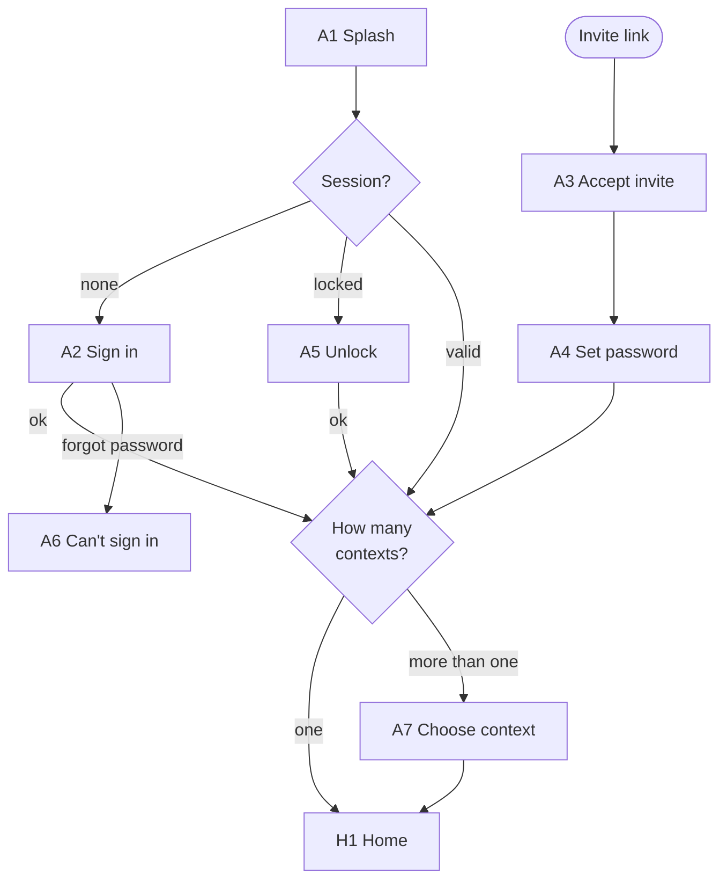
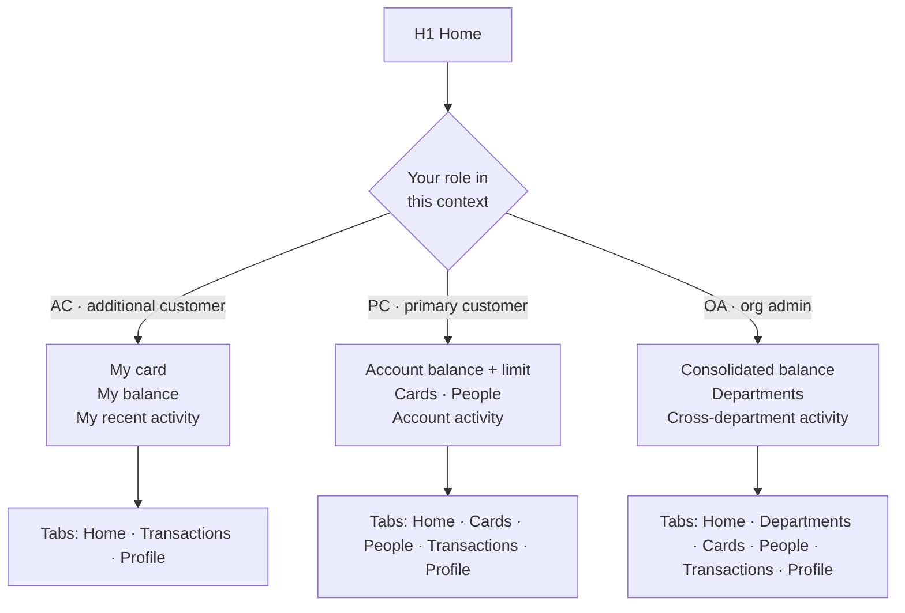
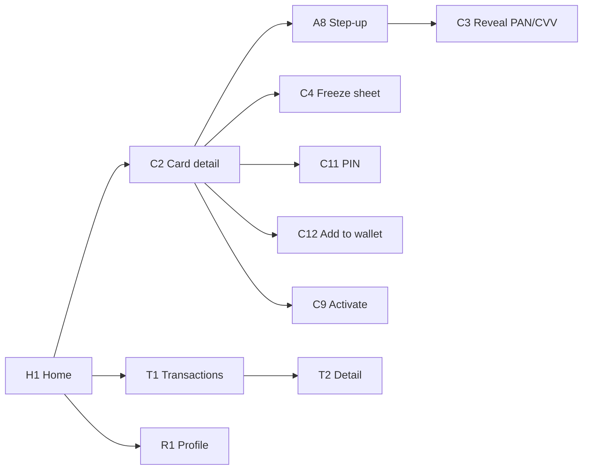
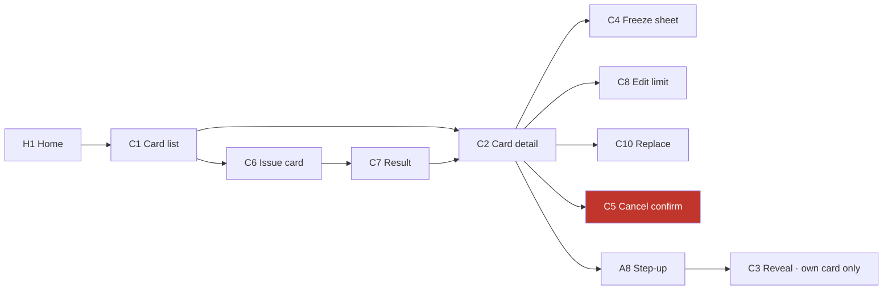
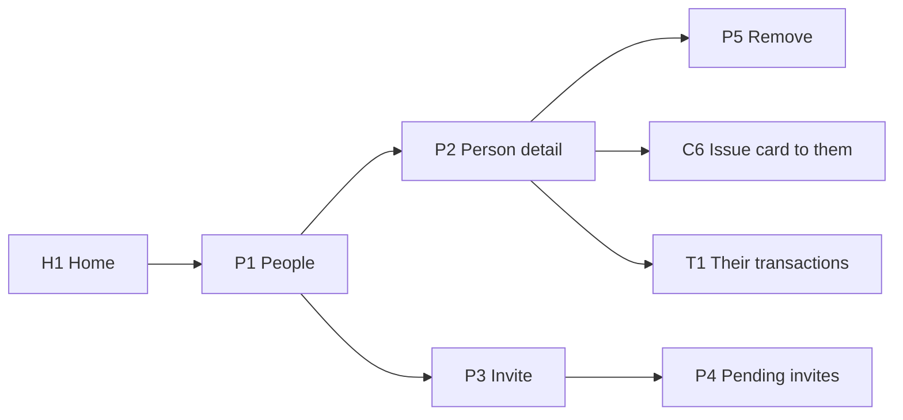
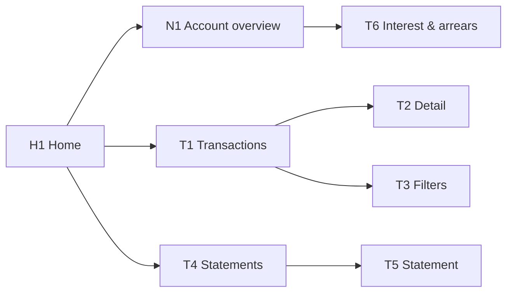
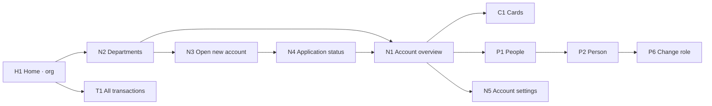
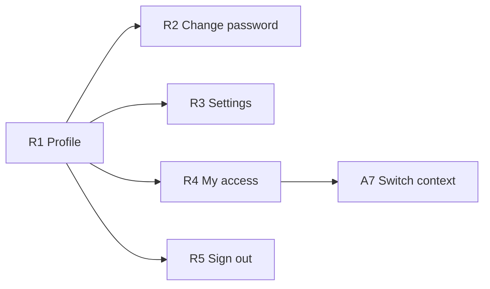
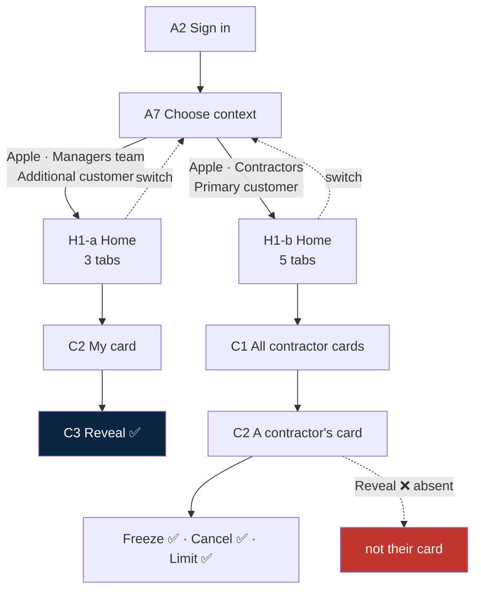

# Screens & Flows

**Status:** working draft · **Date:** 2026-08-13
**Companion to:** [Feature-list.md](Feature-list.md) — read Part 0 there first for the one-page overview.

Every screen in the app, and every path a user can take through them. Flows are written as plain screen-to-screen paths. Diagrams are small and per-section, never one big one.

---

## The four roles, in Pismo's own terms

The earlier draft invented role names. Pismo already has them, so we use those instead:

| Code | Role | What it is in Pismo |
|---|---|---|
| **AC** | Additional customer | A `customer` object added to an existing account. Holds a card. |
| **PC** | Primary customer | The `person` / `company` that created the account — the **account owner**. Exactly one per account. |
| **OA** | Organization admin | **Just a PC whose account is a *parent* account.** Not a separate role — the same rights, applied down the hierarchy. |
| **AU** | Auditor | A read-only overlay on PC or OA scope. Optional, ship later. |

**OA = PC of a parent account** is the simplification that closes open questions 1 and 2 in the feature list. There is no fourth permission tier to build — there is one tier that either sees one account or a tree of them.

Throughout this document: **AC** = limited, **PC** = full control of one account, **OA** = full control of a tree.

---

## Screen inventory

### Entry & identity

| ID | Screen | Who | Purpose |
|---|---|---|---|
| A1 | Splash | all | Silent token refresh, decide where to land |
| A2 | Sign in | all | Email + password |
| A3 | Accept invite | new users | Opened from deep link `cardapp://invite` |
| A4 | Set password | new users | First password, rules, confirmation |
| A5 | Unlock | all | Biometric or passcode after auto-lock |
| A6 | Can't sign in | all | Support contact — **no self-serve reset yet** |
| A7 | Choose context | multi-context users | One row per `(organization · account · role)` |
| A8 | Step-up challenge | all | Biometric / password re-auth before sensitive actions |

### Home

| ID | Screen | Who | Purpose |
|---|---|---|---|
| H1 | Home | all | **One screen, three variants** — see below |
| H1-a | Home · cardholder variant | AC | My card, my balance, my recent transactions |
| H1-b | Home · manager variant | PC | Account balance, card count, people count, recent account activity |
| H1-c | Home · org variant | OA | Consolidated balance, department list, cross-department activity |

### Card

| ID | Screen | Who | Purpose |
|---|---|---|---|
| C1 | Card list | PC OA AU | Every card on the account — masked PAN, holder, status |
| C2 | Card detail | all | Masked PAN, expiry, status, limit, holder, actions |
| C3 | Reveal PAN/CVV | own card only | Full number, 90 s, screenshots blocked |
| C4 | Freeze / unfreeze sheet | AC(own) PC OA | Reversible. Bottom sheet, not a route |
| C5 | Cancel card confirm | PC OA | **Irreversible.** Typed confirmation |
| C6 | Issue card — form | PC OA | Holder, virtual/physical, limit, name, expiry |
| C7 | Issue card — result | PC OA | Success + jump to the new card, or failure |
| C8 | Edit card limit | PC OA | Single field, current value shown |
| C9 | Activate physical card | AC PC | Last 4 + confirm |
| C10 | Replace card | PC OA | Reissue lost/damaged, cancels the old one |
| C11 | Set / change PIN | AC | Own card only |
| C12 | Add to wallet | AC | Apple Pay / Google Pay handoff |

### People

| ID | Screen | Who | Purpose |
|---|---|---|---|
| P1 | People list | PC OA AU | Every customer on the account, role, card count |
| P2 | Person detail | PC OA AU | Their cards, their activity, their role |
| P3 | Invite person — form | PC OA | Name, email, optional card at the same time |
| P4 | Pending invites | PC OA | Sent, expiring, resend, revoke |
| P5 | Remove person confirm | PC OA | What happens to their cards |
| P6 | Change person's role | OA | Promote to primary / demote |

### Account

| ID | Screen | Who | Purpose |
|---|---|---|---|
| N1 | Account overview | PC OA AU | Balance, limit, status, program type, due date |
| N2 | Departments | OA AU | Child accounts, per-department balance |
| N3 | Open new account — form | OA | Application: applicant, program, due date |
| N4 | Application status | OA | Pending / approved / rejected |
| N5 | Account settings | OA | Status, credit limit, billing cycle day |

### Transactions & statements

| ID | Screen | Who | Purpose |
|---|---|---|---|
| T1 | Transactions | all, scoped | List, grouped by day, infinite scroll |
| T2 | Transaction detail | all, scoped | Merchant, amount, FX, status, card used |
| T3 | Filters | all | Date range, card, person, type, amount |
| T4 | Statements | AC(own) PC OA AU | Closed cycles + current open cycle |
| T5 | Statement detail | same | Summary, download / share PDF |
| T6 | Interest & arrears | PC OA AU | Credit programs only — accruals, delinquency buckets |

### Profile

| ID | Screen | Who | Purpose |
|---|---|---|---|
| R1 | Profile | all | Name, email, current context |
| R2 | Change password | all | Old + new + confirm |
| R3 | Settings | all | Biometrics, notifications, language, about |
| R4 | My access | all | Every context you hold, read-only list |
| R5 | Sign out confirm | all | Wipes tokens |

### Cross-cutting (not routes)

| ID | Component | Purpose |
|---|---|---|
| X1 | Loading / empty / error / offline | Every data screen has all four |
| X2 | Session expired | Modal, sends to A2 |
| X3 | 3DS challenge | Inbound VCAS push during a purchase |
| X4 | Activity / notifications | Card frozen, card issued, transaction posted |

---

## 1 · Entry flows

**Cold launch, returning user, one context**
`A1 → H1`

**Cold launch, returning user, several contexts**
`A1 → A7 → H1` — A7 remembers the last context and offers it first.

**Cold launch, session expired**
`A1 → A2 → H1`

**Cold launch, locked (backgrounded > 2 min)**
`A1 → A5 → H1` · biometric fails 3× → `A5 → A2`

**First-time activation from an invite**
`invite email → A3 → A4 → (offer biometrics) → H1`
The invite carries which account and which role. A new user never sees A7 — they have exactly one context.

**Forgot password**
`A2 → A6 → (out of app)` — **there is no self-serve reset.** Support resets it manually. This is a known gap, not a design choice.

**Session expires mid-use**
`any screen → X2 → A2 → back to the same screen`

**Switch context**
`R1 → R4 → A7 → H1` and also `H1 → context chip → A7 → H1`

---

## 2 · What each Home shows

**The tab bar changes with the role.** An AC has three tabs and never sees Cards or People — not greyed out, *absent*. A disabled button that says "you can't do this" is an invitation to try; a missing tab is not.

| | AC | PC | OA |
|---|:--:|:--:|:--:|
| Home | ✅ | ✅ | ✅ |
| Departments | — | — | ✅ |
| Cards | — | ✅ | ✅ |
| People | — | ✅ | ✅ |
| Transactions | own card | account | tree |
| Profile | ✅ | ✅ | ✅ |

---

## 3 · Additional customer (AC) — every flow

This is the smallest surface: one card, read it, protect it.

**See my card**
`H1 → C2`

**Reveal the full number and CVV**
`H1 → C2 → [Reveal] → A8 step-up → C3 → auto-close after 90 s → C2`
Own card only. Screenshots blocked. Countdown visible. Copy-to-clipboard clears itself.

**Freeze my card**
`H1 → C2 → [Freeze] → C4 sheet → confirm → C2 (frozen)`
Reversible. No step-up — freezing is a *safe* action and friction here costs people money.

**Unfreeze my card**
`H1 → C2 → [Unfreeze] → C4 sheet → confirm → C2 (active)`

**Activate a physical card**
`H1 → C2 → [Activate] → C9 → enter last 4 → C2 (active)`

**Set or change my PIN**
`H1 → C2 → [PIN] → A8 step-up → C11 → C2`

**Add to Apple Pay / Google Pay**
`H1 → C2 → [Add to wallet] → A8 step-up → C12 → OS sheet → C2`

**Review my transactions**
`H1 → T1 → T2` · filter: `T1 → T3 → T1`

**My statements**
`H1 → T4 → T5 → [share PDF]`

**Report my card lost**
`H1 → C2 → [Report lost] → C4 (freeze immediately) → notify PC`
An AC **cannot cancel or replace their own card** — that is the manager's call. The app freezes it instantly and tells the manager. Freezing on the user's own authority is right; destroying an asset on their own authority is not.

**A purchase triggers 3DS**
`push → X3 challenge → approve/decline → dismissed`

**Change my password**
`R1 → R2 → confirm → stay signed in`

**Sign out**
`R1 → R5 → confirm → A2`

**What an AC cannot reach at all:** C1, C5, C6, C7, C8, C10, all of P, all of N, T6.

---

## 4 · Primary customer (PC) — card management

Everything an AC can do with their own card, plus control of every card on the account.

**See every card on the account**
`H1 → C1` — filterable by status and holder.

**Issue a card to someone**
`H1 → C1 → [Issue] → C6 form → A8 step-up → C7 result → C2`
Form: holder (must already be a customer on the account), virtual or physical, transaction limit, printed name, expiry.

**Issue a card to someone not yet on the account**
`H1 → P1 → [Invite] → P3 form (tick "issue a card too") → invite sent → on acceptance the card is issued`

**Freeze anyone's card**
`H1 → C1 → C2 → [Freeze] → C4 → confirm → C2 (frozen)`
The holder is notified. Silently freezing someone's card is how you strand a driver at a toll gate.

**Cancel a card**
`H1 → C1 → C2 → [Cancel] → C5 → type the last 4 → A8 step-up → C2 (cancelled)`
**Irreversible.** Pismo termination statuses cannot return to active. C5 says so, in those words.

**Replace a lost card**
`H1 → C1 → C2 → [Replace] → C10 → confirm → old cancelled, new issued → C7 → C2`

**Change a card's limit**
`H1 → C1 → C2 → [Limit] → C8 → save → C2`

**Reveal a card's number**
`H1 → C1 → C2 → [Reveal] → only if it is your own card`
On someone else's card the Reveal action is **absent**. A PC can freeze, cancel and replace a contractor's card; a PC cannot read its number. See the reveal rule in the feature list.

---

## 5 · Primary customer (PC) — people

**See who is on the account**
`H1 → P1`

**Add someone**
`H1 → P1 → [Invite] → P3 → send → P4`
They receive the deep link and land in `A3 → A4`.

**Chase or cancel an invite**
`H1 → P1 → P4 → [Resend] or [Revoke]`

**See one person's cards and spending**
`H1 → P1 → P2` → their cards inline, `→ T1` for their activity

**Remove someone**
`H1 → P1 → P2 → [Remove] → P5 → confirm → P1`
P5 must state what happens to their cards — cancelled, and that is irreversible. Removing a person and destroying their card are the same action here, and the confirm screen has to say so.

**Give someone your account's cards but not control**
Default. Every invited person is an AC unless promoted.

---

## 6 · Primary customer (PC) — account & money view

**Check the account balance and limit**
`H1 → N1`

**Review the whole account ledger**
`H1 → T1` — every card, every person. Filter by person: `T1 → T3 → T1`

**Investigate one transaction**
`H1 → T1 → T2` — shows which card and which person.

**Pull a statement**
`H1 → T4 → T5 → [Share PDF]`

**Check interest and arrears** *(credit programs only)*
`H1 → N1 → T6`

---

## 7 · Organization admin (OA) — the tree

Everything a PC can do, on every account below them, plus opening accounts and appointing managers.

**See all departments and consolidated balance**
`H1 → N2`

**Drill into one department**
`H1 → N2 → N1` — from here every PC flow in sections 4–6 applies to that account.

**Open a new department account**
`H1 → N2 → [New] → N3 form → submit → N4 pending → approved → N1`

**Chase an application**
`H1 → N2 → N4`

**Appoint a department manager**
`H1 → N2 → N1 → P1 → P2 → [Change role] → P6 → confirm`
Promoting to primary customer is the single most consequential permission action in the app. It needs step-up and a written statement of what the person will gain.

**Block or close a department account**
`H1 → N2 → N1 → N5 → change status → confirm`
Blocking an account blocks every card on it. N5 must show the count before confirming.

**Change a department's credit limit or billing day**
`H1 → N2 → N1 → N5 → save`

**Look across all departments at once**
`H1 → T1` — unfiltered, whole tree. `T3` filters by department.

---

## 8 · Everyone — profile & settings

**Change my password** — `R1 → R2 → save` · stays signed in, other devices signed out
**Turn biometrics on or off** — `R1 → R3 → toggle → A8 step-up → R3`
**Notification preferences** — `R1 → R3`
**See every context I hold** — `R1 → R4` — read-only, shows each `(organization · account · role)`
**Switch context** — `R1 → R4 → A7 → H1`
**Sign out** — `R1 → R5 → confirm → A2`

---

## 9 · The dual-hat case, end to end

The scenario from the brief, as an actual click path.

> Lee Wing holds a card on **Apple · Managers team** and runs **Apple · Contractors**.

`A2 → A7 → [Apple · Managers team] → H1-a` — three tabs, one card, full reveal rights on it.
`R1 → R4 → A7 → [Apple · Contractors] → H1-b` — five tabs, twelve cards, no reveal rights on any of them.

**One context is active at a time.** No merged view. The manager hat never reaches back over the personal card, and the personal hat never reaches sideways into the department.

---

## 10 · Coverage check

Every action in the app, and the shortest path to it.

| Action | Who | Path |
|---|---|---|
| See my card | AC PC OA | `H1 → C2` |
| Reveal number & CVV | own card | `H1 → C2 → A8 → C3` |
| Freeze my card | AC PC OA | `H1 → C2 → C4` |
| Freeze someone's card | PC OA | `H1 → C1 → C2 → C4` |
| Cancel a card | PC OA | `H1 → C1 → C2 → C5` |
| Issue a card | PC OA | `H1 → C1 → C6 → C7` |
| Replace a lost card | PC OA | `H1 → C1 → C2 → C10` |
| Change a card limit | PC OA | `H1 → C1 → C2 → C8` |
| Activate physical card | AC PC | `H1 → C2 → C9` |
| Set PIN | AC | `H1 → C2 → A8 → C11` |
| Add to wallet | AC | `H1 → C2 → A8 → C12` |
| Report card lost | AC | `H1 → C2 → C4` (freeze + notify) |
| See who is on the account | PC OA | `H1 → P1` |
| Invite a person | PC OA | `H1 → P1 → P3` |
| Remove a person | PC OA | `H1 → P1 → P2 → P5` |
| Promote to manager | OA | `H1 → N2 → N1 → P1 → P2 → P6` |
| Account balance & limit | PC OA | `H1 → N1` |
| Open a department account | OA | `H1 → N2 → N3 → N4` |
| Block / close an account | OA | `H1 → N2 → N1 → N5` |
| See departments | OA | `H1 → N2` |
| My transactions | AC | `H1 → T1` |
| Account transactions | PC OA | `H1 → T1` |
| Filter transactions | all | `T1 → T3` |
| Transaction detail | all | `T1 → T2` |
| Statements | all | `H1 → T4 → T5` |
| Interest & arrears | PC OA | `H1 → N1 → T6` |
| Change password | all | `R1 → R2` |
| Biometrics on/off | all | `R1 → R3` |
| See my contexts | all | `R1 → R4` |
| Switch context | multi | `R1 → R4 → A7` |
| Sign out | all | `R1 → R5` |
| Reset forgotten password | all | `A2 → A6` → **manual, out of app** |

---

## What is unresolved

1. **Does an AC see the whole account ledger or only their own card?** This document assumes **own card only** — the safe default. On a genuinely shared account that may be wrong. Changes T1 for AC and nothing else.
2. **Can a PC see an AC's transactions in detail, including merchant names?** Assumed yes, since they hold the budget. It is also surveillance of an employee, and some jurisdictions treat that as regulated.
3. **How deep does OA go?** Pismo's *Get related accounts* returns two levels of children. A three-level org chart does not fit without extra calls.
4. **Does removing a person cancel their cards, or orphan them?** Assumed cancel, stated on P5. Needs confirmation — it is irreversible.
5. **Who can promote to primary customer?** Assumed OA only. If a PC can promote within their own account, an account can end up with two owners, which Pismo does not model.
6. **Physical cards at all?** C9, C10, C11 exist only if yes. `CreateCardDto` accepts `PHYSICAL`, so the backend assumes yes.

---

*Screen IDs here are new and do not map to the S1–S26 numbering in `card-app-complete-spec.md`. That document describes the single-cardholder app; this one describes the multi-role app that supersedes it.*
