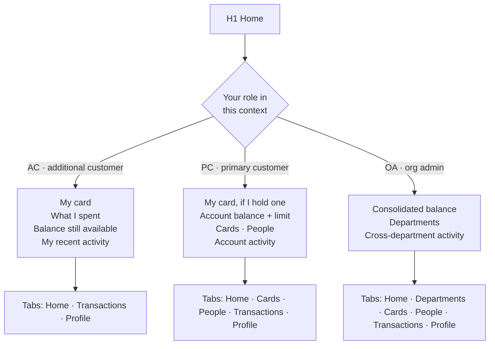
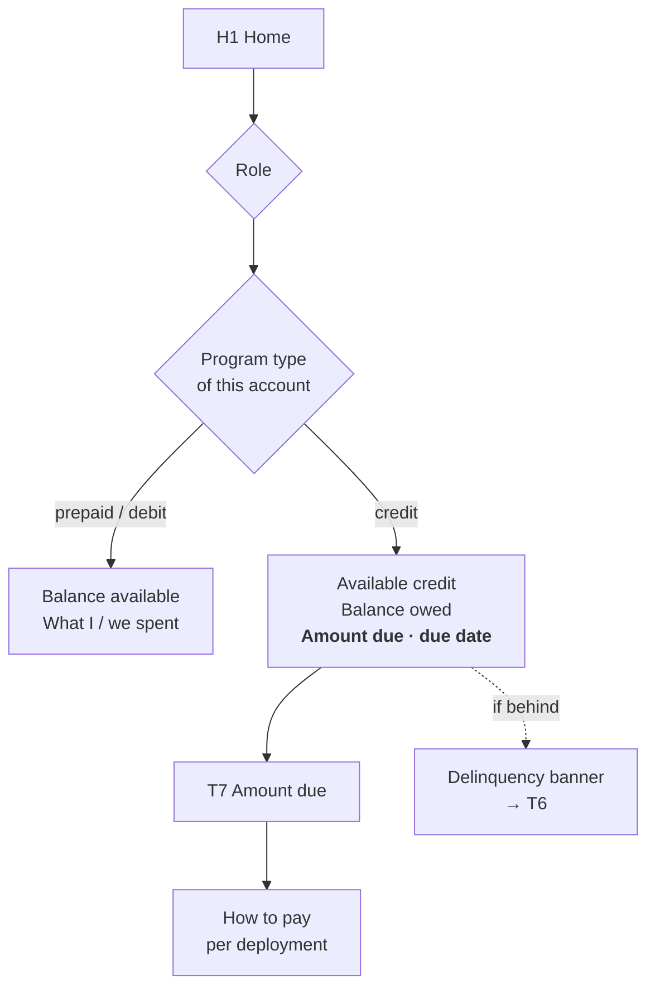
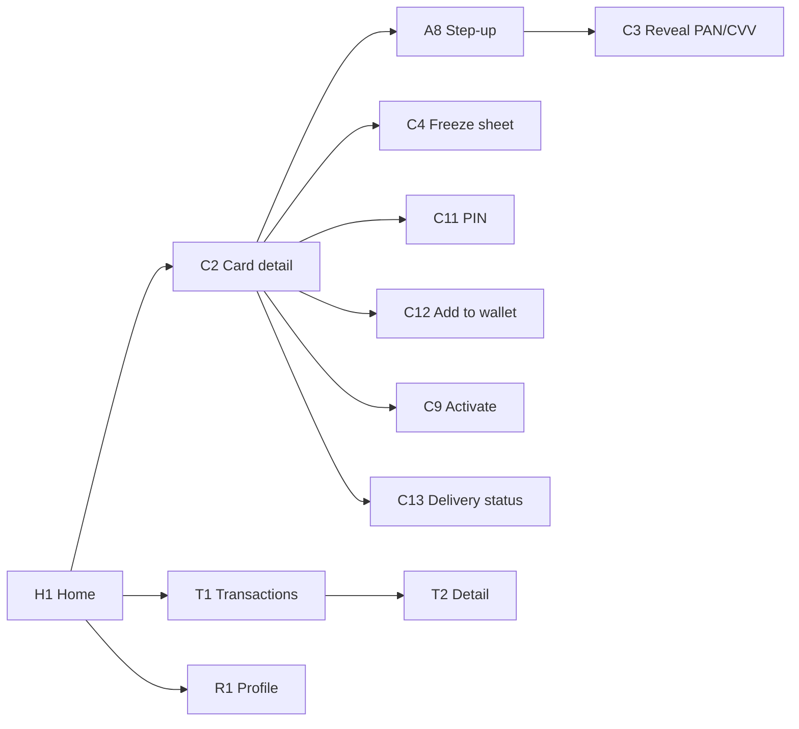
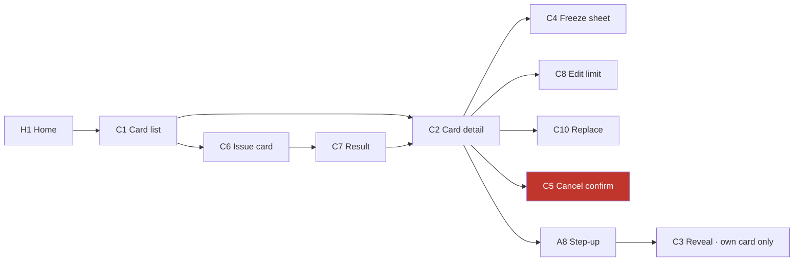
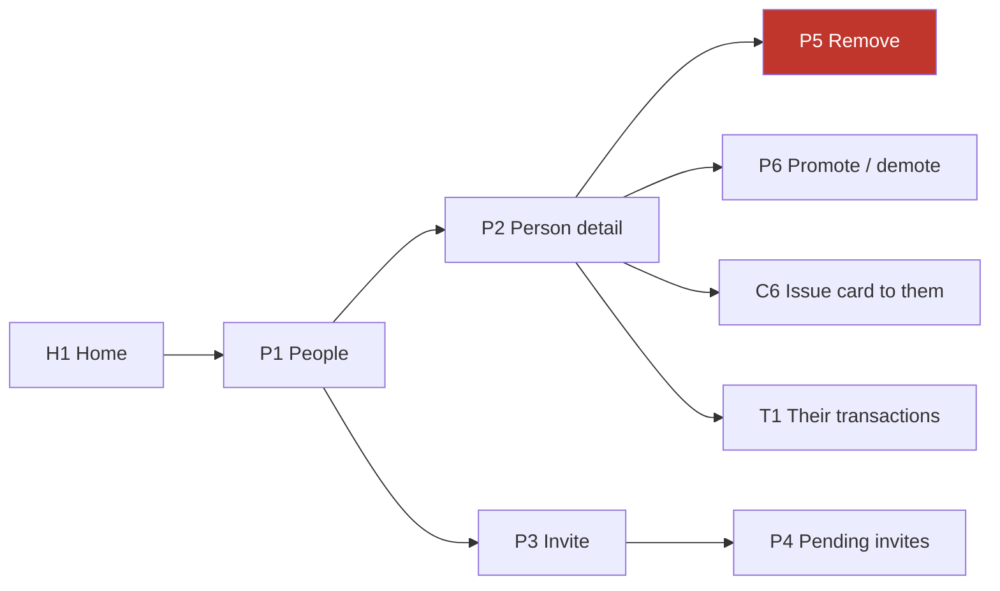
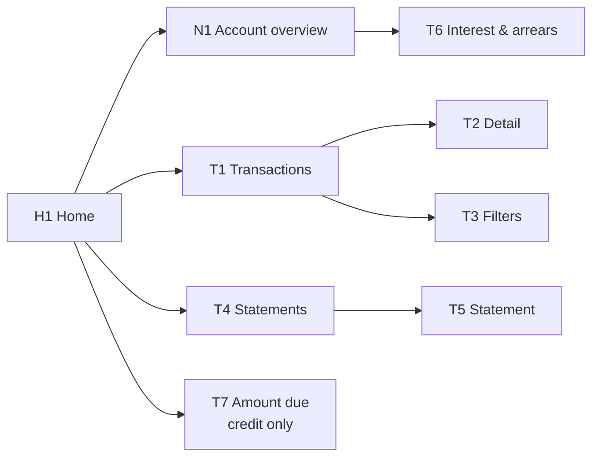
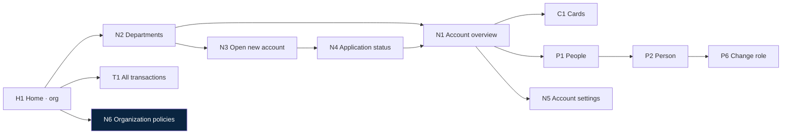
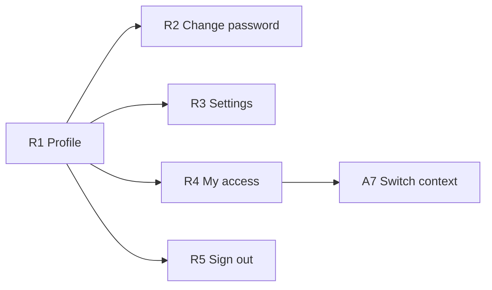
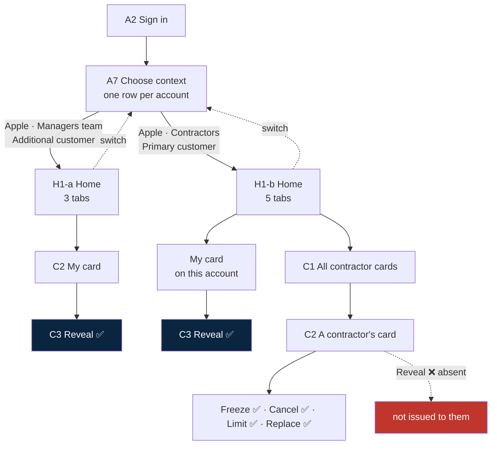

# Screens & Flows

**Status:** working draft · **Date:** 2026-08-13
**Companion to:** [Feature-list.md](Feature-list.md) — read Part 0 there first for the one-page overview.

Every screen in the app, and every path a user can take through them. Flows are written as plain screen-to-screen paths. Diagrams are small and per-section, never one big one.

---

## The roles

| Code | Role | What it is |
|---|---|---|
| **AC** | Additional customer | A `customer` on an account, holding a card. Sees their own card and their own spending. |
| **PC** | Primary customer | A customer on an account who **also holds our manager role** for it. Full control of that one account. Several people can be PC of the same account. |
| **OA** | Organization admin | **A PC whose account is a *parent* account.** Same rights, applied down the tree. Not a separate permission tier. |
| **AU** | Auditor | A read-only overlay on PC or OA scope. Optional, ship later. |

### PC is our role, not Pismo's account owner

These are two different things and conflating them breaks the model:

| | Pismo **account owner** | Our **PC** role |
|---|---|---|
| How many per account | Exactly one | As many as needed |
| What it is | The `person`/`company` the account was created with | A row in **our** authorization table: `(user, account, role)` |
| Who it should be | For a corporate account, **the company** — `Apple Inc.`, not a human | A human who manages the account day to day |
| Changes when | Almost never. Legal/administrative fact | Whenever someone is promoted or demoted |

So on the *Apple · Contractors* account, the Pismo owner is **Apple Inc.** (a `company` object) and the PCs are whichever humans manage contractors this quarter. Nothing in Pismo has to change when a manager is appointed.

Throughout this document: **AC** = own card only, **PC** = full control of one account, **OA** = full control of a tree.

---

## Screen inventory

### Entry & identity

| ID | Screen | Who | Purpose |
|---|---|---|---|
| A1 | Splash | all | Silent token refresh, decide where to land |
| A2 | Sign in | all | Email + password |
| A3 | Accept invite | new users | Opened from deep link `cardapp://invite` |
| A4 | Set password | new users | First password, rules, confirmation |
| A5 | Unlock | all | Biometric or passcode after auto-lock |
| A6 | Can't sign in | all | Support contact — **no self-serve reset yet** |
| A7 | Choose context | multi-context users | **One row per account** — organization, account, and your role on it |
| A8 | Step-up challenge | all | Biometric / password re-auth before sensitive actions |

### Home

| ID | Screen | Who | Purpose |
|---|---|---|---|
| H1 | Home | all | **One screen, three variants** — see below |
| H1-a | Home · cardholder variant | AC | My card, **my spend + available balance**, my recent transactions |
| H1-b | Home · manager variant | PC | **My card (if I hold one)**, account balance, card count, people count, recent account activity |
| H1-c | Home · org variant | OA | Consolidated balance, department list, cross-department activity |

### Card

| ID | Screen | Who | Purpose |
|---|---|---|---|
| C1 | Card list | PC OA AU | Every card on the account — masked PAN, holder, status |
| C2 | Card detail | all | Masked PAN, expiry, status, limit, holder, actions |
| C3 | Reveal PAN/CVV | own card only | Full number, 90 s, screenshots blocked |
| C4 | Freeze / unfreeze sheet | AC(own) PC OA | Reversible. Bottom sheet, not a route |
| C5 | Cancel card confirm | PC OA | **Irreversible.** Typed confirmation |
| C6 | Issue card — form | PC OA | Holder, virtual/physical, limit, name, expiry |
| C7 | Issue card — result | PC OA | Success + jump to the new card, or failure |
| C8 | Edit card limit | PC OA | Single field, current value shown |
| C9 | Activate physical card | AC PC | Last 4 + confirm |
| C10 | Replace card | PC OA | Reissue lost/damaged, cancels the old one |
| C11 | Set / change PIN | AC | Own card only |
| C12 | Add to wallet | AC | Apple Pay / Google Pay handoff |
| C13 | Card delivery status | AC PC OA | Physical only — ordered · embossed · shipped · delivered |
| C14 | Order physical card | PC OA | Delivery address, embossed name, courier |

### People

| ID | Screen | Who | Purpose |
|---|---|---|---|
| P1 | People list | PC OA AU | Every customer on the account, role, card count |
| P2 | Person detail | PC OA AU | Their cards, their activity, their role |
| P3 | Invite person — form | PC OA | Name, email, optional card at the same time |
| P4 | Pending invites | PC OA | Sent, expiring, resend, revoke |
| P5 | Remove person confirm | PC OA | What happens to their cards |
| P6 | Change person's role | OA | Promote to primary / demote |

### Account

| ID | Screen | Who | Purpose |
|---|---|---|---|
| N1 | Account overview | PC OA AU | Balance, limit, status, program type; credit adds cycle and due date |
| N2 | Departments | OA AU | Child accounts, per-department balance |
| N3 | Open new account — form | OA | Application: applicant, program, due date |
| N4 | Application status | OA | Pending / approved / rejected |
| N5 | Account settings | OA | Status, credit limit, billing cycle day |
| N6 | Organization policies | OA | Org-wide toggles inherited by every child account |

### Transactions & statements

| ID | Screen | Who | Purpose |
|---|---|---|---|
| T1 | Transactions | all, scoped | List, grouped by day, infinite scroll |
| T2 | Transaction detail | all, scoped | Merchant, amount, FX, status, card used |
| T3 | Filters | all | Date range, card, person, type, amount |
| T4 | Statements | AC(own) PC OA AU | Closed cycles + current open cycle |
| T5 | Statement detail | same | Summary, download / share PDF |
| T6 | Interest & arrears | PC OA AU | Credit only — accruals, delinquency buckets |
| T7 | Amount due | AC(own) PC OA | Credit only — balance owed, minimum, due date, how to pay |

### Profile

| ID | Screen | Who | Purpose |
|---|---|---|---|
| R1 | Profile | all | Name, email, current context |
| R2 | Change password | all | Old + new + confirm |
| R3 | Settings | all | Biometrics, notifications, language, about |
| R4 | My access | all | Every context you hold, read-only list |
| R5 | Sign out confirm | all | Wipes tokens |

### Cross-cutting (not routes)

| ID | Component | Purpose |
|---|---|---|
| X1 | Loading / empty / error / offline | Every data screen has all four |
| X2 | Session expired | Modal, sends to A2 |
| X3 | 3DS challenge | Inbound VCAS push during a purchase |
| X4 | Activity / notifications | Card frozen, card issued, transaction posted |

---

## 1 · Entry flows

**Cold launch, returning user, one context**
`A1 → H1`

**Cold launch, returning user, several contexts**
`A1 → A7 → H1` — A7 remembers the last context and offers it first.

**Cold launch, session expired**
`A1 → A2 → H1`

**Cold launch, locked (backgrounded > 2 min)**
`A1 → A5 → H1` · biometric fails 3× → `A5 → A2`

**First-time activation from an invite**
`invite email → A3 → A4 → (offer biometrics) → H1`
The invite carries which account and which role. A new user never sees A7 — they have exactly one context.

**Forgot password**
`A2 → A6 → (out of app)` — **there is no self-serve reset.** Support resets it manually. This is a known gap, not a design choice.

**Session expires mid-use**
`any screen → X2 → A2 → back to the same screen`

**Switch context**
`R1 → R4 → A7 → H1` and also `H1 → context chip → A7 → H1`

---

## 2 · What each Home shows

**The tab bar changes with the role.** An AC has three tabs and never sees Cards or People — not greyed out, *absent*. A disabled button that says "you can't do this" is an invitation to try; a missing tab is not.

### What an AC sees on a shared-balance account

Three numbers, and only three:

| Shown | Not shown |
|---|---|
| **What I spent** on my card, this cycle | What anyone else spent |
| **Balance still available** on the shared pool | Who consumed the rest of it |
| **My transactions**, in full detail | Anyone else's transactions |

The available balance is a property of the account, so it moves when a colleague spends. That is correct and it is the point — a driver needs to know whether there is money left before pulling up to a toll gate. They do not need to know which colleague spent it.

> **One honest leak:** given the credit limit, the available balance, and their own spend, an AC can compute what *everyone else combined* has spent. They can never attribute it to a person. We accept this — hiding it would mean hiding the available balance, which defeats the feature.

### A PC who also holds a card

The common case, not the exception: a team lead manages the department and carries a company card on it. H1-b therefore has **two zones**, and the boundary between them is a security boundary:

| Zone | Contains | Reveal |
|---|---|---|
| **My card** | The card issued to them | ✅ full PAN + CVV under step-up |
| **The account** | Every card, every person, the ledger | ❌ absent on every card here |

Same screen, one card's number readable and a dozen not. The rule is not "managers can't reveal" — it is **"you can only reveal a card issued to you"**, and it happens to bite hardest on the person with the most power. That is the correct place for it to bite.

A PC with no card of their own simply has no first zone.

### The second axis: program type

**Role decides what you can see. Program type decides what the numbers mean.** The two compose — there is no separate "credit app".

| | Prepaid / debit | Credit |
|---|---|---|
| H1 headline | Balance available | Available credit **and** balance owed |
| Cycle | none | Closing date, days remaining |
| Obligation | none | Amount due, minimum, due date → **T7** |
| N1 adds | — | Cycle, due date, interest to date |
| T4 statements | A period of activity | A closed cycle with a due date and balance |
| T6 | absent | Interest accruals, delinquency buckets |
| Card blocked because… | frozen, cancelled | frozen, cancelled, **or account delinquent** |

An AC on a credit account sees the obligation for the pool they draw on — amount due and due date — because it explains why their card may stop working. They still never see another person's spending.

> **⚠ The app shows a bill it cannot pay.** Payment initiation is out of scope, so T7 displays the amount due and a per-deployment **"how to pay"** instruction — bank transfer, direct debit, or "your finance team settles this" — and no Pay button. This is the assumed answer, not a settled one: the alternative is bringing statement payment in as the single exception to the money-movement freeze. It is a much narrower flow than the deferred Part III, and it is the one place where read-only genuinely hurts the user. **Decide before credit ships.**

| | AC | PC | OA |
|---|:--:|:--:|:--:|
| Home | ✅ | ✅ | ✅ |
| Departments | — | — | ✅ |
| Cards | — | ✅ | ✅ |
| People | — | ✅ | ✅ |
| Transactions | own card | account | tree |
| Profile | ✅ | ✅ | ✅ |

---

## 3 · Additional customer (AC) — every flow

This is the smallest surface: one card, read it, protect it.

**See my card**
`H1 → C2`

**Reveal the full number and CVV**
`H1 → C2 → [Reveal] → A8 step-up → C3 → auto-close after 90 s → C2`
Own card only. Screenshots blocked. Countdown visible. Copy-to-clipboard clears itself.

**Freeze my card**
`H1 → C2 → [Freeze] → C4 sheet → confirm → C2 (frozen)`
Reversible. No step-up — freezing is a *safe* action and friction here costs people money.

**Unfreeze my card**
`H1 → C2 → [Unfreeze] → C4 sheet → confirm → C2 (active)`

**Track my physical card on its way to me**
`H1 → C2 → C13` — ordered → embossed → shipped → delivered.

**Activate a physical card**
`H1 → C2 → [Activate] → C9 → enter last 4 → C2 (active)`

**Set or change my PIN**
`H1 → C2 → [PIN] → A8 step-up → C11 → C2`

**Add to Apple Pay / Google Pay**
`H1 → C2 → [Add to wallet] → A8 step-up → C12 → OS sheet → C2`

**Review my transactions**
`H1 → T1 → T2` · filter: `T1 → T3 → T1`

**My statements**
`H1 → T4 → T5 → [share PDF]`

**See what's due** *(credit accounts only)*
`H1 → T7` — the pool's amount due and due date, plus how it gets paid. No Pay button.

**Report my card lost**
`H1 → C2 → [Report lost] → C4 (freeze immediately) → notify PC`
An AC **cannot cancel or replace their own card** — that is the manager's call. The app freezes it instantly and tells the manager. Freezing on the user's own authority is right; destroying an asset on their own authority is not.

**A purchase triggers 3DS**
`push → X3 challenge → approve/decline → dismissed`

**Change my password**
`R1 → R2 → confirm → stay signed in`

**Sign out**
`R1 → R5 → confirm → A2`

**What an AC cannot reach at all:** C1, C5, C6, C7, C8, C10, C14, all of P, all of N, T6.
They see C13 for their own card only.

---

## 4 · Primary customer (PC) — card management

Everything an AC can do with their own card, plus control of every card on the account.

**See every card on the account**
`H1 → C1` — filterable by status and holder.

**Issue a card to someone**
`H1 → C1 → [Issue] → C6 form → A8 step-up → C7 result → C2`
Form: holder (must already be a customer on the account), virtual or physical, transaction limit, printed name, expiry.

**Issue a card to someone not yet on the account**
`H1 → P1 → [Invite] → P3 form (tick "issue a card too") → invite sent → on acceptance the card is issued`

**Freeze anyone's card**
`H1 → C1 → C2 → [Freeze] → C4 → confirm → C2 (frozen)`
The holder is notified. Silently freezing someone's card is how you strand a driver at a toll gate.

**Cancel a card**
`H1 → C1 → C2 → [Cancel] → C5 → type the last 4 → A8 step-up → C2 (cancelled)`
**Irreversible.** Pismo termination statuses cannot return to active. C5 says so, in those words.

**Replace a lost card**
`H1 → C1 → C2 → [Replace] → C10 → confirm → old cancelled, new issued → C7 → C2`

**Change a card's limit**
`H1 → C1 → C2 → [Limit] → C8 → save → C2`

**Reveal a card's number**
`H1 → C1 → C2 → [Reveal] → only if it is your own card`
On someone else's card the Reveal action is **absent**. A PC can freeze, cancel and replace a contractor's card; a PC cannot read its number. See the reveal rule in the feature list.

### Physical cards

In scope. A physical card has a life before it works and a life after it is lost, and both need screens.

**Order a physical card for someone**
`H1 → C1 → [Issue] → C6 (type: physical) → C14 delivery details → A8 step-up → C7 → C13`
C14 collects embossed name, delivery address and courier. The card exists in Pismo from this moment but cannot transact until activated.

**Track a card in production or transit**
`H1 → C1 → C2 → C13` — ordered → embossed → shipped → delivered → activated.
The cardholder sees C13 for their own card too. "Where is my card" is the single most common support call in card programs, and it is answerable in-app for free.

**The cardholder activates it on arrival**
`H1 → C2 → [Activate] → C9 → last 4 → C2 (active)` then `C2 → A8 → C11` to set a PIN.

**A card is lost**
AC: `H1 → C2 → [Report lost] → C4 freeze → PC notified`
PC: `H1 → C1 → C2 → [Replace] → C10 → confirm → old cancelled, new ordered → C13`
Freeze first, replace second. The freeze is instant and reversible in case it turns up in a coat pocket; the replacement cancels irreversibly, so it is the manager's decision and it happens later.

**A card expires**
Reissue ahead of the expiry date, same path as replace. The list at C1 flags cards expiring within 60 days.

> **Backend reality check.** `CreateCardDto` accepts `type: PHYSICAL` and `pin_length`, so issuance works today. **Activation, PIN management, reissuing and any delivery tracking are all absent from the gateway** — reissuing exists in Pismo unproxied, and delivery status may not exist at all depending on the card bureau. C9, C10, C11, C13 and C14 are the least backed screens in this document.

---

## 5 · Primary customer (PC) — people

**See who is on the account**
`H1 → P1`

**Add someone**
`H1 → P1 → [Invite] → P3 → send → P4`
They receive the deep link and land in `A3 → A4`.

**Chase or cancel an invite**
`H1 → P1 → P4 → [Resend] or [Revoke]`

**See one person's cards and spending**
`H1 → P1 → P2` → their cards inline, `→ T1` for their activity

**Remove someone who has left the organization**
`H1 → P1 → P2 → [Remove] → P5 → type their name → A8 step-up → P1`

A card is issued *to a person*. If the person is gone, the card is gone:

- Every card issued to them is **cancelled** — a Pismo termination status, which cannot be reversed.
- Their **transaction history stays**, attached to the account, for monitoring and audit.
- They lose the context immediately. Next launch, it is absent from A7.

P5 lists the cards by last-4 and says plainly that cancelling cannot be undone. Removing a person and destroying their cards are one action, and the confirm screen must not pretend otherwise.

> **Retention vs. erasure.** Keeping a departed employee's merchant-level history indefinitely is the right call for financial monitoring and the wrong one under some data-protection regimes, which grant erasure rights over exactly this data. The resolution is normally a defined retention period after which records are anonymised rather than deleted — the ledger keeps its integrity, the person stops being identifiable. **Someone needs to set that period.** It is not a screen; it is a policy the backend enforces.

**Promote someone to primary customer**
`H1 → P1 → P2 → [Promote] → P6 → A8 step-up → P2`

A PC can promote, without going to the OA. Promotion is **additive** and nothing is taken away:

- They **keep** their customer record on the account.
- They **keep** their card, and their own reveal rights on it.
- They **gain** manager scope: every card, every person, the account ledger.
- The promoter keeps everything they had. Nobody is demoted to make room.

**The card is bound to the person, so it travels with them.** They do not become a manager *instead of* a cardholder — they become a manager *who holds a card on the account they manage*. That is the normal state for a team lead carrying a company card, not an edge case.

**One account, one role.** A7 lists one row per **account**, and promotion changes the role on that row rather than adding a second row. There is no hat-switching within a single account — the PC context already contains their own card, with full reveal rights on it, alongside everyone else's cards which they can manage but never reveal.

Dual contexts happen **across** accounts, not within one. See section 9.

**Demote someone**
`H1 → P1 → P2 → [Demote] → P6 → confirm → P2`
Removes the manager row. They remain an AC with their card intact. A PC cannot demote the last remaining PC of an account — N1 would become unmanageable.

**Give someone a card but not control**
Default. Every invited person is an AC until promoted.

---

## 6 · Primary customer (PC) — account & money view

**Check the account balance and limit**
`H1 → N1`

**Review the whole account ledger**
`H1 → T1` — every card, every person. Filter by person: `T1 → T3 → T1`

**Investigate one transaction**
`H1 → T1 → T2` — shows which card and which person.

**Pull a statement**
`H1 → T4 → T5 → [Share PDF]`

**Check interest and arrears** *(credit only)*
`H1 → N1 → T6`

**Check what the account owes and when** *(credit only)*
`H1 → T7` — balance owed, minimum payment, due date, days remaining, how to pay.

**The account has fallen behind** *(credit only)*
`H1 → delinquency banner → T6 buckets → T1 filtered to unpaid`
Delinquency blocks cards at the account level, so C2 must explain *why* a card is not working — "account overdue", not a bare "blocked". A cardholder stranded at a toll gate needs the real reason, and it is not their card's fault.

---

## 7 · Organization admin (OA) — the tree

Everything a PC can do, on every account below them, plus opening accounts and appointing managers.

**See all departments and consolidated balance**
`H1 → N2`

**Drill into one department**
`H1 → N2 → N1` — from here every PC flow in sections 4–6 applies to that account.

**Open a new department account**
`H1 → N2 → [New] → N3 form → submit → N4 pending → approved → N1`

**Chase an application**
`H1 → N2 → N4`

**Appoint a department manager**
`H1 → N2 → N1 → P1 → P2 → [Promote] → P6 → A8 step-up → P2`
Same flow a PC uses, applied to any account in the tree.

**Set organization-wide policy**
`H1 → N6 → toggle → A8 step-up → N6`

Policies live on the parent account and are **inherited by every child account**. A department PC sees the effect and cannot override it. The first one we need:

| Policy | Default | Effect when off |
|---|---|---|
| **Managers may see cardholders' transaction detail** | On | PC and OA see amount, date, card and status — **merchant name and location are hidden**. The transaction still appears; it is redacted, not missing. |

That is the answer to the employee-surveillance question: on by default because the manager holds the budget, switchable off by the organization because in some jurisdictions merchant-level visibility into an employee's spending is regulated. **It must be enforced server-side** — the redacted fields have to be absent from the response, not hidden by the client. A policy the app enforces is a policy anyone with a proxy can turn back on.

Room for more later: whether PCs may promote, whether reveal is allowed at all, statement retention, default card limits.

**Walk a hierarchy deeper than three levels**
`H1 → N2 → N1 → [Sub-departments] → N2 → …`

Pismo's structure is **not depth-limited** — `parent_account_id` is a plain field, so accounts nest as deep as a corporation needs. The limit is on the convenience endpoint: *Get related accounts* returns parent + children + grandchildren, **three levels**, and it returns them as a **flat array** with the parent-child links stripped out.

Two consequences for us:

1. Even inside three levels, we cannot render a tree from that response — we have to rebuild it from each account's `parent_account_id`.
2. Beyond three levels, we walk: call the endpoint again from each grandchild.

So the backend keeps its own account-tree index, built from `parent_account_id` and kept in step by webhooks. Then N2 renders any depth from one query of our own, and *Get related accounts* becomes a source for balances rather than the thing we navigate with. Arbitrary depth is achievable — it just isn't free.

**Block or close a department account**
`H1 → N2 → N1 → N5 → change status → confirm`
Blocking an account blocks every card on it. N5 must show the count before confirming.

**Change a department's credit limit or billing day**
`H1 → N2 → N1 → N5 → save`

**Look across all departments at once**
`H1 → T1` — unfiltered, whole tree. `T3` filters by department.

---

## 8 · Everyone — profile & settings

**Change my password** — `R1 → R2 → save` · stays signed in, other devices signed out
**Turn biometrics on or off** — `R1 → R3 → toggle → A8 step-up → R3`
**Notification preferences** — `R1 → R3`
**See every context I hold** — `R1 → R4` — read-only, shows each `(organization · account · role)`
**Switch context** — `R1 → R4 → A7 → H1`
**Sign out** — `R1 → R5 → confirm → A2`

---

## 9 · The dual-hat case, end to end

**Two hats means two accounts, never two roles on one account.** Within a single account you have exactly one role, and if you hold a card there it comes with that role.

The scenario from the brief, as an actual click path.

> Lee Wing holds a card on **Apple · Managers team** and runs **Apple · Contractors**, where they also carry a card of their own.

`A2 → A7 → [Apple · Managers team] → H1-a` — three tabs, one card, full reveal rights on it.
`R1 → R4 → A7 → [Apple · Contractors] → H1-b` — five tabs. Their own card is here too, revealable. The twelve contractor cards beside it are fully manageable and not revealable.

**One context is active at a time, and one role per account.** No merged view across accounts. Inside the Contractors context, the boundary is not between two hats — it is between *their card* and *everyone else's*.

### What promotion actually changed

Say Lee Wing started as an ordinary contractor with a card, and was promoted to run the department:

| | Before | After |
|---|---|---|
| Rows in A7 for Contractors | 1 | **1** — unchanged |
| Role on that row | Additional customer | Primary customer |
| Their card | Card ending 4417 | **Card ending 4417** — same card |
| Reveal on it | ✅ | ✅ |
| Other people's cards | invisible | manageable, not revealable |
| Tabs | 3 | 5 |

Nothing was cancelled, reissued, or vacated. One row changed value; the card never moved.

---

## 10 · Coverage check

Every action in the app, and the shortest path to it.

| Action | Who | Path |
|---|---|---|
| See my card | AC PC OA | `H1 → C2` |
| Reveal number & CVV | own card | `H1 → C2 → A8 → C3` |
| Freeze my card | AC PC OA | `H1 → C2 → C4` |
| Freeze someone's card | PC OA | `H1 → C1 → C2 → C4` |
| Cancel a card | PC OA | `H1 → C1 → C2 → C5` |
| Issue a card | PC OA | `H1 → C1 → C6 → C7` |
| Replace a lost card | PC OA | `H1 → C1 → C2 → C10` |
| Change a card limit | PC OA | `H1 → C1 → C2 → C8` |
| Order a physical card | PC OA | `H1 → C1 → C6 → C14 → C7` |
| Track a card in transit | AC PC OA | `H1 → C2 → C13` |
| Activate physical card | AC PC | `H1 → C2 → C9` |
| Set PIN | AC | `H1 → C2 → A8 → C11` |
| Add to wallet | AC | `H1 → C2 → A8 → C12` |
| Report card lost | AC | `H1 → C2 → C4` (freeze + notify) |
| See who is on the account | PC OA | `H1 → P1` |
| Invite a person | PC OA | `H1 → P1 → P3` |
| Remove a person | PC OA | `H1 → P1 → P2 → P5` |
| Promote to PC | PC OA | `H1 → P1 → P2 → P6` |
| Demote a PC | PC OA | `H1 → P1 → P2 → P6` |
| Account balance & limit | PC OA | `H1 → N1` |
| Open a department account | OA | `H1 → N2 → N3 → N4` |
| Block / close an account | OA | `H1 → N2 → N1 → N5` |
| See departments | OA | `H1 → N2` |
| Set org-wide policy | OA | `H1 → N6` |
| My transactions | AC | `H1 → T1` |
| Account transactions | PC OA | `H1 → T1` |
| Filter transactions | all | `T1 → T3` |
| Transaction detail | all | `T1 → T2` |
| Statements | all | `H1 → T4 → T5` |
| Interest & arrears *(credit)* | PC OA | `H1 → N1 → T6` |
| Amount due & how to pay *(credit)* | AC PC OA | `H1 → T7` |
| Change password | all | `R1 → R2` |
| Biometrics on/off | all | `R1 → R3` |
| See my contexts | all | `R1 → R4` |
| Switch context | multi | `R1 → R4 → A7` |
| Sign out | all | `R1 → R5` |
| Reset forgotten password | all | `A2 → A6` → **manual, out of app** |

---

## Decisions, settled 2026-08-17

| # | Question | Decision |
|---|---|---|
| 1 | What does an AC see on a shared-balance account? | **Own card only** — their own transactions, their own spend, and the pool's available balance. Never another person's activity. |
| 2 | Can a PC see an AC's transaction detail? | **Yes by default, switchable off org-wide** by an OA at N6. Off means merchant name and location are redacted, server-side. |
| 3 | How deep can the hierarchy go? | **Any depth.** `parent_account_id` is unlimited; only *Get related accounts* stops at three levels and flattens them. We keep our own tree index. |
| 4 | Does removing a person cancel their cards? | **Yes, irreversibly.** Transaction history is retained for monitoring. A retention/anonymisation period still needs setting. |
| 5 | Who can promote to PC? | **Any PC of that account**, no OA needed. A card is bound to the person it was issued to, so promotion changes only their role — same card, same reveal rights, one context. |
| 6 | Physical cards? | **In scope.** Order, track, activate, PIN, replace, reissue. |
| 7 | Which program types? | **Credit as well as prepaid/debit.** Program type is a second axis alongside role — same permissions, different numbers. |

### The one thing decision 5 required changing

The brief's mechanics were that a promoted person "loses access to the AC account and gains access to PC", vacating a seat that a new person could fill with no cards attached.

That would have cost the promoted person their card — and a team lead who manages the contractors while also carrying a company card is the exact dual-hat case in section 9. Losing the card on promotion contradicts it.

The cause was an overloaded term: **PC was standing in for Pismo's account owner**, and Pismo permits exactly one of those, so adding a second looked impossible. Separating them removes the constraint entirely — Pismo's owner becomes the *company*, PC becomes a row in our own table, and any number of people can hold it. Promotion then adds a row and takes nothing away. The intent — a PC can promote without escalating to the OA — is preserved exactly.

## Still open

1. **How does a credit statement get paid?** The app shows the amount due and cannot discharge it. Default assumption: a per-deployment "how to pay" instruction on T7. The alternative — bringing statement payment in as the one exception to the money-movement freeze — is narrow enough to be worth considering. **Blocks credit shipping, not credit building.**
2. **Retention period** for a departed person's transaction history before anonymisation. Legal, not product.
3. **Does the OA policy set at N6 also cover reveal?** Whether an organization can switch off PAN reveal entirely for its cardholders.
4. **Delivery tracking depth** for physical cards — depends on what the card bureau exposes, which is not in the gateway at all.
5. **Can a PC promote someone to PC of a *child* account they don't manage?** Assumed no. Only within their own account, or anywhere in the tree if they are an OA.

---

*Screen IDs here are new and do not map to the S1–S26 numbering in `card-app-complete-spec.md`. That document describes the single-cardholder app; this one describes the multi-role app that supersedes it.*
