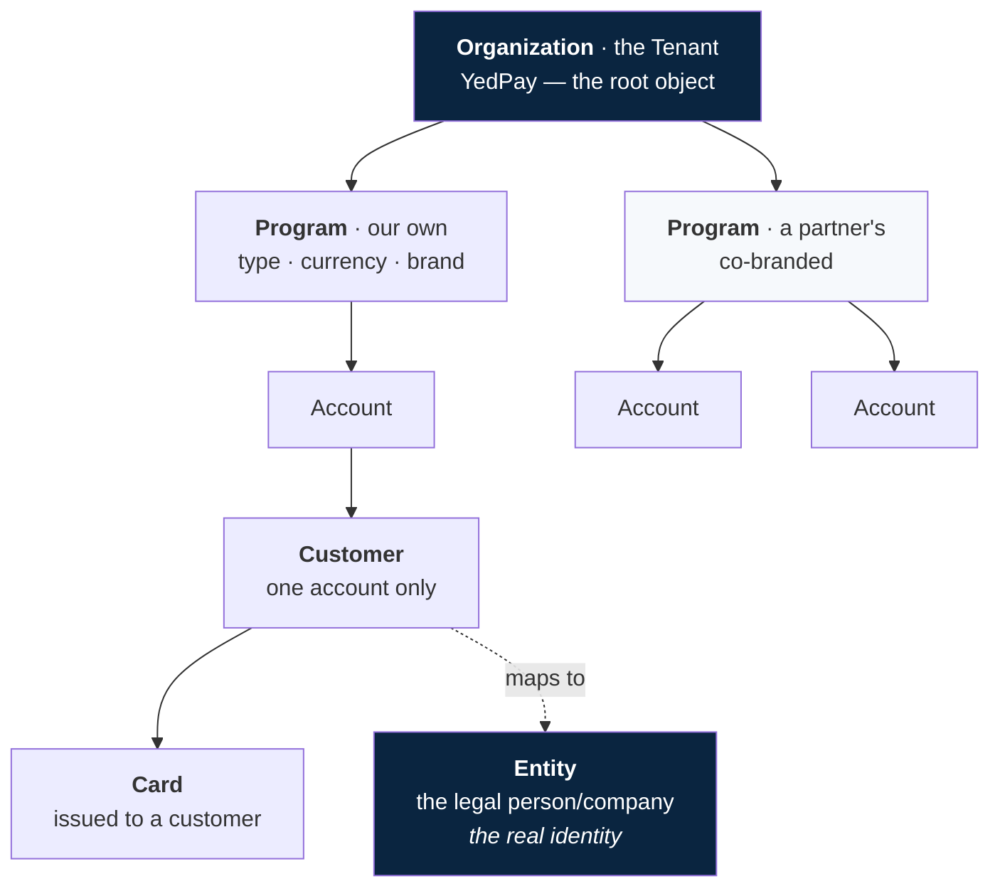
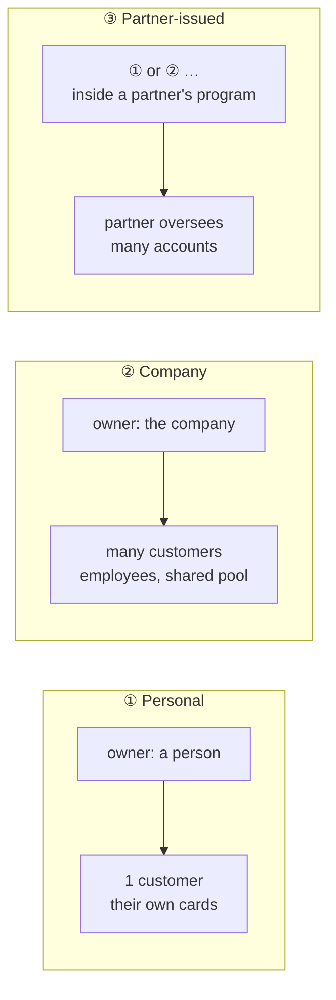
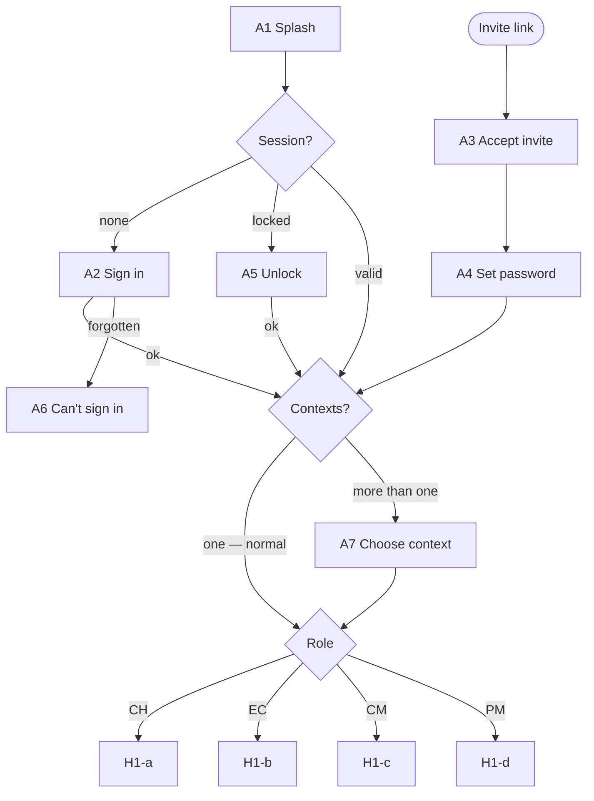
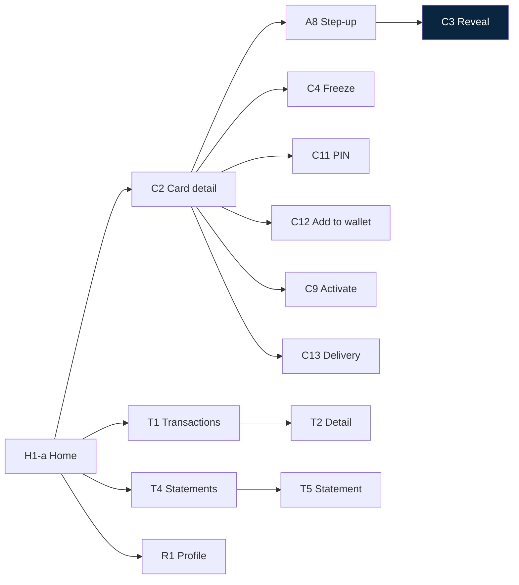
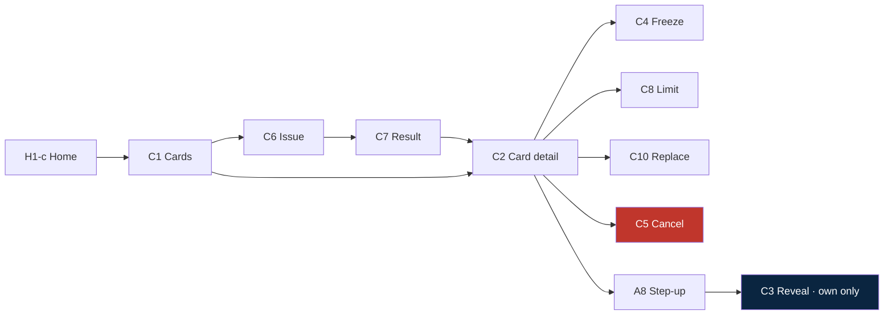
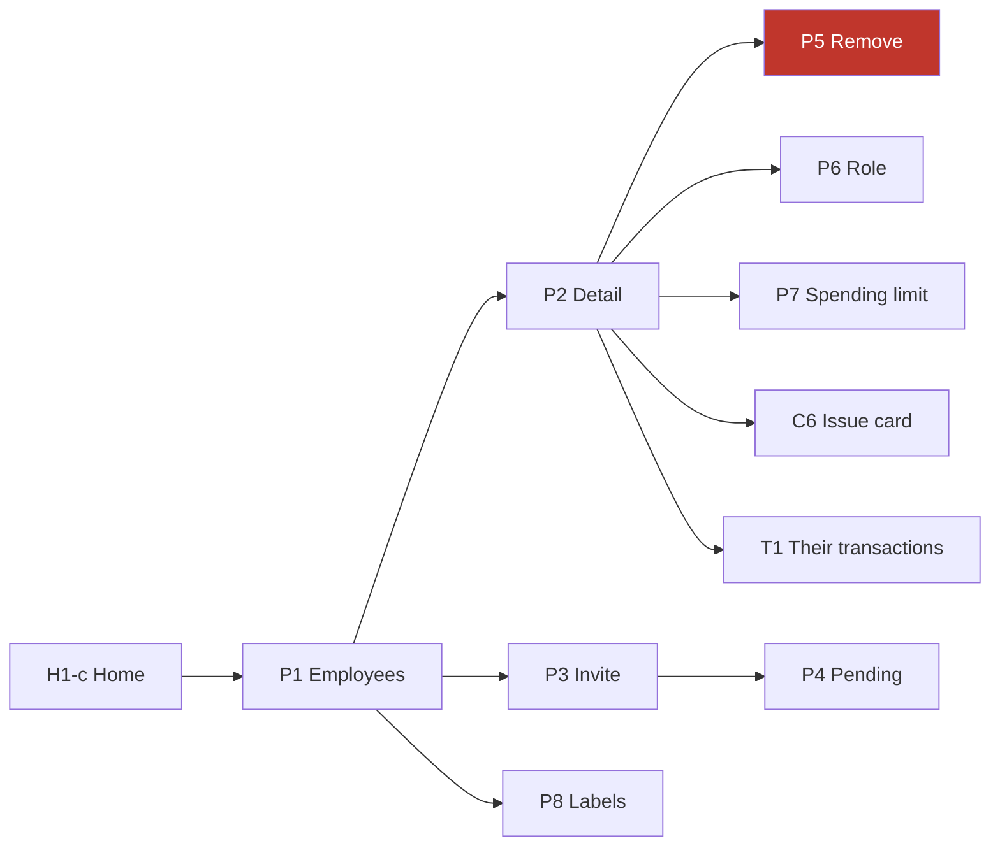
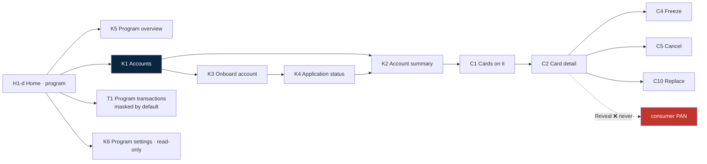
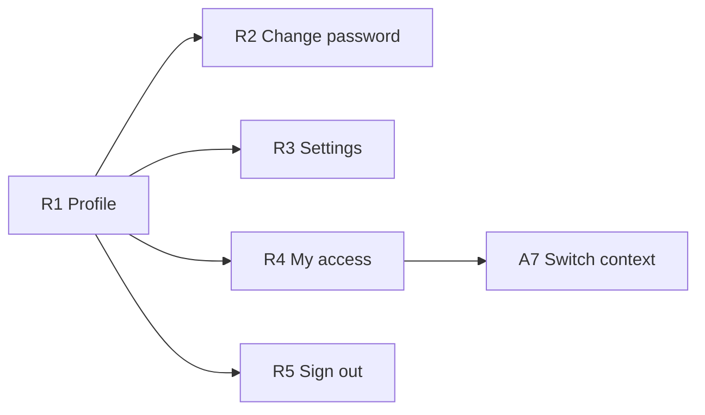
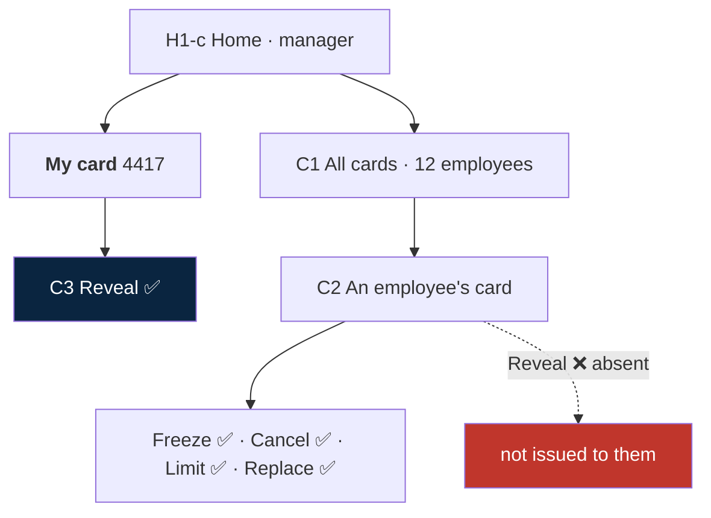
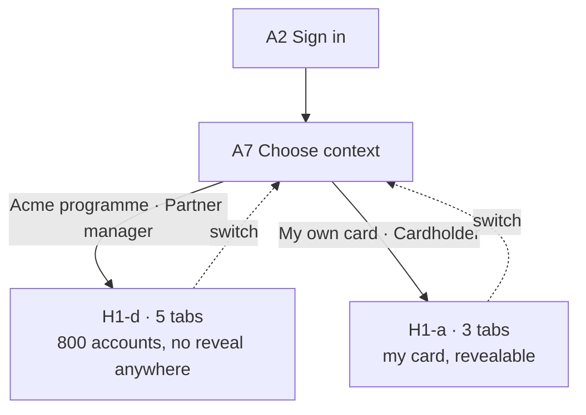

# Screens & Flows

**Status:** working draft · **Date:** 2026-08-13
**Revised:** 2026-08-19 — reshaped around the verified Pismo object model. Adds partner-issued card programs as a first-class use case.
**Companion to:** [Feature-list.md](Feature-list.md)

Every screen in the app, and every path through them. Flows are written as plain screen-to-screen paths. Diagrams are small and per-section.

One app serves four kinds of user. **Everyone gets the same build; the tabs and actions they see come from their role.** Nothing is greyed out — it is absent.

---

## 1 · The model

Read directly from Pismo's *Core objects* and *Program types* references on 2026-08-19. Quoted text is verbatim.

| Object | What it is | Why it matters here |
|---|---|---|
| **Organization** | *"Defines your company or enterprise. Contains one or more programs."* The root. Its ID is the Tenant ID, `TN-…`. | **This is YedPay.** Not the partner, not the customer company. |
| **Program** | *"Defines a set of parameters for a group of accounts."* Carries type, currency, brand, due dates. Accounts inherit anything they do not define. | **This is the partner boundary.** A partner is one or more programs inside our org. |
| **Entity** | *"A legal entity (person, company, or organization)."* And crucially: *"multiple customers with different customer IDs could all map to the same entity object, meaning they are all the same person or company."* | **This is identity.** One human = one entity = many customer records. |
| **Account** | *"Each account belongs to a single program."* One owner, one balance. | The ledger. |
| **Customer** | *"Each account contains at least one customer… but only one designated owner. **A customer can only belong to one account.**"* | The link between an entity and one account. |
| **Card** | Issued to a customer. | Never to an account directly. |

### Program types

`CREDITO` · `CREDITO ZERO-BALANCE` · `DEBITO` · `DEBITO ZERO-BALANCE` · `PRE-PAGO` · `PRE-PAGO ZERO-BALANCE` · `VOUCHER`

Full-balance vs zero-balance is a card-network integration model, not a product difference the cardholder sees. **The app cares about three:** credit, debit, prepaid. Voucher (meal/food) is a prepaid variant worth knowing exists — a partner may well want one.

### What this settles

**Entity is the answer to "what does a login map to."** Our `User` maps to one Pismo **entity**; that entity has one customer record per account they hold. The old contradiction — "a customer can have multiple accounts" vs *Core objects*' flat *"a customer can only belong to one account"* — dissolves: the customer is the link, the entity is the person.

> ⚠ **Do not build on entity lookup.** Pismo: *"To search an organization's data using an entity ID, contact our Service Desk and request this."* Entity search is off by default. Our BFF keeps its own `user → [(customer_id, account_id)]` table; entity is the concept we mirror, not an API we call.

---

## 2 · Three account shapes

The same objects arrange three ways. Everything downstream follows from which one you are in.

| | ① Personal | ② Company | ③ Partner-issued |
|---|---|---|---|
| Owner | a `person` | a `company` | either |
| Customers | usually just them | employees | per underlying shape |
| Balance | theirs | **shared pool** | per underlying shape |
| Whose program | ours | ours | **the partner's** |
| Who manages | nobody — self-service | a company manager | a partner program manager |
| Example | a card we issue you directly | Apple's drivers | cards issued under Acme's brand |

**③ is not a third structure — it is ① or ② sitting in a partner's program.** That single fact keeps the app from forking: partner accounts reuse every personal and company screen. What the partner *adds* is an oversight layer above many accounts.

> **The unit of management differs, and that is the whole design.** A company manager manages **customers on one account**. A partner manager manages **accounts in one program**. Different noun, different tab, different screens.

---

## 3 · Who uses this app

| Code | Persona | Scope | Manages |
|---|---|---|---|
| **CH** | Cardholder | their own personal account | nothing — self-service |
| **EC** | Employee cardholder | their card on a company account | nothing |
| **CM** | Company manager | one company account | **customers** |
| **PM** | Partner manager | one program | **accounts** |
| **AU** | Auditor | read-only over CM or PM scope | nothing. Optional, ship later |
| **BO** | Back-office (us) | everything | not this app — a console |

**CM is our role, not Pismo's account owner.** Pismo permits exactly one owner and setting `is_owner = true` *changes* it, firing an *Account owner changed* event — a second owner is unrepresentable. So the owner is the company; CM is a row in our table, `(user, account, role)`, and several people can hold it.

**PM is likewise ours**, scoped to `program_id` rather than `account_id`.

### Tabs

| Tab | CH | EC | CM | PM |
|---|:--:|:--:|:--:|:--:|
| Home | ✅ | ✅ | ✅ | ✅ |
| Cards | — | — | ✅ | ✅ |
| People | — | — | ✅ | — |
| Accounts | — | — | — | ✅ |
| Transactions | own | own | account | program |
| Profile | ✅ | ✅ | ✅ | ✅ |

Three tabs for cardholders, five for managers. A cardholder never sees a Cards tab because their card is the Home screen.

### Who may reveal a card number

| | Own card | Someone else's |
|---|:--:|:--:|
| CH | ✅ | n/a |
| EC | ✅ | ❌ |
| CM | ✅ | ❌ |
| PM | ✅ *(only if they hold one)* | ❌ **never** |
| AU | ❌ | ❌ |

**Reveal never travels with rank.** A company manager may freeze, cancel, replace and re-limit an employee's card and still never read its number. A partner manager is stricter still: their end-customers are consumers, not staff.

> ⚠ **The platform will not enforce this.** Pismo's PCI endpoints return a PAN by card id and do not know who is asking. "Own card only" exists **solely in our BFF**. This is the single easiest thing to get wrong and the worst to get wrong.

### Who may read transaction detail

| | Default | Notes |
|---|---|---|
| CH / EC | full, own card | always |
| CM | full, all employees | **switchable off per org** — merchant name and location redacted server-side. Employer oversight of a company budget. |
| PM | **masked by default** | Account status, balances, card status, aggregate spend. **Not** merchant-level detail on a consumer's spending. |

The CM and PM defaults are deliberately opposite. An employer funds the spending and has a legitimate reason to see it; a partner whose brand is on the card does not automatically acquire the right to read a consumer's purchase history. Flipping PM to full detail is a per-program decision with a compliance conversation attached, not a toggle we ship on.

---

## 4 · Screen inventory

### A · Access & identity

| ID | Screen | Who | Purpose |
|---|---|---|---|
| A1 | Splash | all | Silent token refresh, decide where to land |
| A2 | Sign in | all | Email + password |
| A3 | Accept invite | new users | Deep link `cardapp://invite` |
| A4 | Set password | new users | First password, rules, confirmation |
| A5 | Unlock | all | Biometric or passcode after auto-lock |
| A6 | Can't sign in | all | Support contact — **no self-serve reset yet** |
| A7 | Choose context | rare | One row per account or program you hold |
| A8 | Step-up challenge | all | Re-auth before anything sensitive |

### H · Home — one screen, four variants

| ID | Variant | Who | Shows |
|---|---|---|---|
| H1 | Home | all | The tab; renders one of the variants below. Referred to as `H1` in flow paths |
| H1-a | Cardholder | CH | My card, my balance, my recent transactions |
| H1-b | Employee | EC | My card, **what I spent**, **what's left in the pool**, my transactions |
| H1-c | Company manager | CM | My card if I hold one · account balance and limit · cards · people · account activity |
| H1-d | Partner manager | PM | Program totals · accounts · active cards · alerts (delinquency, blocked, expiring) |

### C · Card

| ID | Screen | Who | Purpose |
|---|---|---|---|
| C1 | Card list | CM PM AU | Cards in scope — masked PAN, holder, status |
| C2 | Card detail | all | Masked PAN, expiry, status, limit, holder |
| C3 | Reveal PAN/CVV | own card only | Full number, 90 s, screenshots blocked |
| C4 | Freeze / unfreeze sheet | CH EC(own) CM PM | Reversible. Bottom sheet, not a route |
| C5 | Cancel card confirm | CM PM | **Irreversible.** Typed confirmation |
| C6 | Issue card — form | CM PM | Holder, virtual/physical, limit, name, expiry |
| C7 | Issue card — result | CM PM | Success + jump to the card, or failure |
| C8 | Edit card limit | CM PM | Single field, current value shown |
| C9 | Activate physical card | CH EC | Last 4 + confirm |
| C10 | Replace card | CM PM | Reissue lost/damaged; cancels the old one |
| C11 | Set / change PIN | CH EC | Own card only |
| C12 | Add to wallet | CH EC | Apple Pay / Google Pay handoff |
| C13 | Delivery status | CH EC CM PM | Physical only — ordered · embossed · shipped · delivered |
| C14 | Order physical card | CM PM | Delivery address, embossed name, courier |

### P · People — customers on a company account

| ID | Screen | Who | Purpose |
|---|---|---|---|
| P1 | Employees | CM AU | Everyone on the account — role, cards, limit, label |
| P2 | Employee detail | CM AU | Their cards, activity, role, spending limit |
| P3 | Invite employee | CM | Name, email, optional card at the same time |
| P4 | Pending invites | CM | Sent, expiring, resend, revoke |
| P5 | Remove employee | CM | **Cancels their cards.** Irreversible |
| P6 | Change role | CM | Promote to manager / demote |
| P7 | Spending limit | CM | Flex control — amount, period, reset |
| P8 | Labels | CM | Group employees; carries a default limit for joiners |

### K · Portfolio — accounts in a program *(new)*

| ID | Screen | Who | Purpose |
|---|---|---|---|
| K1 | Accounts | PM AU | Every account in the program — holder, status, balance, cards |
| K2 | Account summary | PM AU | One account: status, balance, cards, holder. **Masked** |
| K3 | Onboard account — form | PM | Application: applicant, program, due date |
| K4 | Application status | PM | Pending / approved / rejected |
| K5 | Program overview | PM AU | Totals, active cards, delinquency, alerts |
| K6 | Program settings | PM AU | **Read-only.** Type, currency, brand, limits, due dates |

### N · One account

| ID | Screen | Who | Purpose |
|---|---|---|---|
| N1 | Account overview | CM PM AU | Balance, limit, status, program type; credit adds cycle and due date |
| N4 | Account health | CM PM AU | Status and collection status. **Read-only** |

### T · Transactions & statements

| ID | Screen | Who | Purpose |
|---|---|---|---|
| T1 | Transactions | all, scoped | Grouped by day, infinite scroll |
| T2 | Transaction detail | all, scoped | Merchant, amount, FX, status, card — **redactable** |
| T3 | Filters | all | Date, card, person, account, label, type, amount |
| T4 | Statements | CH EC(own) CM PM AU | Closed cycles + current |
| T5 | Statement detail | same | Summary, download / share PDF |
| T6 | Interest & arrears | CM PM AU | Credit only |
| T7 | Amount due | CH EC(own) CM PM | Credit only — owed, minimum, due date, how to pay |

### R · Profile

| ID | Screen | Who | Purpose |
|---|---|---|---|
| R1 | Profile | all | Name, email, current context |
| R2 | Change password | all | Old + new + confirm |
| R3 | Settings | all | Biometrics, notifications, language, about |
| R4 | My access | all | Every context held, read-only |
| R5 | Sign out | all | Wipes tokens |

### X · Cross-cutting (not routes)

| ID | Component | Purpose |
|---|---|---|
| X1 | Loading / empty / error / offline | Every data screen has all four |
| X2 | Session expired | Modal → A2 |
| X3 | 3DS challenge | Inbound VCAS push during a purchase |
| X4 | Activity / notifications | Card frozen, issued, transaction posted |

---

## 5 · Access flows — everyone

**Returning user, one context** — `A1 → H1`
**Locked** — `A1 → A5 → H1` · three biometric failures → `A5 → A2`
**Session expired** — `A1 → A2 → H1`
**First-time activation** — `invite → A3 → A4 → offer biometrics → H1`. The invite carries which account and which role, so a new user never sees A7.
**Forgot password** — `A2 → A6 → out of app`. **No self-serve reset.** Support resets manually.
**Session expires mid-use** — `any → X2 → A2 → back to the same screen`
**Switch context** — `R1 → R4 → A7 → H1`

### When does A7 appear?

Only when one person holds more than one context. Three real cases:

- Works for **two companies** — an employee at each.
- Is a **partner manager and a cardholder** — runs Acme's program and carries a personal card.
- Is a **manager and holds a personal account** with us.

Within one company there is nothing to switch: one account, one role on it.

---

## 6 · CH · Cardholder — personal account

The smallest surface. One account they own, their cards, full self-service, nothing to manage.

**See my card** — `H1-a → C2`
**Reveal number and CVV** — `H1-a → C2 → [Reveal] → A8 → C3 → auto-close 90 s → C2`
**Freeze / unfreeze** — `H1-a → C2 → [Freeze] → C4 → confirm → C2`. No step-up: freezing is the *safe* action and friction here costs money.
**Add to Apple Pay / Google Pay** — `H1-a → C2 → [Add to wallet] → A8 → C12 → OS sheet → C2`
**Set or change PIN** — `H1-a → C2 → [PIN] → A8 → C11 → C2`
**Track my card in the post** — `H1-a → C2 → C13`
**Activate on arrival** — `H1-a → C2 → [Activate] → C9 → last 4 → C2`
**Report lost** — `H1-a → C2 → [Report lost] → C4 freeze → support notified`
**Transactions** — `H1-a → T1 → T2`, filter `T1 → T3 → T1`
**Statements** — `H1-a → T4 → T5 → [Share PDF]`
**What's due** *(credit)* — `H1-a → T7`
**3DS during a purchase** — `push → X3 → approve/decline`

**Out of reach:** C1, C5–C8, C10, C14, all of P, all of K, N1, N4, T6.

---

## 7 · EC · Employee cardholder — company account

Identical to CH with one difference, and it is on the Home screen.

### What an employee sees of a shared pool

| Shown | Not shown |
|---|---|
| **What I spent** this cycle | What anyone else spent |
| **Balance still available** in the pool | Who consumed the rest |
| **My transactions**, in full | Anyone else's |

The available balance moves when a colleague spends, and that is correct — a driver needs to know there is money left before pulling up to a toll gate. They do not need to know which colleague spent it.

> **One honest leak:** from the limit, the available balance and their own spend, an employee can compute what *everyone else combined* spent. Never per person. Hiding it would mean hiding the available balance, which defeats the feature.

**Different from CH:** an employee **cannot cancel or replace their own card** — that is the manager's call. Report-lost freezes instantly and notifies. Acting alone to *protect* an asset is right; acting alone to destroy one is not.

---

## 8 · CM · Company manager — one account, many people

Everything an employee can do with their own card, plus control of the account.

### Cards

**All cards on the account** — `H1-c → C1`
**Issue a card** — `H1-c → C1 → [Issue] → C6 → A8 → C7 → C2`
**Issue to someone not yet on the account** — `H1-c → P1 → [Invite] → P3 (tick "issue a card too") → on acceptance the card is issued`
**Freeze anyone's card** — `H1-c → C1 → C2 → C4 → confirm`. The holder is notified — silently freezing a card is how you strand a driver at a toll gate.
**Cancel a card** — `H1-c → C1 → C2 → C5 → type last 4 → A8 → C2`. **Irreversible**; Pismo termination statuses cannot return to active.
**Replace a lost card** — `H1-c → C1 → C2 → C10 → confirm → old cancelled, new ordered → C13`
**Change a card limit** — `H1-c → C1 → C2 → C8 → save`
**Order a physical card** — `H1-c → C1 → C6 (physical) → C14 → A8 → C7 → C13`
**Reveal** — only on a card issued to them. On anyone else's the action is **absent**.

### People

**See who is on the account** — `H1-c → P1`
**Add someone** — `H1-c → P1 → [Invite] → P3 → send → P4`. They land in `A3 → A4`.
**Chase or cancel an invite** — `H1-c → P1 → P4 → [Resend] / [Revoke]`
**One person's cards and spending** — `H1-c → P1 → P2`, then `→ T1`

**Remove someone who has left** — `H1-c → P1 → P2 → [Remove] → P5 → type their name → A8 → P1`

A card is issued *to a person*. If the person is gone, the card is gone:
- Every card issued to them is **cancelled** — irreversible.
- Their **transaction history stays**, for monitoring and audit.
- They lose the context immediately.

> ⚠ **`is_active` is not an off-switch.** Pismo documents it as *"informative only. There are no restrictions that prevent inactive customers from performing any actions."* Cutting off a departed employee means cancelling cards and revoking the session — never just flipping that flag.

> **Retention vs erasure.** Keeping a departed employee's merchant-level history indefinitely is right for monitoring and wrong under some data-protection regimes. The usual resolution is a retention period after which records are anonymised — the ledger keeps its integrity, the person stops being identifiable. **Someone must set that period.**

**Promote someone to manager** — `H1-c → P1 → P2 → [Promote] → P6 → A8 → P2`

Additive; nothing is taken away. They keep their customer record, keep their card, keep reveal rights on it, and gain manager scope. The promoter keeps everything. **One account, one role** — A7 gains no row, the card never moves.

**Demote** — `→ P6 → confirm`. They stay an employee with their card intact. A manager cannot demote the last remaining manager.

### Budgets and labels

**Set what one employee may spend** — `H1-c → P1 → P2 → [Spending limit] → P7 → save`

P7 writes a Pismo *customer flex control*: an amount, a period (`limit_duration`), a reset cadence (`reset_period`). Types are `spending_limit` (value) and `usage_limit` (count). **The type cannot be changed after creation** — P7 must create the right kind first time, or replace rather than edit.

**Group employees into a department** — `H1-c → P1 → P8`

A label in our system. It filters lists, groups reporting, and carries a default limit for new joiners. **It is not a Pismo object and does not partition the balance.** A group budget is a bulk write of one flex control per employee, and a new joiner inherits nothing automatically — our system applies the label's limit on invite.

### Account and money

**Account position** — `H1-c → N1` · **health** — `H1-c → N1 → N4`
**Whole-account ledger** — `H1-c → T1`, filter by person or label via `T3`
**Statements** — `H1-c → T4 → T5` · **interest & arrears** *(credit)* — `H1-c → N1 → T6` · **amount due** — `H1-c → T7`

### What a manager cannot do

| Action | Why | Where |
|---|---|---|
| Open an account | Underwriting act | Back-office |
| Change the credit limit | Underwriting decision | Back-office |
| Change account status | Blocks every card at once; needs a reason code | Back-office |
| Set the transaction-visibility policy | A manager switching off their own oversight is self-limiting | Per-org config |

---

## 9 · PM · Partner manager — one program, many accounts

**New.** A partner issues cards under their own brand, in their own program, to their own end-customers. Their unit of management is the **account**, not the customer — each end-customer has their own account and their own balance.

**Program at a glance** — `H1-d → K5` — accounts open, active cards, total balances, delinquency count, cards expiring.
**Browse the portfolio** — `H1-d → K1`, filter by status, balance, card state.
**Look at one account** — `H1-d → K1 → K2` — status, balance, holder, cards. Masked throughout.
**Onboard a new end-customer** — `H1-d → K1 → [Onboard] → K3 → submit → K4 pending → approved → K2`
**Chase an application** — `H1-d → K1 → K4`
**Issue a card on an account** — `H1-d → K1 → K2 → C1 → C6 → C7`
**Freeze / cancel / replace a card** — `H1-d → K1 → K2 → C1 → C2 → C4 / C5 / C10`
**Program-wide reporting** — `H1-d → T1`, `T3` filters by account, status or date.
**Program configuration** — `H1-d → K6`. **Read-only.** Type, currency, brand, program limits and due dates are set with us at onboarding.

### The two hard rules for partners

**1 · A partner never reveals an end-customer's card number.** Not masked-with-a-button, not audited-and-allowed. The action does not exist on K2 or on any card reached through it. Their end-customers are consumers who gave their details to a card programme, not employees on a company budget.

**2 · Transaction detail is masked by default.** T1 in program scope shows amount, date, card and status. Merchant name and location are **absent from the response**, not hidden by the client. A partner sees that an account is spending and whether it is healthy — not what a consumer bought and where.

Turning either on is a per-program decision with a compliance conversation attached. Neither is a toggle we ship in the on position.

### What a partner manager cannot do

| Action | Where |
|---|---|
| Reveal any end-customer PAN | **Nowhere.** Not available to anyone but the cardholder |
| Change program type, currency, brand | Back-office, at onboarding |
| Change program limits or due dates | Back-office |
| Create a program | Back-office |
| See merchant-level consumer detail | Off unless enabled per program |

### ⚠ The portfolio view has no Pismo endpoint

There is **no "list all accounts in a program" endpoint.** Account search is by **document number** or **phone number**, with an optional `program_ID` filter — you must already know who you are looking for.

So **K1 and K5 cannot be built from Pismo directly.** Our backend maintains its own index of accounts per program, populated at onboarding and kept current by account and card webhooks. Pismo stays the source of truth for each account's balance and status; the *list* is ours.

This is the largest new piece of backend work the partner use case introduces, and it is not optional — K1 is the partner's home screen.

---

## 10 · Everyone — profile & settings

**Change password** — `R1 → R2 → save`. Stays signed in; other devices signed out.
**Biometrics on/off** — `R1 → R3 → toggle → A8 → R3`
**Notifications** — `R1 → R3`
**See every context I hold** — `R1 → R4`
**Switch context** — `R1 → R4 → A7 → H1`
**Sign out** — `R1 → R5 → confirm → A2`

---

## 11 · Two hats

Two contexts means **two accounts or two programs — never two roles on one account.** Within a single account you have exactly one role, and any card you hold comes with it.

### Case A — a manager who also carries a card (common)

One account, one role, **two zones on one screen**.

No switching. The boundary is not between hats — it is between **their card** and **everyone else's**, on one screen, under one role.

### Case B — a partner manager who also holds a card

The same human runs a programme of 800 consumer accounts and holds one personal card. In the programme they may never reveal a number; in their own account they may reveal theirs. **One context active at a time**, nothing crosses.

### What promotion changes

An employee with card 4417 is promoted to manager:

| | Before | After |
|---|---|---|
| Accounts they appear on | 1 | **1** |
| Rows in A7 | 0 — picker skipped | **0** |
| Role | Employee | Manager |
| Their card | 4417 | **4417** |
| Reveal on it | ✅ | ✅ |
| Others' cards | invisible | manageable, never revealable |
| Tabs | 3 | 5 |

Nothing cancelled, reissued or vacated. The card is bound to the person; only the role changes.

---

## 12 · Coverage

| Action | Who | Path |
|---|---|---|
| See my card | CH EC CM | `H1 → C2` |
| Reveal number & CVV | own card | `H1 → C2 → A8 → C3` |
| Freeze my card | CH EC CM | `H1 → C2 → C4` |
| Add to wallet | CH EC | `H1 → C2 → A8 → C12` |
| Set PIN | CH EC | `H1 → C2 → A8 → C11` |
| Activate physical card | CH EC | `H1 → C2 → C9` |
| Track card in transit | CH EC CM PM | `H1 → C2 → C13` |
| Report card lost | CH EC | `H1 → C2 → C4` |
| My transactions | CH EC | `H1 → T1 → T2` |
| My statements | CH EC | `H1 → T4 → T5` |
| Amount due *(credit)* | CH EC CM PM | `H1 → T7` |
| All cards in scope | CM PM | `H1 → C1` |
| Issue a card | CM PM | `H1 → C1 → C6 → C7` |
| Order a physical card | CM PM | `H1 → C1 → C6 → C14 → C7` |
| Freeze someone's card | CM PM | `H1 → C1 → C2 → C4` |
| Cancel a card | CM PM | `H1 → C1 → C2 → C5` |
| Replace a lost card | CM PM | `H1 → C1 → C2 → C10` |
| Change a card limit | CM PM | `H1 → C1 → C2 → C8` |
| See employees | CM | `H1 → P1` |
| Invite an employee | CM | `H1 → P1 → P3` |
| Remove an employee | CM | `H1 → P1 → P2 → P5` |
| Promote / demote | CM | `H1 → P1 → P2 → P6` |
| Set a spending limit | CM | `H1 → P1 → P2 → P7` |
| Manage labels | CM | `H1 → P1 → P8` |
| Account position | CM PM | `H1 → N1` |
| Account health | CM PM | `H1 → N1 → N4` |
| Account ledger | CM | `H1 → T1` |
| Interest & arrears *(credit)* | CM PM | `H1 → N1 → T6` |
| Program overview | PM | `H1 → K5` |
| Browse accounts | PM | `H1 → K1` |
| One account summary | PM | `H1 → K1 → K2` |
| Onboard an end-customer | PM | `H1 → K1 → K3 → K4` |
| Program settings | PM | `H1 → K6` *(read-only)* |
| Program-wide transactions | PM | `H1 → T1` *(masked)* |
| Change password | all | `R1 → R2` |
| Switch context | multi | `R1 → R4 → A7` |
| Sign out | all | `R1 → R5` |
| Reset forgotten password | all | `A2 → A6` → **manual** |
| Open an account / change its limit | — | **back-office** |

---

## 13 · Decisions

| # | Question | Decision |
|---|---|---|
| 1 | What does an employee see on a shared pool? | Own transactions, own spend, pool available. Never another person's activity. |
| 2 | Can a company manager see employee transaction detail? | **Yes by default**, switchable off per org. Redaction is server-side. |
| 3 | Can a partner manager see end-customer transaction detail? | **No by default.** Masked. Enabling it is a per-program compliance decision. |
| 4 | Can a partner reveal an end-customer PAN? | **Never.** The action does not exist. |
| 5 | Does removing a person cancel their cards? | **Yes, irreversibly.** History retained; retention period TBD. |
| 6 | Who can promote to manager? | Any manager of that account. Additive — same card, same rights, one context. |
| 7 | Physical cards? | **In scope.** Order, track, activate, PIN, replace, reissue. |
| 8 | Program types? | **Credit, debit and prepaid.** Voucher exists and a partner may want one. |
| 9 | How are departments represented? | A label plus a per-employee flex control. Not accounts. |
| 10 | How is a partner represented? | **A program** inside our org. Not a sub-org, not a parent account. |
| 11 | What does a login map to? | A Pismo **entity**. One entity → one customer per account. Our own table, not entity search. |

## 14 · Still open

1. **How does a credit statement get paid?** The app shows the amount due and cannot discharge it. Default: a per-deployment "how to pay" line on T7. The alternative is statement payment as the one exception to the money-movement freeze. **Blocks credit shipping, not credit building.**
2. **Retention / anonymisation period** for a departed person's history. Legal, not product.
3. **Can a partner manager freeze and cancel end-customer cards at all?** Assumed yes — a partner running a card programme needs fraud response. But it is real power over a consumer's money, and it may need a reason code and an audit trail rather than a bare confirm.
4. **Does a partner ever need PAN access for support?** Assumed never. If their support desk genuinely needs to verify a card, the answer is last-4 confirmation, not reveal.
5. **Can one partner run several programs?** Structurally yes — an org holds many programs. Whether PM scope is one program or a set of them changes K1 and K5.
6. **Delivery-tracking depth** for physical cards — depends on the card bureau, which is not in the gateway at all.
7. **Is there a floor on managers?** A manager cannot demote the last one. Whether a company may run with zero in-app managers is undecided.

---

*Screen IDs are this document's own and do not map to the S1–S26 numbering in `card-app-complete-spec.md`, which describes the single-cardholder app this supersedes.*
