# Card Management App — Complete Specification

**Version:** 1.0 · **Date:** 2026-07-29 · **Status:** Front-end build in progress

**Companion documents**
- [Product requirements (PRD)](../2026-07-13-card-management-app-prd.md) — the product contract
- [Front-end design spec](superpowers/specs/2026-07-29-card-app-frontend-design.md) — tokens, architecture, build phases

---

## How to read this document

This is the single reference for **what the app does, screen by screen**. Each screen gets:

- **Goal** — what the user is trying to accomplish, and what "done" means
- **Flow diagram** — the actual paths through that screen, including failures
- **Elements** — what is on it
- **States** — loading, empty, error, offline
- **Backend** — the endpoint it calls
- **Acceptance** — the PRD criteria it must satisfy
- **Status** — what is built today

Diagrams use Mermaid. Failure paths are drawn, not implied — most of the work in a finance app is the non-happy path.

---

## 1. What this app is

A cardholder-facing mobile app for a **single virtual card** issued through the Pismo hub. The cardholder can see the card, reveal its full number under biometric protection, freeze and unfreeze it, and review transaction history.

**It is not** a card-application product. Accounts are created by back-office and delivered as an invite. There is no signup, no KYC, no card issuance in-app.

### The three things that define the design

1. **One user ↔ one customer ↔ one account ↔ one active card.** Every screen assumes exactly one card. Multi-card is a v1.1 architectural change, not a UI tweak.
2. **PAN and CVV are the crown jewels.** They exist in memory, for at most 90 seconds, on one screen, behind a biometric gate, with screenshots blocked. Everything else in the app shows masked data.
3. **The backend derives identity from the session.** The app never sends an `account_id` or `customer_id`. It cannot address another user's card even if it tried.

---

## 2. System at a glance

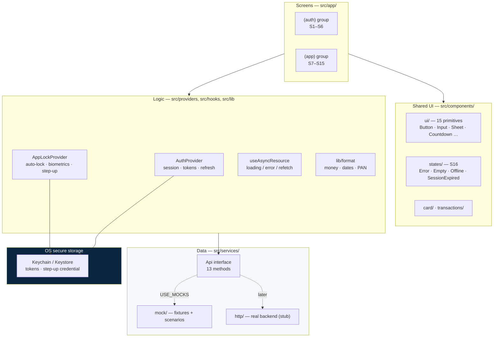

**The seam that matters:** screens talk to the `Api` interface, never to HTTP. Swapping the mock for the real backend changes one line in `src/services/index.ts`.

---

## 3. Master flow

The complete journey, from cold launch to every terminal state.

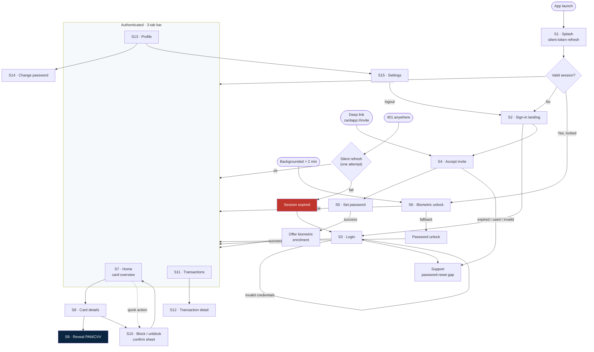

### Route map

| Route | Screen | Group |
|---|---|---|
| `/` | S1 Splash | root |
| `/unlock` | S6 Biometric unlock | root, fullscreen modal |
| `/(auth)/landing` | S2 | pre-auth |
| `/(auth)/login` | S3 | pre-auth |
| `/(auth)/invite` | S4 | pre-auth |
| `/(auth)/set-password` | S5 | pre-auth |
| `/(auth)/support` | Support | pre-auth |
| `/(app)/(home)` | S7 | tab 1 |
| `/(app)/(home)/card/[cardId]` | S8 | tab 1 |
| `/(app)/(home)/card/[cardId]/reveal` | S9 | tab 1, fullscreen modal |
| `/(app)/(transactions)` | S11 | tab 2 |
| `/(app)/(transactions)/[txnId]` | S12 | tab 2 |
| `/(app)/(profile)` | S13 | tab 3 |
| `/(app)/(profile)/change-password` | S14 | tab 3 |
| `/(app)/(profile)/settings` | S15 | tab 3 |

S10 is a bottom sheet, not a route — it must open over both S7 and S8. S16 is a component set, not a route.

---

# Part I — Authentication (S1–S6)

## S1 · Splash

**Goal:** Decide where the user belongs before showing them anything. The user should never see a flash of the wrong screen.

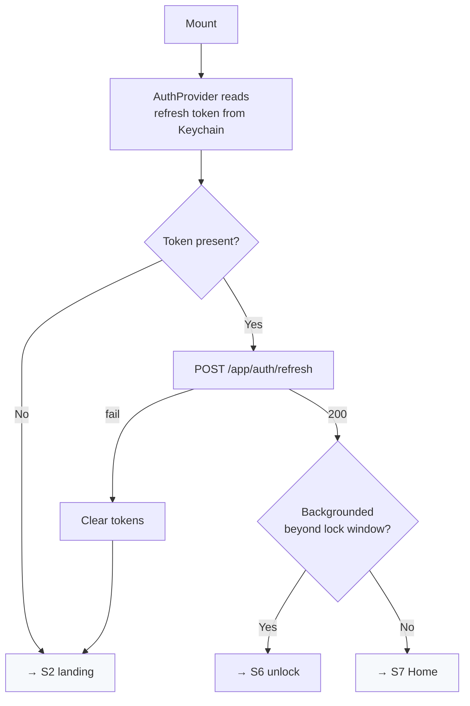

**Achieve:** Native splash stays up until auth resolves — no intermediate blank frame. A failed refresh is not an error the user sees; it is simply a signed-out state.

**Backend:** `POST /app/auth/refresh` · **Status:** Built

---

## S2 · Sign-in landing

**Goal:** The app's first impression. Establish that this is a legitimate financial product, and offer exactly two doors.

**Elements:** Brand mark, one line of positioning, "Log in" (primary), "Activate invite" (secondary).

**Achieve:** Restraint. Two CTAs, generous spacing, brand navy. No marketing copy, no carousel — a cardholder opening this has already been issued a card.

**Backend:** none · **Status:** Stub

---

## S3 · Login

**Goal:** Get a known user back to their card in as few taps as possible, without leaking whether an email is registered.

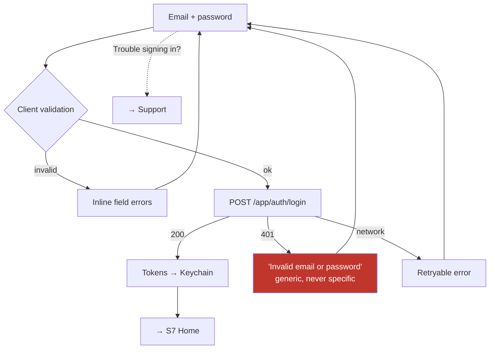

**Achieve:** The error message is **deliberately generic**. "No account with that email" is an account-enumeration vulnerability. Password-manager integration must work — correct `textContentType` and `autoComplete` so iOS and Android offer the saved credential.

**Acceptance:** F2/AC1, F2/AC2 · **Backend:** `POST /app/auth/login` · **Status:** Stub

---

## S4 · Accept invite

**Goal:** Turn an out-of-band invite into an activated account, whether the user tapped a link or is typing a code off an email.

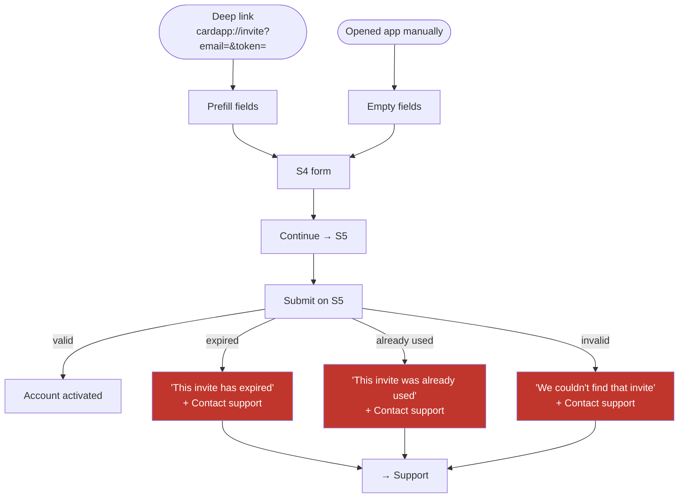

**Achieve:** Both entry paths must work — deep link prefill and manual entry. The three failure modes get **distinct** copy; "invalid invite" for an expired token wastes a support call. No account is created or modified on any failure path.

**Acceptance:** F1/AC2, F1/AC3 · **Backend:** validated on S5 submit · **Status:** Stub

---

## S5 · Set password

**Goal:** Finish activation and land the user on their card, already signed in.

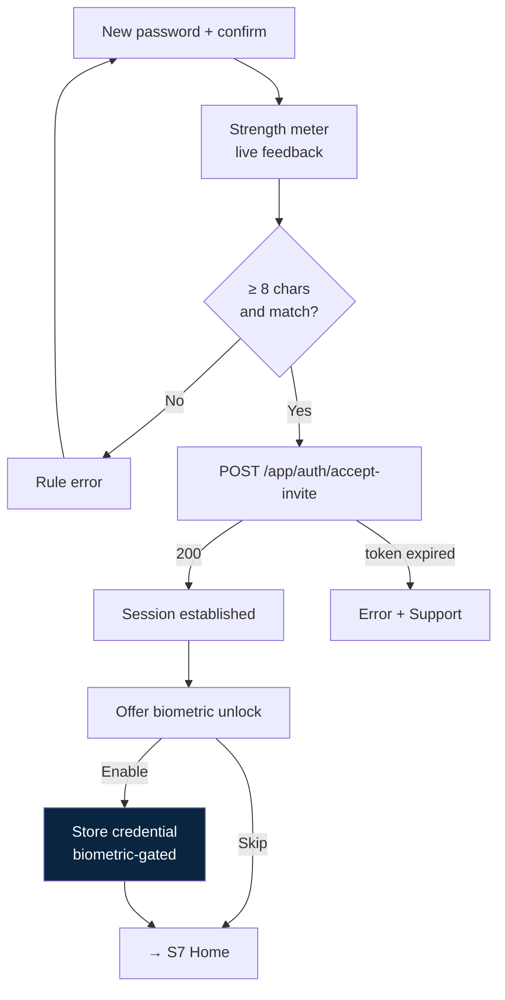

**Achieve:** The biometric enrolment offer happens **here**, while the password is still in memory — `enableBiometrics(password)` needs it, and asking again later means asking the user to retype a password they just set. Skipping is a first-class choice, not a nag.

**Acceptance:** F1/AC1 · **Backend:** `POST /app/auth/accept-invite` · **Status:** Stub

---

## S6 · Biometric unlock

**Goal:** Re-admit a returning user in one glance, with a path that always works if biometrics fail.

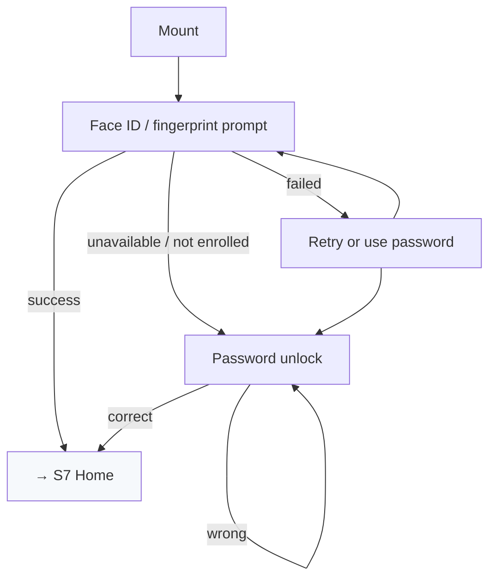

**Achieve:** **No card data may render behind this screen.** The gate sits above the `(app)` route group, so tab screens never mount while locked — not on cold launch, not on a deep link, not on a re-lock while a tab is already open.

**Acceptance:** F2/AC3 · **Backend:** none, local · **Status:** Stub

---

## Support

**Goal:** Absorb the PRD's known gap — there is no self-service password reset in the MVP — without leaving the user stranded.

**Achieve:** Say plainly that password resets are handled by support, and give a real contact action. Do not imply a reset link is coming by email.

**Status:** Stub

---

# Part II — The card (S7–S10)

## S7 · Home / card overview

**Goal:** Answer "is my card OK and how much can I spend?" in under two seconds, without a tap.

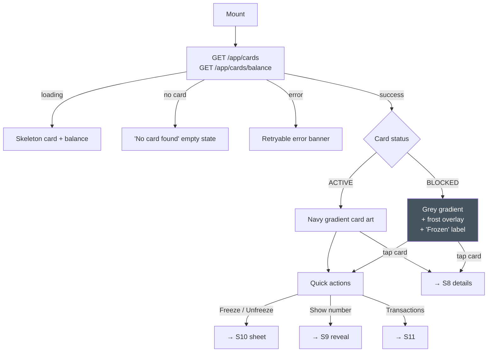

**Achieve:** The card tile is the hero object — it renders identically in light and dark, the way a physical card does. The **blocked state carries three simultaneous signals** (hue change, frost overlay, text label), because PRD F3/AC2 requires it be unmistakable and no single signal survives colour blindness, glare, and glanceability at once.

**Acceptance:** F3/AC1, F3/AC2 · **Backend:** `GET /app/cards`, `GET /app/cards/balance` · **Status:** Partial — `CardArt` and `CardStatusBadge` built, screen is a stub

---

## S8 · Card details

**Goal:** Everything about the card that is safe to show, plus the two controls that matter.

**Elements:** Cardholder name, type (VIRTUAL), status, transaction limit, validity/expiry, Block/Unblock control, "Show card number".

**Achieve:** **Masked metadata only.** No full PAN, no CVV on this screen — those live exclusively on S9 behind the biometric gate. Skeleton rows while loading; retryable error.

**Acceptance:** F4/AC1, F4/AC2 · **Backend:** `GET /app/cards/:cardId` · **Status:** Stub

---

## S9 · Reveal PAN / CVV

**The most security-sensitive screen in the product.** Every requirement below is mandatory.

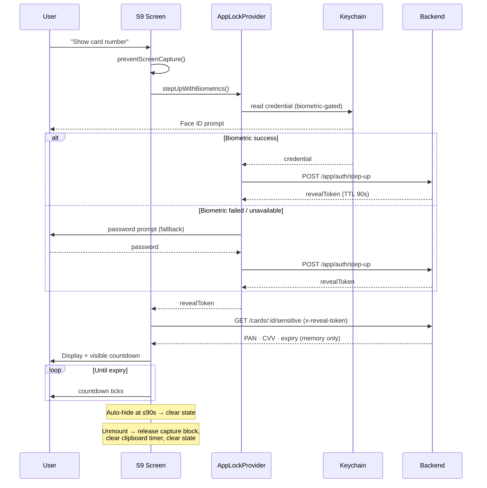

### Hard requirements

| # | Requirement | Why |
|---|---|---|
| AC1 | Biometric step-up before any sensitive fetch | The device gate, not just the session |
| AC2 | Visible countdown, auto-hide ≤ 90 s | Matches `APP_REVEAL_TTL`; a number left on screen is a number over someone's shoulder |
| AC3 | Copy clears the clipboard after 60 s | Clipboard is readable by other apps |
| AC4 | Screenshots and recording blocked; excluded from app-switcher preview | The obvious exfiltration paths |
| AC5 | PAN/CVV in memory only — never disk, cache, logs, analytics, route params | Any persistence is a breach |

**Achieve:** Teardown is the hard part, not display. Releasing the capture block, clearing the clipboard timer, and wiping state must happen on unmount, on countdown expiry, and on backgrounding — three paths, one cleanup.

**Known gap:** iOS app-switcher snapshot exclusion has no Expo API. Approximated with an `AppState`-driven cover view. A complete fix needs a native module.

**Screen reader:** must not read the full PAN aloud unless the user explicitly revealed it (PRD §10).

**Backend:** `POST /app/auth/step-up`, `GET /app/cards/:cardId/sensitive` · **Status:** Stub

---

## S10 · Block / unblock confirm

**Goal:** Make freezing feel instant and safe, and make failure honest.

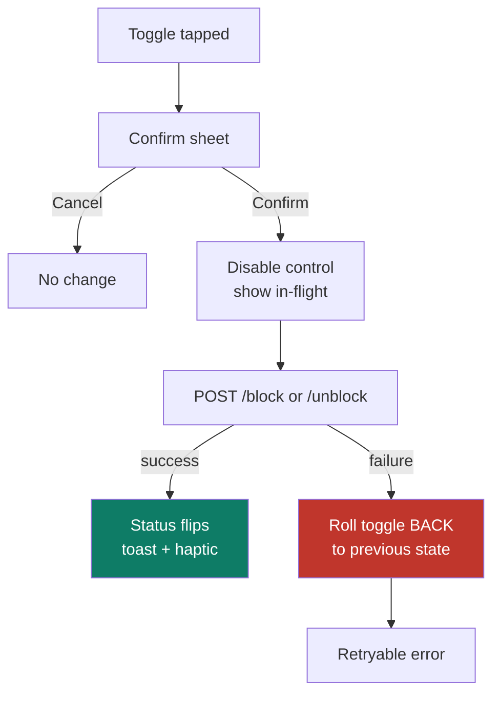

**Achieve:** The rollback is the requirement. A toggle that stays flipped after a failed request tells the user their card is frozen when it is not — the single most dangerous lie this app could tell.

**Acceptance:** F6/AC1, F6/AC2, F6/AC3 · **Backend:** `POST /app/cards/:cardId/block` \| `/unblock` · **Status:** Stub

---

# Part III — Transactions (S11–S12)

## S11 · Transactions list

**Goal:** Let the user find a specific charge fast, and scroll a long history without jank.

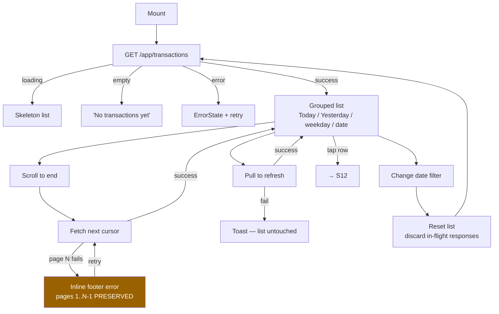

**Achieve:** Three interacting async behaviours — pagination, pull-to-refresh, filter change — must not corrupt each other. A stale response from the previous filter must never land under the new filter's header; a request-id guard discards it. A page-N failure must not destroy pages already on screen.

Amounts use tabular figures so digits do not shift while scrolling. Credits render in `success`, debits in `ink`. Declined transactions must never read as completed.

**Acceptance:** F7/AC1–AC4 · **Backend:** `GET /app/transactions` · **Status:** **Built**

---

## S12 · Transaction detail

**Goal:** Answer "what exactly was this charge?"

**Elements:** Amount, direction, status, `createdAt`, `authorizedAt`, authorization code, terminal, MCC.

**Achieve:** Absent fields are **omitted, not rendered empty**. A PENDING transaction has no `authorizedAt`; a DECLINED one has no authorization code. Rendering "Authorization: null" is worse than rendering nothing.

**Acceptance:** F7/AC4 · **Backend:** `GET /app/transactions` (item) · **Status:** **Built**

---

# Part IV — Profile and settings (S13–S15)

## S13 · Profile

**Goal:** Confirm identity. Read-only in the MVP.

**Elements:** Display name, email, links to Change password and Settings. Skeleton while loading, retryable error.

**Backend:** `GET /app/me` · **Status:** Stub

---

## S14 · Change password

**Goal:** Rotate the password without breaking the biometric reveal flow.

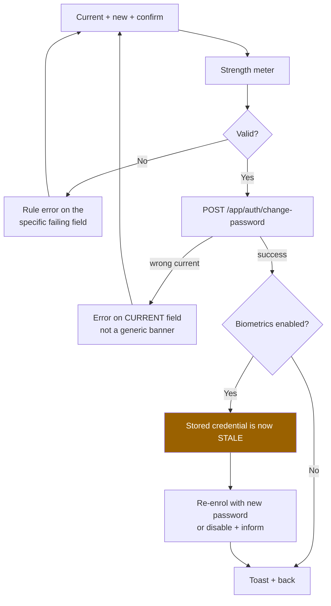

**Achieve:** The stale-credential problem is the trap. The biometric-gated credential holds the *old* password; leaving it there means the reveal flow fails silently days later with no obvious cause. It must be re-enrolled or explicitly disabled at the moment of change.

**Acceptance:** F8/AC2 · **Backend:** `POST /app/auth/change-password` · **Status:** Stub

---

## S15 · Settings

**Goal:** The small set of controls a cardholder actually needs.

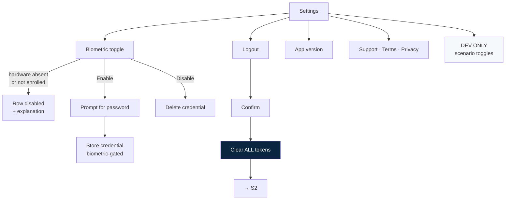

**Achieve:** A toggle that cannot work must not be offered — if the device has no biometric hardware or no enrolment, show a disabled row with a reason. Logout must clear every token from secure storage, not just reset navigation.

The developer section (force error / empty / offline / slow network) renders only under `__DEV__`. It is how the non-happy states get demonstrated.

**Acceptance:** F9/AC1, F9/AC2 · **Status:** Stub

---

# Part V — Cross-cutting behaviour (S16)

These are not screens. They are behaviours every screen inherits.

## Session expiry

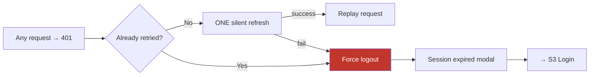

Implemented once in `AuthProvider`, never per-screen. Exactly one refresh attempt — a retry loop against an expired refresh token is an accidental self-DoS.

## Auto-lock

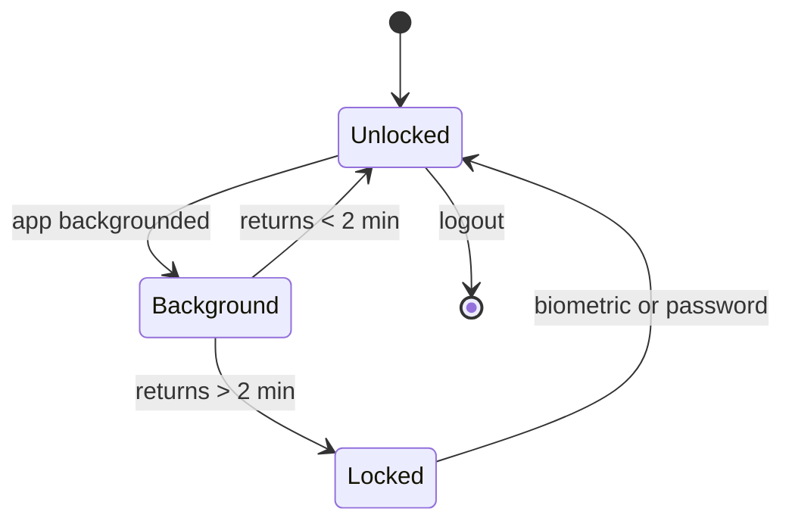

## Offline

Read-only cached card summary with a visible "offline · last updated" indicator. Actions that require the network — block, unblock, reveal — disable gracefully rather than failing after a tap.

## Error copy rules

| Rule | Example |
|---|---|
| Human, not technical | "We couldn't reach your card right now" — not "500 Internal Server Error" |
| Actionable | Always pair with retry or a contact path |
| Never enumerate | "Invalid email or password", never "no such account" |
| Never raw | `errorMessageOf()` refuses to surface an exception string |

---

# Part VI — Design system

Palette extracted from the live DOM at `tpcg.global`, then contrast-corrected where it failed WCAG AA.

| Token | Light | Dark | Use |
|---|---|---|---|
| `bg` | `#FFFFFF` | `#061520` | Page |
| `bgSubtle` | `#F6F9FC` | `#0A2035` | Tinted sections |
| `surface` | `#FFFFFF` | `#0F2A40` | Cards, rows |
| `border` | `#E6EBF1` | `#1C3D57` | Decorative dividers |
| `borderStrong` | `#7F8FA1` | `#346690` | Input outlines (3:1) |
| `ink` | `#0A2540` | `#EAF2F8` | Primary text |
| `inkMuted` | `#647389` | `#94A9BE` | Secondary text |
| `inkSubtle` | `#8391A2` | `#6B8299` | Placeholder |
| `brand` | `#003D5D` | `#4A9FD4` | Primary actions |
| `accent` | `#2B73C7` | `#5FB0E8` | Focus, inline links |
| `success` | `#0E7C66` | `#3DBE9A` | Credits |
| `danger` | `#C0362C` | `#FF6B5E` | Errors, destructive |
| `warning` | `#9A6100` | `#E5A33D` | Offline, frozen notice |

**Card art** is theme-independent: active `#0A2540 → #003D5D → #01507A`; blocked `#2C3A47 → #46545F` plus frost and label.

**Type:** system font, 11 variants from `display` 34/40 to `overline` 11/14. Money, PAN, and countdowns use tabular figures.

**Spacing:** 4-based, `xs 4` → `giant 48`. **Radius:** `sm 8` → `card 20`, `pill 999`. **Touch targets:** 44pt minimum everywhere.

All 36 foreground/background pairs verified against WCAG AA in both themes.

---

# Part VII — Build status

| Phase | Scope | Status |
|---|---|---|
| 1 | Design tokens + 15 UI primitives + gallery | **Done** |
| 2 | Mock service layer, fixtures, scenarios | **Done** |
| 3 | Routes, providers, auth gate, lock gate | **Done** |
| 4 | S1–S6 auth screens | S1 done; S2–S6 stubs |
| 5 | S7–S10 card screens | `CardArt` + badge done; screens stubs |
| 6 | S11–S12 transactions | **Done** |
| 7 | S13–S15 profile | Stubs |
| 8 | S16 states, a11y, simulator verification | States done; verification pending |

**Verification blocker:** no iOS simulator runtime is installed on the build machine. `xcodebuild -downloadPlatform iOS` is required before the app can be run and screenshotted.

---

# Part VIII — Known gaps

| Gap | Impact | Recommendation |
|---|---|---|
| **Step-up stores the account password** | Backend `step-up` only accepts a password, so biometric reveal requires holding it in the Keychain. Not revocable server-side; goes stale on password change. | Backend issues a scoped, revocable, device-bound step-up token instead. Small change, removes the password from device storage. |
| **No self-service password reset** | PRD's own noted gap. Routes to support. | Add `forgot-password` + `reset-password` to the backend and a reset flow to the app. |
| **App-switcher snapshot on iOS** | No Expo API. Approximated with an `AppState` cover view. | Small native module during security hardening. |
| **Certificate pinning** | Not implemented — belongs with real API integration. | Add when `http.ts` is wired. |
| **Analytics** | Call sites marked `TODO(analytics)`; no SDK added. | Wire after integration, scrubbing per §9.5. |

---

*Diagrams and behaviour in this document reflect the PRD dated 2026-07-13 and the front-end design spec dated 2026-07-29.*
